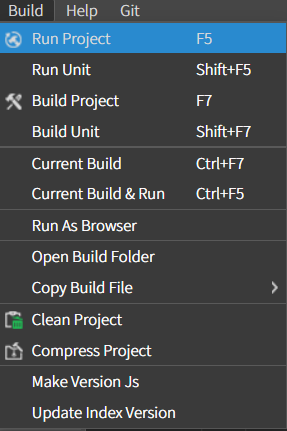
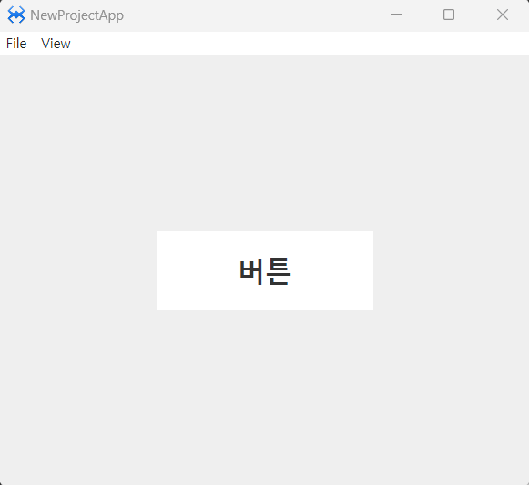

# 03. 빌드 및 실행 (Web)

[**02. 컴포넌트 배치 및 이벤트 연결**](02.md)에서 레이아웃 구성 후 실행

### 빌드 및 실행

만들어진 프로젝트를 실행하기 위해 상단 메뉴 Build > Run Project

> 단축키: F5

**Build 탭 설명** ➡️ [**E. Build**](<../Guide for SpiderGen/06  SpiderGen Editor/01  Main Menu/E  Build.md>)

**시뮬레이터를 통해 실행 결과를 확인**

lay에서 생성했던 button을 시뮬레이터를 통해 클릭

위 사진과 같이 알림창이 실행되면 성공

\

### 시뮬레이터

#### 시뮬레이터 디버깅 툴

좌측 상단 메뉴 ➡️ View 클릭

아래 사진과 같이 시뮬레이터를 컨트롤할 수 있는 메뉴가 나옴

* **Reload** : **시뮬레이터를 새로고침** 하고 스파이더젠에서 **새로 빌드된 사항을 적용**합니다.
* **FullScreen** : 시뮬레이터 창을 **최대화** 합니다.
*   **Show DevTools** : **Developer Tools(개발자 모드) 를 오픈** 합니다.

    > 각 컴포넌트의 속성과 스타일을 확인 및 코드의 디버깅이 가능
    >
    > 크롬 기반 개발자 툴이며 [이 곳](https://developer.chrome.com/docs/devtools/open?hl=ko) 에서 사용법 확인

***

\

#### 스파이더젠 프로젝트를 웹에서 띄우는 방법

**1️⃣ 자동 실행**

**2️⃣ 수동 실행**

\

### 자동 실행

Build > Run AsBrowser 선택 ➡️\
자동으로 생성되어진 로컬서버에 빌드 된 프로젝트가 옮겨지고 바로 웹에서 확인 가능

### 수동 실행

**만약 사용 중인 웹 서버가 있다면?**

프로젝트 빌드 후 생성되는 bin 폴더 내부의 index.html을 포함한 생성된 모든 폴더 및 파일들을 웹 서버에 복사하거나 옮겨서 사용 가능

**< 사진 - bin 폴더 내부 구조 >**

> bin 폴더가 존재하는 프로젝트는 스파이더젠에서 Open Folder를 클릭해 오픈할 수 있음
