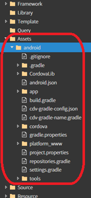
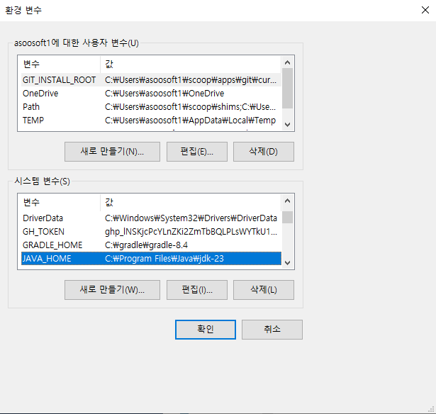
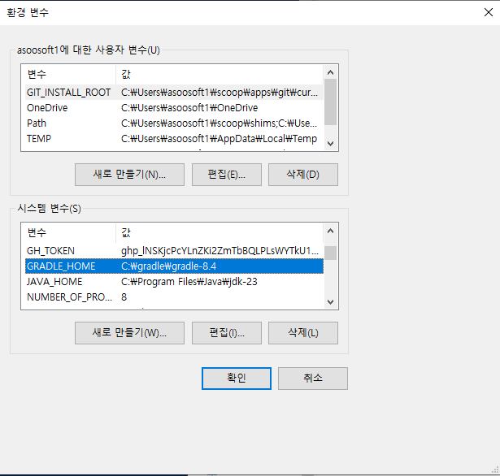
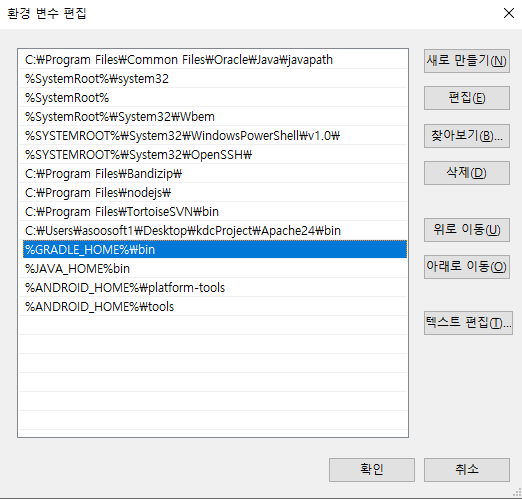
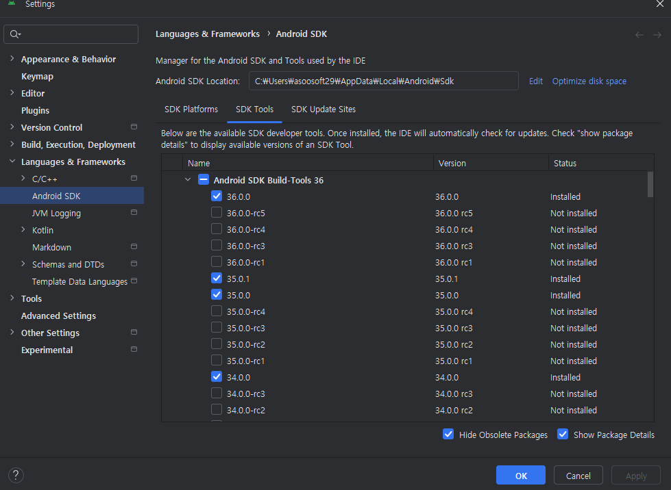
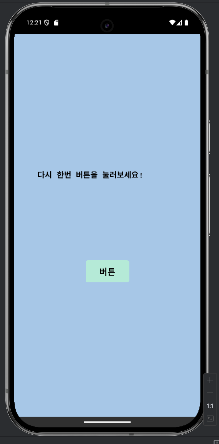
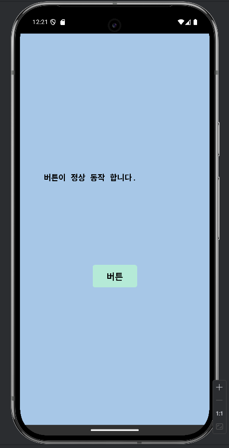

# A. Android 앱 구축하기

## 1. 환경 설정

***

`환경 설정은 다음의 순서대로 진행해야 합니다.`

### 1. Android Studio 설치

Android Studio 는 Android 앱 개발을 위한 공식 IDE입니다.

> [Android Studio 공식 홈페이지](../../Guide%20for%20SpiderGen/03%20%20Start%20Guide/04%20%20%EB%B9%8C%EB%93%9C%20%EB%B0%8F%20%EC%8B%A4%ED%96%89\(Mobile\)/\[https:/developer.android.com/studio)

(직접 디바이스를 연결 하거나 가상 디바이스로 앱을 실행할 수 있습니다.)

### 2. Node js 설치

Node js 를 설치합니다.

> [node js 공식 홈페이지](https://nodejs.org/en/)

### 3. Cordova 설치

cmd 에서 아래의 단계를 순서대로 진행합니다.

> `npm i -g cordova`

(npm을 사용하여 Cordova를 전역 설치합니다.)

> `cordova -v`

(설치가 정상적으로 완료되면 Cordova의 버전이 출력됩니다.)

> `cordova create MyApp`

(MyApp이라는 새로운 Cordova 프로젝트 폴더를 생성합니다.)

> `cd MyApp`

(생성된 프로젝트 폴더인 MyApp/으로 이동합니다.)

> `cordova platform add android`

(Cordova 프로젝트에 android 플랫폼을 추가합니다.)

> [코르도바 공식 홈페이지](../../Guide%20for%20SpiderGen/03%20%20Start%20Guide/04%20%20%EB%B9%8C%EB%93%9C%20%EB%B0%8F%20%EC%8B%A4%ED%96%89\(Mobile\)/cordova.apache.org#getstarted)

### 4. SpiderGen cordova export

경로에 생성된 Android 폴더를 스파이더젠 프로젝트 Assets 폴더에 복사사합니다.



### 5. JAVA JDK 설치

> [JAVA 공식 홈페이지](https://www.oracle.com/java/technologies/downloads/?er=221886)

windows-x64.exe 다운로드 및 설치를 합니다.

Cordova는 Java JDK 8 이상부터 동작하지만, 사용하는 Android Studio 버전에 따라 호환되는 JDK 버전이 다를 수 있습니다. 따라서 Android Studio의 권장 사양을 함께 확인하여 적절한 JDK 버전을 설치하는 것이 좋습니다.

### 6. JAVA\_HOME 환경변수 등록

* 환경변수 설정: "고급 시스템 설정" 실행 -> 고급탭(환경 변수)
* 시스템변수 새로만들기: JAVA\_HOME / 설치한 JDK 경로 추가
* 시스템변수 Path: "%JAVA\_HOME%\bin" 추가



<figure><figcaption></figcaption></figure>

### 7. Gradle설치, 환경변수 등록

> [Gradle 공식 홈페이지](https://gradle.org/install/)

* 환경변수 설정: "고급 시스템 설정" 실행 -> 고급탭(환경 변수)
* 특정 폴더에 넣고 그 폴더경로를 환경변수에 등록
* 커맨드창 껏다 켜야 적용





## 2. SpiderGen 프로젝트 만들기

***

### 1. 예제 코드 추가

SpiderGen 프로젝트의 js파일에 예제 코드를 추가합니다. 예를 들어 Button 컴포넌트와 id가box인 TextBox 컴포넌트 추가 후 Button의 click Event 설정에 예제 코드를 추가합니다.

```

	onButtonClick(comp, info, e)
	{

       if (!this.isClicked) {
            this.isClicked = false; // 초기값 설정
        }
        
        if (this.isClicked) {
            this.box.setText("다시 한번 버튼을 눌러보세요!");
        } else {
            this.box.setText("버튼이 정상 동작 합니다.");
        }

        this.isClicked = !this.isClicked;


	}
```

그리고 F7을 눌러 빌드하고 bin파일을 생성합니다.

### 2. Cordova 앱 빌드 및 실행

`MyApp\platforms\android\app\src\main\assets\www` 위 경로에 SpiderGen 프로젝트 bin 폴더안에 있는 파일을 복사합니다.

Android Studio를 실행합니다.

Android Studio의 Menu에 진입 후 File -> Open 생성해두었던 `MyApp\platforms\android` 를 선택하여 파일을 오픈합니다.

> 처음 Android Studio 를 설치하면 sdk파일이 없어서 빌드가 안되는 경우가 있을수있습니다. **menu - tools - sdk manager** **sdk tools**에서 사용할 버전을 찾아 설치하고 다시 빌드합니다.
>
> 사용하는 Android Studio 버전에 따라 호환되는 JDK 버전이 다를 수 있습니다. 따라서 Android Studio의 권장 사양을 함께 확인하여 적절한 JDK 버전을 설치하는 것이 좋습니다.



### 3. Android Studio에서 프로젝트를 실행합니다.

디바이스를 직접 연결 하거나 가상 디바이스를 설정해야 합니다.\
가상 디바이스는 **Menu - Tools -Device Manager** 에서 설정할 수 있습니다.



### 4. 버튼을 눌러 정상 동작을 확인합니다.



### 5. APK 파일 생성

프로젝트를 run 했다면 apk 파일이 생성됩니다.\
(프로젝트 이름이 MyApp 라면 아래의 경로에 생성)`MyApp\platforms\android\app\build\intermediates\apk\debug`

### 6. Plugin

프로젝트를 진행하다보면 HTML만으론 불가능한 네이티브 기능이 필요합니다.

기기의 진동, 벨소리, 앱 이름, 버전 등은 네이티브에서만 실행 가능합니다.

> 스파이더젠과 네이티브를 이어주는 브릿지 역할 ➡️ cordova

> 스파이더젠에서 cordova 함수를 통해 네이티브로 요청 ➡️

> 네이티브에서 받은 요청에 따라 수행 후 다시 웹브라우저로 값 리턴

필요한 플러그인이 있다면 [cordova 공식 페이지](https://cordova.apache.org/)에서 찾아볼 수 있습니다.

[스파이더젠 프로젝트 안드로이드 앱 코르도바 플러그인 사용방법](<../../Guide for SpiderGen/05  Advanced/09  Cordova Hybrid앱 구축하기/A  Android 앱 구축하기(cordova).md>)
