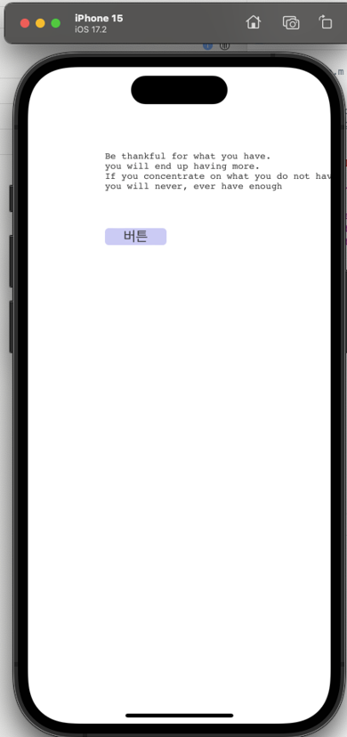

# B. iOS 앱 구축하기

## 1. 환경 설정

***

**- 환경 설정은 다음의 순서대로 진행해야 합니다.**

### 1. Xcode 설치

* **Xcode**는 macOS에서만 사용할 수 있는 iOS 앱 개발을 위한 공식 IDE입니다.\
  -iOS 앱을 테스트하거나 배포하려면 Apple Developer 계정이 필요합니다.
* **App Store**를 열고 **Xcode**를 검색하여 설치합니다.


### 2. Node js 설치

* **Node.js 공식 홈페이지**에서 설치 파일을 다운로드하여 설치합니다.

> [node js 공식 홈페이지](https://nodejs.org/en/)


### 3. Cordova 설치

**- 터미널 에서 아래의 단계를 순서대로 진행합니다.**

```
npm i -g cordova
```

* **Cordova**를 전역 설치합니다.


<mark style="color:red;">`EACCES: permission denied, mkdir '/usr/local/lib/node_modules/cordova'`</mark>&#x20;

→ 일반 사용자 권한으로는 npm -g 전역 설치 경로에 디렉토리를 생성할 수 없어서 발생합니다.

해당 오류발생시 **`sudo npm i -g cordova`**

sudo는 관리자 권한으로 실행한다는 의미입니다. 실행 후 비밀번호를 입력하라는 메시지가 나올 수 있습니다.


```
cordova -v
```

* **cordova 버전**을 **확인**합니다. \
  설치가 정상적으로 완료되면 Cordova의 버전이 출력됩니다.

```
cordova create MyApp
```

* **MyApp**이라는 새로운 **Cordova 프로젝트** 폴더를 **생성**합니다.

```
cd MyApp
```

* 생성된 프로젝트 폴더인 **MyApp으로 이동**합니다.

```
cordova platform add ios
```

* **Cordova** 프로젝트에 **iOS 플랫폼을 추가**합니다.


* `myApp/platforms/ios/platform_www` 경로에 생성된 **cordova.js**파일을  **SpiderGen 프로젝트** **Assets** **폴더**에 복사합니다.

<figure><figcaption></figcaption></figure>


## 2. SpiderGen 프로젝트 만들기

***

### 1. 예제 코드 추가

* **SpiderGen** 프로젝트 **MainView.lay**에 `Button`  컴포넌트와 **ID**가 **textBox**인 `TextBox` 컴포넌트를 추가합니다.
* 추가한 `Button`  컴포넌트의 **클릭이벤트 핸들러를 설정**합니다.

```javascript
	//MainView.js

	onButtonClick(comp, info, e)
	{
       	    this.textBox.setText("기능이 동작합니다");
	}
```

* &#x20;**F7**을 눌러 **빌드**합니다.\
  \- **`open folder`** 버튼을 이용해서 프로젝트 폴더로 쉽게 이동할 수 있습니다.


## 3. 프로젝트 실행

***

### 1. XCode에 Cordova 앱 추가

* &#x20;**Xcode**에서 File -> Open → `MyApp/platforms/ios/HelloCordova.xcodeproj`  파일 열기
* **SpiderGen프로젝트**에서  빌드후 생성된 **bin폴더**의 폴더와 파일들을 **Cordova프로젝트의** `Staging/www`  폴더로 복사합니다.\
  \- 기존의 www 하위의 파일 및 폴더는 삭제합니다.

<figure><figcaption></figcaption></figure>

* iOS는 기본적으로 `file://` 프로토콜을 지원하지 않으므로, `localhost` 방식으로 설정합니다.
* `Staging/config.xml`에 **아래 항목을 추가**합니다.

```xml
<preference name="WKWebViewOnly" value="true" />
<preference name="scheme" value="app" />
<preference name="hostname" value="localhost" />
```


### 2. Xcode에서 프로젝트를 실행

* **Xcode**의 상단에서 **HelloCordova프로젝트**를 **선택**하고 **실제 디바이스 또는 시뮬레이터 선택후** ▶ 버튼을 눌러 실행합니다.

<figure><figcaption></figcaption></figure>

* 앱실행 후 **버튼**을 눌러 "기능이 동작합니다" **텍스트가 출력**되는지 **확인**합니다.

<div align="center"> <figure><figcaption></figcaption></figure></div>

### 3. app 파일 생성

* 프로젝트를 실행하면 다음 경로에 `.app` 파일이 생성됩니다.

```
MyApp/platforms/ios/build/emulator/MyApp.app
```

* 생성된 `.app` 파일은 **Xcode**를 이용해 `.ipa` 파일로 변환할 수 있습니다.


## 4. Cordova Plugin 연동

***

* 프로젝트 진행 중 **네이티브 기능**(진동, 벨소리, 앱 이름, 버전 등)이 필요한 경우가 있습니다.
* HTML/JavaScript만으로는 불가능하므로 **Cordova를 통해 네이티브 기능과의 연동**을 구현합니다.

> 스파이더젠과 네이티브를 이어주는 브릿지 역할 ➡️ cordova

> 스파이더젠에서 cordova 함수를 통해 네이티브로 요청 ➡️

> 네이티브에서 받은 요청에 따라 수행 후 다시 웹브라우저로 값 리턴

* 필요한 기능은 [Cordova Plugin 공식 페이지](https://cordova.apache.org/plugins/)에서 검색하여 확인할 수 있습니다.
* SpiderGen에서 Cordova 플러그인을 사용하려면 **Cordova 명령어로 플러그인을 추가**한 후, **JavaScript에서 호출**하면 됩니다.

[스파이더젠 프로젝트 iOS 코르도바 플러그인 사용방법](../../08.-mobile-app/09-cordova-hybrid/b-ios-cordova.md)
