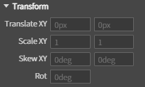
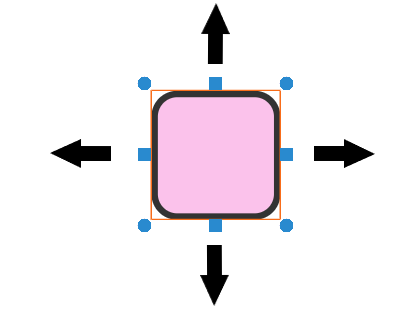
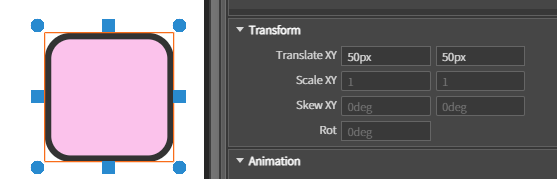
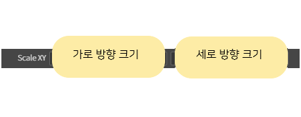
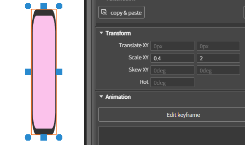
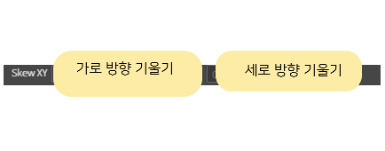
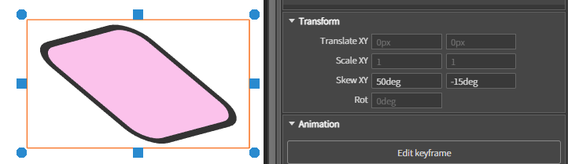
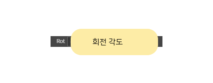
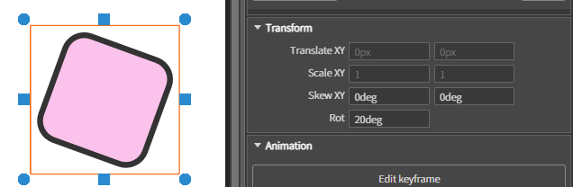

# 03. Transform 변형 디자인

✅ 이 영역에서 디자인을 적용

## 1. Translate XY

#### 가로(X)와 세로(Y) 방향으로 특정 거리만큼 이동하는 속성

### 1️⃣ 컴포넌트를 선택하여 이동시킬 x,y 값을 입력

> X 가 양수일 경우 : 오른쪽 이동\
> X 가 음수일 경우 : 왼쪽이동\
> Y 가 양수일 경우 : 위쪽 이동\
> Y 가 음수일 경우 : 아래쪽 이동

***

## 2. Scale XY

#### 가로(X)와 세로(Y) 방향으로의 크기를 조정하는 속성

### 1️⃣ 컴포넌트를 선택하여 크기를 조정시킬 x,y 값을 입력

***

## 3. Skew XY

#### 가로(X)와 세로(Y) 방향으로의 기울기를 각도로 조정하는 속성

### 1️⃣ 컴포넌트를 선택하여 각도를 조정시킬 x,y 값을 입력

***

## 4. Rot

#### 시계 방향 또는 반시계 방향으로 회전시키는 속성

### 1️⃣ 컴포넌트를 선택하여 방향을 회전시킬 값 입력

> 양수일 경우 : 시계 방향 이동\
> 음수일 경우 : 반시계 방향
