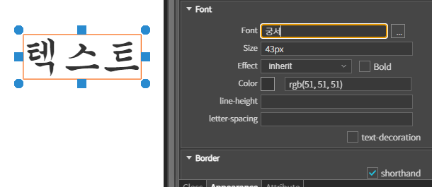
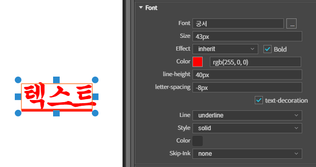
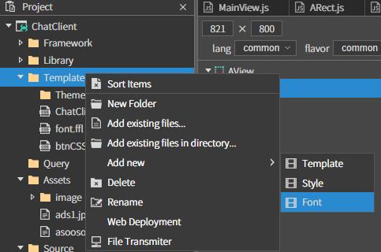
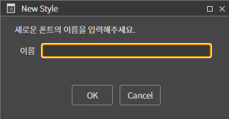
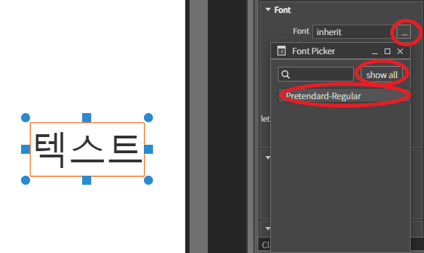
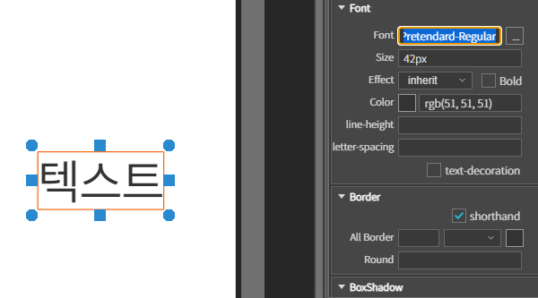

# 06. 폰트 디자인

## 1. 1️⃣ 텍스트 컴포넌트 선택 후, `Font` 에 직접 폰트명을 작성

> 시스템에 존재하는 값만 가능

### 2️⃣ 폰트를 원하는 디자인으로 수정

| 값                 | 설명                                                                                                                    |
| ----------------- | --------------------------------------------------------------------------------------------------------------------- |
| `Size`            | 텍스트의 크기                                                                                                               |
| `Effect`          | 
<code>inherit</code> : 부모 요소의 폰트 스타일 <code>nomal</code> : 기본 폰트 스타일 <code>italic</code> : 텍스트를 기울여서 표시
   |
| `Color`           | 텍스트의 색상                                                                                                               |
| `line-height`     | 텍스트 줄 간의 높이                                                                                                           |
| `letter-spacing`  | 텍스트의 글자 간 간격                                                                                                          |
| `text-decoration` | 텍스트 장식 효과 표시 / 숨김                                                                                                     |
| `Line`            | 
텍스트에 적용할 선의 종류 <code>underline</code> : 밑줄 <code>overline</code> : 윗줄 <code>line-through</code> : 취소선
 |
| `Color`           | 선의 색상                                                                                                                 |
| `Skip-link`       | 텍스트 장식이 링크를 건너뛰도록 설정                                                                                                  |

***

## 2. 폰트 템플릿을 생성하여 디자인하는 방법

### 1️⃣ `Template` 폴더에 폰트 템플릿을 추가

### 2️⃣ `+` 버튼을 클릭하여 폰트 생성

**❗주의 : 이름에는 font-famaily의 값이 들어가야 함.**

> font-family: 'Pretendard-Regular'; 일 경우,\
> 이름에는 Pretendard-Regular 을 입력 (콤마 ' 를 제외)

### 3️⃣ 폰트 CSS 작성 후 `save`

### 4️⃣ `Font`의 `...` 버튼 클릭 후 `show all` 버튼을 클릭하여 폰트 스타일 로드 및 폰트 적용

✅ Pretendard-Regular가 적용된 모습.

***

## 3. 스타일을 생성하여 디자인하는 방법

### 기존 스타일 생성 방법과 동일 ([이동하기](../07-style/04.md))
