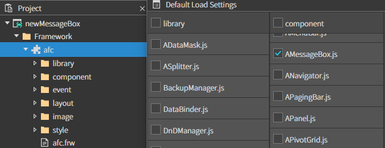
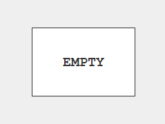
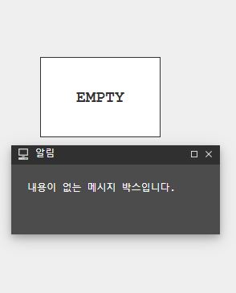

# A. Empty MessageBox

`AMessageBox.EMPTY`는 메시지 박스를 띄울 때 버튼이 없는 타입을 의미함.\
이 타입을 사용하면 메시지 박스에 단순히 메시지만 표시되고, 사용자가 클릭할 수 있는 버튼은 제공되지 않음.

***

### 1. Framework 추가

* 프로젝트를 시작하기 전에 필요한 기능들을 준비함.
  * MessageBox를 사용하기 위해 `afc` 폴더에 **AMessageBox.js** 컴포넌트를 추가함.



***

### 2. 컴포넌트 배치

* View에 아래와 같이 **AButton** 컴포넌트를 배치함.

| component | text  |
| --------- | ----- |
| AButton   | EMPTY |



***

### 3. 버튼 이벤트 연결

* **EMPTY** 버튼의 Click 이벤트 함수를 아래와 같이 작성함.

```javascript
onEMPTYClick(comp, info, e) {
    let msgBox = new AMessageBox();
    msgBox.openBox(
        null,                     // 부모 컨테이너 (null: 최상위)
        "알림",                  // 제목 (MessageBox의 타이틀)
        "내용이 없는 메시지 박스입니다.",  // 내용 (표시될 메시지)
        AMessageBox.EMPTY,        // 버튼 타입
        function (result) {
            // 버튼 클릭 결과에 따른 추가 처리가 필요하면 여기에 작성합니다.
        }
    );
}
```

***

### 4. 빌드 및 실행

* 프로젝트를 빌드 후 실행함.
* **EMPTY** 버튼을 클릭하여 출력되는 MessageBox를 확인함.


