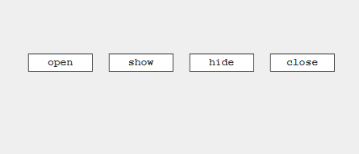

# E. Window Show and Hide

**open()** 메서드는 **새로운 윈도우나 컨테이너를 생성**하고 화면에 띄우는 기능을 함.\
프로그램이 처음 실행될 때 특정 레이아웃 파일을 로드하고 원하는 위치와 크기로 윈도우를 표시할 때 사용됨.\
즉, **기존에 없던 윈도우**를 새로 만드는 과정임.

**show()** 메서드는 **기존에 숨겨져 있던 윈도우나 컨테이너를 다시 보이게** 하는 기능을 함.\
hide() 메서드로 숨겼던 객체를 다시 표시할 때 사용되며, 이**미 존재하는 객체**를 화면에 보이게 하는 것임.

**hide()** 메서드는 **현재 화면에 표시되고 있는 객체를 숨기는 기능**을 함.\
객체가 화면에서 사라지더라도 내부 데이터나 상태는 그대로 유지됨.\
즉, show()를 사용하면 다시 원래 상태로 표시할 수 있음.

**close()** 메서드는 윈도우나 컨테이너를 **완전히 닫고 초기화**하는 기능을 함.\
close()를 호출하면 객체가 제거되며, 다시 사용하려면 open()을 호출하여 새롭게 생성해야 함.

***

### 1. Framework 추가

* 프로젝트 시작 전에 필요한 기능들을 준비함.
  * 메시지(알림창)를 간단히 띄우기 위해 afc 폴더에 **AToast.js** 파일을 추가함.
  * 이후 코드에서 `AToast.show("메시지")`처럼 바로 알림창을 표시할 수 있음.

.png>)

***

### 2. 컴포넌트 배치

* View에 아래와 같이 버튼들을 배치함.

| component | text  |
| --------- | ----- |
| AButton   | Open  |
| AButton   | Hide  |
| AButton   | Show  |
| AButton   | Close |



***

### 3. 버튼 이벤트 연결 (메인 화면)

* **Open 버튼**\
  버튼 클릭 시 동작할 이벤트 함수를 아래와 같이 작성함.

```javascript
onOpenClick(comp, info, e) {
    let wnd = AWindow.findWindow('winA');

    if (wnd) {
        AToast.show('이미 WinA 윈도우가 열려 있습니다.');
        return;
    }

    wnd = new AWindow('winA');
    // Center 위치로 400x200 크기로 열기
    wnd.openCenter('Source/ShowHideWinView.lay', this.getContainer(), 400, 200);
}
```

* **Hide 버튼**\
  버튼 클릭 시 동작할 이벤트 함수를 아래와 같이 작성함.

```javascript
onHideClick(comp, info, e) {
    const winA = AWindow.findWindow('winA');

    if (!winA) {
        AToast.show('WinA 윈도우가 존재하지 않습니다.');
        return;
    }

    winA.getContainer().hide();  // 화면에서 숨김
}
```

* **Show 버튼**\
  버튼 클릭 시 동작할 이벤트 함수를 아래와 같이 작성함.

```javascript
onShowClick(comp, info, e) {
    const winA = AWindow.findWindow('winA');

    if (!winA) {
        AToast.show('WinA 윈도우가 존재하지 않습니다.');
        return;
    }

    winA.getContainer().show();  // 다시 화면에 표시
}
```

* **Close 버튼**\
  버튼 클릭 시 동작할 이벤트 함수를 아래와 같이 작성함.

```javascript
onCloseClick(comp, info, e) {
    const winA = AWindow.findWindow('winA');

    if (winA) {
        winA.getContainer().close();  // 실제로 닫아 객체를 제거
    }
}
```

***

### 4. ShowHideWin 레이아웃 설정

* 새로운 화면을 추가하고 배경색을 지정함.
* ShowHideWin 레이아웃에는 아래와 같이 컴포넌트와 이벤트를 추가함.

| component | text  |
| --------- | ----- |
| AButton   | Hide  |
| AButton   | Close |


***

### 5. 버튼 이벤트 연결

**ShowHideWin** 레이아웃에 아래와 같이 이벤트를 연결함

* **Hide 버튼 클릭 이벤트**\
  버튼 클릭 시 동작할 이벤트 함수를 아래와 같이 작성함.

```javascript
onHideClick(comp, info, e) {
    this.getContainer().hide();
}
```

* **Close 버튼 클릭 이벤트**\
  버튼 클릭 시 동작할 이벤트 함수를 아래와 같이 작성함.

```javascript
onCloseClick(comp, info, e) {
    // 'winA'로 열었던 윈도우 객체가 있는지 확인
    const winA = AWindow.findWindow('winA');

    if (winA) {
        winA.getContainer().close();  // 실제로 창을 닫음
    }
}
```

***

### 6. 빌드 및 실행 (동작 확인)

* 메인 화면에 있는 **Open** 버튼을 눌러 ‘winA’ 윈도우를 생성함.
* **Hide**, **Show**, **Close** 버튼을 번갈아 클릭하면서 창이 숨겨지거나 다시 나타나고, 완전히 닫히는지 확인함.
* ShowHideWin 내부의 **Hide**와 **Close** 버튼도 사용해 보면, `AWindow.findWindow('winA')`로 확인되는 객체가 실제로 존재하는지 여부를 이해할 수 있음.
