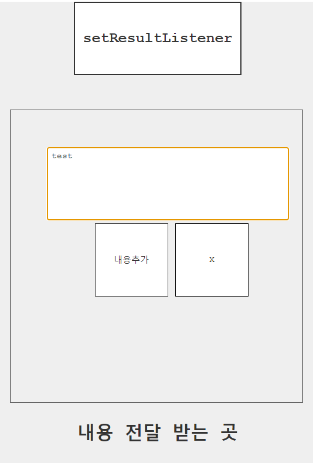
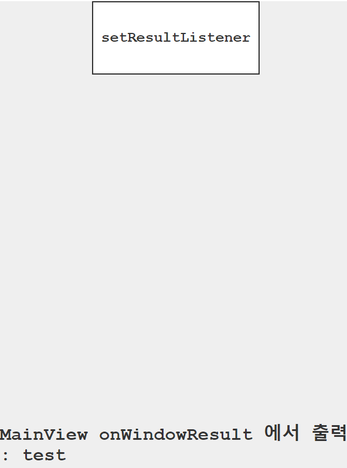

# G. Window setResultListener

**setResultListener** 는 스파이더젠에서 윈도우가 닫힐 때 결과값을 수신받을 객체를 설정하는 기능을 제공함.\
이 메서드를 사용하면 윈도우가 닫힐 때 특정 객체의 메서드를 호출하여 결과값과 데이터를 처리할 수 있음.\
즉, 윈도우가 닫힌 후의 로직을 외부 객체에서 처리할 수 있도록 도와줌.

***

### 1. 컴포넌트 배치

* View에 아래와 같이 **setResultListener** 버튼을 배치함.

| component | text              |
| --------- | ----------------- |
| AButton   | setResultListener |

* 위와 같이 배치된 **setResultListener** 버튼에 클릭 이벤트를 설정함.

***

### 2. 버튼 이벤트 연결

* **setResultListener** 버튼의 Click 이벤트 함수를 아래와 같이 작성함.

```javascript
onSetResultListenerClick(comp, info, e) {
    // 컨테이너 id를 설정하고 AWindow 인스턴스를 생성함.
    const wnd = new AWindow('result-window');
    
    // 윈도우가 닫힐 때 this의 onWindowResult 함수를 호출하도록 설정함.
    wnd.setResultListener(this);
    
    // url, parent, width, height 순서대로 지정하여 모달로 윈도우 오픈
    wnd.openAsDialog('Source/DataWindow.lay', this.getContainer(), 400, 400);
}
```

***

### 3. 이벤트 수신 객체 구현

* 수신 객체(예: MainView)에서 onWindowResult 메소드를 추가 및 재정의함.

```javascript
onWindowResult(result, data, awindow) {
    // 호출한 윈도우의 컨테이너 id를 가져옴
    const winId = awindow.getContainerId();
    
    if (result) {
        // 메인 화면에 배치된 Label(객체 id: text)에 데이터를 출력함.
        this.text.setData('MainView onWindowResult 에서 출력 : ' + data);
    }
}
```

> **주의:** 위 코드에서 `this.text`는 메인 화면에 배치된 Label 컴포넌트의 id가 **text**인 객체임.

***

### 4. 빌드 및 실행

1. 메인 화면에 있는 **setResultListener** 버튼을 클릭하여 DataWindow를 모달로 오픈함.
2. DataWindow가 열리면 텍스트 영역에 원하는 내용을 입력한 후, **내용추가** 버튼 등을 통해 데이터를 저장함.
3. **X** 버튼을 눌러 DataWindow를 닫으면, 메인 화면의 Label(객체 id: text)에 입력했던 내용이 출력되는지 확인함.

\

