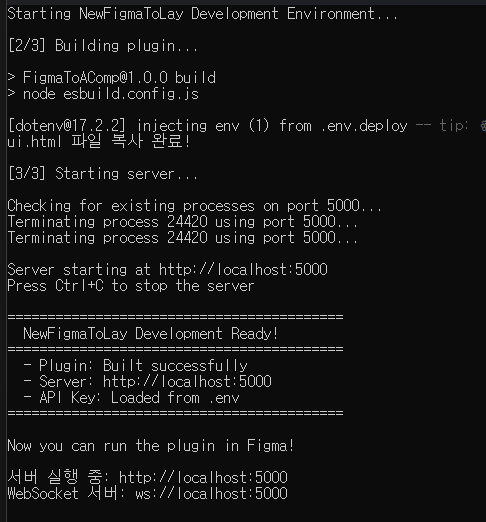

# 5. Tlay 로 SppiderGen 에 화면 생성

## 1. 로그인 화면 생성 (예제)

* 로그인을 위해 다음과 같은 UI 를 생성합니다.
  * Label - ID, Password 이름표시
  * TextField - ID, Password 입력용
  * Button - 확인, 취소용
  * CheckBox - ID 기억용
* Template 에서 4개의 컴포넌트를 새 화면에 복사합니다.
  *

      <figure><figcaption></figcaption></figure>
* 각 Component 들의 디자인을 수정합니다
  * 용도별로 버튼이 색상이 다르면  아래   버튼처럼 각각 색상수만큼 UI 를 생성해야 합니다.
  * 또한 각 컴포넌트의 이름은 Unique 해야 하므로, 반드시 <mark style="color:red;">**컴포넌트 이름을**</mark> <mark style="color:red;">**변경**</mark>합니다.
  *

      <figure><figcaption></figcaption></figure>
* 플러그인을 실행하여 CSS & TLay 생성하기를 실행합니다.
  *

      <figure><figcaption></figcaption></figure>
* SpiderGen 에서 tlay 를 열어 결과물을 확인합니다.
  *

      <figure><figcaption></figcaption></figure>
  * MainView.lay  를 열고 TLay 화면에서 버튼을 Lay 로 드래그 해서 배치합니다
    * 이런식으로 TLay 화면에서 Lay 로 컴포넌트를 생성할수 있습니다.
    *

        <figure><figcaption></figcaption></figure>
*   각각 컴포넌트를 Lay 에 드래그해서 로그인 화면을 완성합니다.

    *

        <figure><figcaption></figcaption></figure>

    * 각 Component 를 더블클릭하여 텍스트를 수정합니다
      *

          <figure><figcaption></figcaption></figure>

## 2. 결과 확인

* F5 로 실행하여 각 컴포넌트 동작이 잘되는지 확인합니다.

<figure><figcaption></figcaption></figure>

