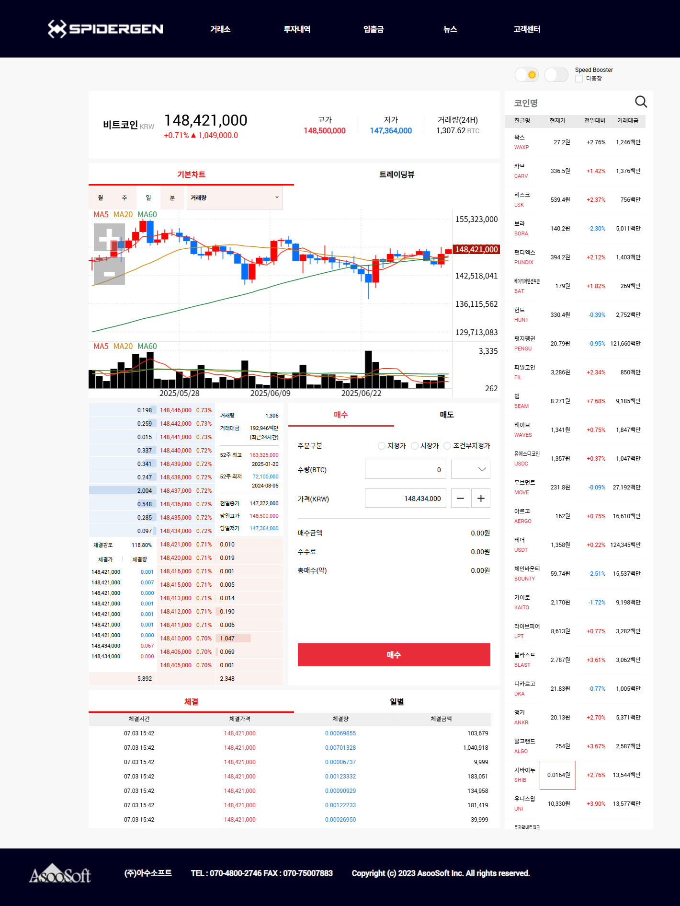

# 09. WTS 개발하기

### 화면 목록 및 구조  기획

화면목록

* 종목뷰: 개별 주식에 대한 상세 정보 제공
* 종목리스트: 관심종목이나 상위종목 등으로 구성된 목록
* 차트: 종목뷰에 세팅된 종목에 대한 데이터를 차트로 표현
* 호가: 현재 매수 및 매도 호가 및 확인
* 체결: 시간 및 일자별 거래 내역 조회
* 주문 관리: 매수 및 매도 거래를 효율적으로 수행

화면구조

예시) Spidergen 홈페이지 WTS 구조

<figure><figcaption><p>Spidergen WTS</p></figcaption></figure>

### [프로젝트 생성](../03-start-guide/01.md)

### [stock 프레임워크](../07-components/stock/) 추가

### 화면 구조 잡기

화면 구조는 화면 분할 후 사이즈 변경 가능여부에 따라&#x20;

1. Main Container createSplit

WtsSampleApp.js

<pre class="language-javascript"><code class="lang-javascript">onReady()
{
    super.onReady()
    this.displayMainPage()
}
   
displayMainPage()
{
    theApp.setMainContainer(new APage('main'))
    theApp.mainContainer.open()
    let cntrArr = theApp.mainContainer.createSplit(3, [25, -1, 25], 'column')
    cntrArr[0].setView('Source/MenuView.lay')
    cntrArr[2].setView('Source/StatusView.lay')
    
    theApp.mainNavi = new ANavigator('mainNavi', cntrArr[1])
    theApp.mainNavi.registerPage('Source/Main/Exchange.lay', 'exchange')
    theApp.mainNavi.registerPage('Source/Main/Investment.lay', 'investment')
    theApp.mainNavi.registerPage('Source/Main/Transactions.lay', 'transactions')
    theApp.mainNavi.registerPage('Source/Main/News.lay', 'news')
    theApp.mainNavi.registerPage('Source/Main/CustomerCenter.lay', 'customerCenter')
    
    cntrArr[0].getView().firstMenuClick()
    
    //Library/MainPage.js 를 사용하는 경우
    //theApp.setMainContainer(new MainPage('main'))
    //theApp.mainContainer.open()
<strong>}
</strong></code></pre>

Library/MainPage.js

```javascript
class MainPage extends APage
{
    constructor()
    {
        super()
    }
    
    onCreate()
    {
        super.onCreate()
        
        let cntrArr = this.createSplit(3, [25, -1, 25], 'column')
        cntrArr[0].setView('Source/MenuView.lay')
        cntrArr[2].setView('Source/StatusView.lay')
        
        let navi = new ANavigator('mainNavi', cntrArr[1])
        navi.registerPage('Source/Main/Exchange.lay', 'exchange')
        navi.registerPage('Source/Main/Investment.lay', 'investment')
        navi.registerPage('Source/Main/Transactions.lay', 'transactions')
        navi.registerPage('Source/Main/News.lay', 'news')
        navi.registerPage('Source/Main/CustomerCenter.lay', 'customerCenter')
        
        theApp.mainNavi = navi
        cntrArr[0].getView().firstMenuClick()
    }
```

Source/MenuView.js

```javascript
class MenuView extends AView
{
    constructor()
    {
        super()
    }
    
    init(context, evtListener)
    {
        super.init(context, evtListener)
    }
    
    firstMenuClick()
    {
        //exchange btn click 이벤트 호출
        this.exchange.reportEvent('click')
    }
    
    onMenuBtnClick(comp, info, e)
    {
        //mainNavi 에 등록된 화면 이동
        theApp.mainNavi.goPage(comp.getComponentId())
    }
}
```


2. Main Container View 로 로드한 MainView에서 화면 배치 및 로드\
   \- AView loadView\
   \- AView loadContainer 후 ANavigator registerPage\
   \- ATabView addTab

```javascript
onReady()
{
    super.onReady()
    
    this.displayMainPage()
}

displayMainPage()
{
    theApp.setMainContainer(new APage('main'))
    theApp.mainContainer.open('Source/MainView.lay')
}
```


MainView.lay


3. Main Container View 로 로드한 MainView에 SplitView를 올려놓고 createSplit

```javascript
// Some code
```

### 화면추가 및 로드

* 빌드하여 확인해보기

### 서버와의 통신 연결(HTTP, Websocket) 및 데이터 송수신

### AQuery 시스템 사용여부 결정 후 화면 개발
