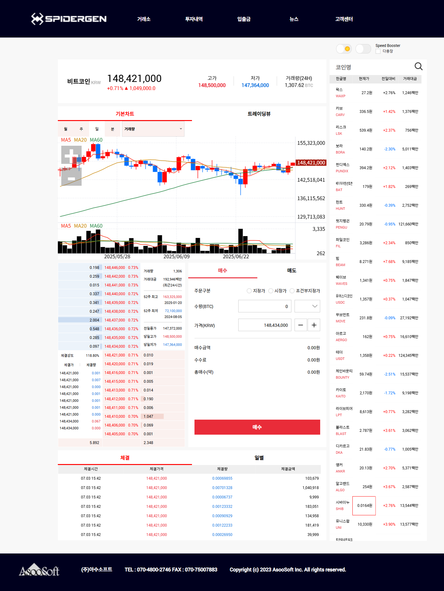

# 8. 종합

## 화면 목록 및 구조  기획

화면목록

* 종목뷰: 개별 주식에 대한 상세 정보 제공
* 종목리스트: 관심종목이나 상위종목 등으로 구성된 목록
* 차트: 종목뷰에 세팅된 종목에 대한 데이터를 차트로 표현
* 호가: 현재 매수 및 매도 호가 및 확인
* 체결: 시간 및 일자별 거래 내역 조회
* 주문 관리: 매수 및 매도 거래를 효율적으로 수행

화면구조

예시) Spidergen 홈페이지 WTS 구조

<figure><figcaption><p>Spidergen WTS</p></figcaption></figure>

## 개발

### [프로젝트 생성](../../03-start-guide/01.md)

### [stock 프레임워크](../../07-components/stock/) 추가 (매뉴얼은 [링크 ](../../07-components/stock/)참고)

### 화면 구조 잡기

화면 구조는 화면 분할 후 사이즈 변경 가능여부에 따라 다르게 처리합니다.

1. Main Container createSplit
2. Main Container View 로 로드한 MainView에서 화면 배치 및 로드
3. Main Container View 로 로드한 MainView에 SplitView를 올려놓고 createSplit

#### Main Container createSplit

WtsSampleApp.js

<pre class="language-javascript"><code class="lang-javascript">onReady()
{
    super.onReady()
    this.displayMainPage()
}
   
displayMainPage()
{
    theApp.setMainContainer(new APage('main'))
    theApp.mainContainer.open()
    let cntrArr = theApp.mainContainer.createSplit(3, [25, -1, 25], 'column')
    cntrArr[0].setView('Source/MenuView.lay')
    cntrArr[2].setView('Source/StatusView.lay')
    
    theApp.mainNavi = new ANavigator('mainNavi', cntrArr[1])
    theApp.mainNavi.registerPage('Source/Main/Exchange.lay', 'exchange')
    theApp.mainNavi.registerPage('Source/Main/Investment.lay', 'investment')
    theApp.mainNavi.registerPage('Source/Main/Transactions.lay', 'transactions')
    theApp.mainNavi.registerPage('Source/Main/News.lay', 'news')
    theApp.mainNavi.registerPage('Source/Main/CustomerCenter.lay', 'customerCenter')
    
    cntrArr[0].getView().firstMenuClick()
    
    //Library/MainPage.js 를 사용하는 경우
    //theApp.setMainContainer(new MainPage('main'))
    //theApp.mainContainer.open()
<strong>}
</strong></code></pre>

Library/MainPage.js

```javascript
class MainPage extends APage
{
    constructor()
    {
        super()
    }
    
    onCreate()
    {
        super.onCreate()
        
        let cntrArr = this.createSplit(3, [25, -1, 25], 'column')
        cntrArr[0].setView('Source/MenuView.lay')
        cntrArr[2].setView('Source/StatusView.lay')
        
        let navi = new ANavigator('mainNavi', cntrArr[1])
        navi.registerPage('Source/Main/Exchange.lay', 'exchange')
        navi.registerPage('Source/Main/Investment.lay', 'investment')
        navi.registerPage('Source/Main/Transactions.lay', 'transactions')
        navi.registerPage('Source/Main/News.lay', 'news')
        navi.registerPage('Source/Main/CustomerCenter.lay', 'customerCenter')
        
        theApp.mainNavi = navi
        cntrArr[0].getView().firstMenuClick()
    }
```

Source/MenuView.js

```javascript
class MenuView extends AView
{
    constructor()
    {
        super()
    }
    
    init(context, evtListener)
    {
        super.init(context, evtListener)
    }
    
    firstMenuClick()
    {
        //exchange btn click 이벤트 호출
        this.exchange.reportEvent('click')
    }
    
    onMenuBtnClick(comp, info, e)
    {
        //mainNavi 에 등록된 화면 이동
        theApp.mainNavi.goPage(comp.getComponentId())
    }
}
```

#### Main Container View 로 로드한 MainView에서 화면 배치 및 로드 - AView loadView - AView loadContainer 후 ANavigator registerPage - ATabView addTab

WtsSampleApp.js

```javascript
onReady()
{
    super.onReady()
    
    this.displayMainPage()
}

displayMainPage()
{
    theApp.setMainContainer(new APage('main'))
    theApp.mainContainer.open('Source/MainView.lay')
}
```


MainView.lay

<div align="left"><figure><figcaption></figcaption></figure></div>

MainView.js

```javascript
init(context, evtListener)
{
    super.init(context, evtListener)

    this.menuView.awaitLoadView().then(view => {
        theApp.menuView = view
        view.firstMenuClick()
    })

    this.naviView.loadContainer().then(cntr => {
        let navi = new ANavigator('mainNavi', cntr)
        navi.registerPage('Source/main/Exchange.lay', 'exchange')
        navi.registerPage('Source/main/Investment.lay', 'investment')
        navi.registerPage('Source/main/Transactions.lay', 'transactions')
        navi.registerPage('Source/main/News.lay', 'news')
        navi.registerPage('Source/main/CustomerCenter.lay', 'customerCenter')
        theApp.mainNavi = navi
    })
}
```

#### Main Container View 로 로드한 MainView에 SplitView를 올려놓고 createSplit

```javascript
init(context, evtListener)
{
    super.init(context, evtListener)

    this.splitView.createSplit(3, [25, -1, 25], 'column')
    this.splitView.setSplitView(0, 'Source/MenuView.lay')
    this.splitView.setSplitView(2, 'Source/StatusView.lay')
    
    const naviView = new AView()
    naviView.init()
    naviView.setStyleObj({
        left: 0, top: 0,
        width: '100%',
        height: '100%',
    })
    this.naviView = naviView
    this.splitView.setSplitView(1, naviView)
    this.naviView.loadContainer().then(cntr => {
        let navi = new ANavigator('mainNavi', cntr)
        navi.registerPage('Source/main/Exchange.lay', 'exchange')
        navi.registerPage('Source/main/Investment.lay', 'investment')
        navi.registerPage('Source/main/Transactions.lay', 'transactions')
        navi.registerPage('Source/main/News.lay', 'news')
        navi.registerPage('Source/main/CustomerCenter.lay', 'customerCenter')
        theApp.mainNavi = navi
    })
}
```

### 화면추가 및 로드

main, view 폴더 추가

<figure><figcaption></figcaption></figure>

main, view 폴더내에화면추가

<figure><figcaption></figcaption></figure>

main 폴더에 추가할 파일목록

* Source/main/Exchange
* Source/main/Investment
* Source/main/Transactions
* Source/main/News
* Source/main/CustomerCenter

view 폴더에 추가할 파일목록

* Source/view/ItemInfoView
* Source/view/ItemListView
* Source/view/ChartView
* Source/view/HogaView
* Source/view/OrderView
* Source/view/CnclView

Exchange.lay

흰색 사각형 안의 스타일을 GridLayou 와 프로퍼티에 적용

<figure><figcaption></figcaption></figure>

Exchange.js

```javascript
init(context, evtListener)
{
    super.init(context, evtListener)
    
    this.itemInfoView.loadContainer('Source/view/ItemInfoView.lay', 'ItemInfoView').then(cntr => {
        this.itemInfoView = cntr.getView()
    })
    this.itemListView.loadContainer('Source/view/ItemListView.lay', 'ItemListView')
    this.chartView.loadContainer('Source/view/ChartView.lay', 'ChartView')
    this.hogaView.loadContainer('Source/view/HogaView.lay', 'HogaView')
    this.orderView.loadContainer('Source/view/OrderView.lay', 'OrderView')
    this.cnclView.loadContainer('Source/view/CnclView.lay', 'CnclView')
}
```

## 서버와의 통신 연결(HTTP, Websocket) 및 데이터 송수신


샘플 프로젝트에서는 업비트의 Open API를 사용합니다.


### RestAPI 사용

Define.js

```javascript
var Define = {
    SERVER_ADDR_REST : 'https://api.upbit.com/v1/',
    SERVER_ADDR_WEBSOCKET : 'api.upbit.com/websocket/v1',
}
```


WtsSampleApp.js

```javascript
sendAPI(url)
{
    return new Promise((resolve, reject) => {
        fetch(`${Define.SERVER_ADDR_REST}${url}`).then(response => {
            if (!response.ok) {
                throw new Error('Network response was not ok');
            }
            return response.json();
        }).then(data => {
            // this.onReceived(data, packetId);
            console.log(data);
            resolve(data);
        }).catch(error => {
            //console.error('api error', error);
            reject(error);
        });
    })
}

getCoinInfo()
{
    if(!theApp.masterArr) return;
    for(let idx in theApp.masterArr)
    {
        const info = theApp.masterArr[idx];
        if(info.market == code)
        {
            return info;
        }
    }
}

displayMainPage()
{
    this.sendAPI('market/all?is_details=true')
    .then(dataArr => {
        theApp.masterArr = dataArr; //전체 코인 목록저장
        theApp.setMainContainer(new APage('main'))
        theApp.mainContainer.open('Source/MainView.lay')
    })
    .catch(e => {
        
    });
}
```

### Websocket 연결 및 데이터 요청


웹소켓을 사용하는 경우 요청한 함수 또는 화면에 수신한 데이터를 전달하기 위한 처리작업이 필요합니다.


프로젝트 트리뷰에서 Framework > sys 우클릭 > Default Load Settings.. 설정창 열고\
Library > NetworkIO.js, WebsocketIO.js 선택하여 기본 로드처리


#### Websocket 연결하기

WTSSampleApp.js

```javascript
onReady()
{
    super.onReady();

    //this.displayMainPage();
    this.realFuncObj = {};
    this.realDataObj = {};
    this.textDecoder = new TextDecoder();
    this.connectSocketServer();
}

connectSocketServer()
{
    if(!theApp.nio) theApp.nio = new WebsocketIO(this, true)
    theApp.nio.startIO(Define.SERVER_ADDR_WEBSOCKET)
}

onConnected(success)
{
    let style = 'padding:30px; color: white; background-color: black;'
    console.log('%c-----> 소켓 연결 %s', style, success)

    if(success) {
        theApp.nio.setHeartbeat(null)
        if(!theApp.mainContainer) this.displayMainPage()
    } else {
        theApp.connectSocketServer()
    }
}

onClosed()
{
    let style = 'padding:30px; color: white; background-color: black;'
    console.log('%c-----> 소켓 끊어짐', style)
    
    //3초 후 재접속처리. 재접속된 경우 화면갱신필요
    setTimeout(() => { theApp.connectSocketServer(); }, 3000);
}
```


전송 및 수신 함수 생성

```javascript
onReceived(data, size)
{
    let msg = textDecoder.decode(new Uint8Array(data))
    msg = [JSON.parse(msg)]
    const ty = msg[0].ty, cd = msg[0].cd
    let tmp = this.realFuncObj[ty]
    if(tmp && tmp[cd]) {
        this.realDataObj[ty][cd] = msg;
        tmp[cd].forEach(listener => listener.onReceived(msg))
    }
}

sendTran(name, codeArr, listener, sendType)
{
    if(!codeArr.length) return
    if(sendType == undefined) sendType = 3

    let obj = this.realFuncObj[name],
        codeArrForSend = codeArr.slice(),
        codeArrForReal = []

    if(sendType != 1) {
        codeArrForReal = codeArr.slice()
        if(!obj) {
            obj = this.realFuncObj[name] = {}
            this.realDataObj[name] = {}
        } else if(sendType == 2) {
            let code
            for(let i=codeArrForReal.length; i>-1; i--) {
                code = codeArrForReal[i]
                if(obj[code]) {
                    if(obj[code].indexOf(listener)<0) obj[code].push(listener)
                    listener.onReceived(this.realDataObj[name][code])
                    codeArrForReal.splice(i, 1)
                }
            }
            //등록할 리얼이 없다면 전송하지 않는다.
            if(!codeArrForReal.length) return
        }
    }

    const sendArr = []
    sendArr.push({"ticket": 'Test0_'+Date.now()})
    //조회 요청하는 항목이 있는 경우
    if(sendType&1) {
        sendArr.push({
            type: name,
            codes: codeArrForSend,
            is_only_snapshot: sendType==1,
        });
    }

    let realCodeArr = Object.keys(obj)
    if(sendType==2) realCodeArr = realCodeArr.concat(codeArrForReal)
    else if(sendType==3) {
        //조회+리얼 인 종목 제거 후 실시간만 요청할 목록
        for(let i=realCodeArr.length-1; i>-1; i--) {
            if(codeArrForSend.indexOf(realCodeArr[i]) > -1) realCodeArr.splice(i,1)
        }
    }

    if(realCodeArr.length) {
        //이전까지 실시간 데이터 요청했던 종목 포함하여 다시 전달
        for(let trName in this.realFuncObj) {
            sendArr.push({
                type: trName,
                codes: trName==name?realCodeArr:Object.keys(this.realFuncObj[trName]),
                is_only_realtime: true
            })
        }
    }
    sendArr.push({format: "SIMPLE"})
    
    theApp.nio.sendData(JSON.stringify(sendArr), function(e) {
        console.error('SEND FAIELD', e)
    })

    codeArr.forEach(code => {
        if(!obj[code]) obj[code] = [listener];
        else if(obj[code].indexOf(listener) < 0) obj[code].push(listener)
    })
}
```


ItemInfoView.lay

EXItemView 추가, id itemView로 세팅, change 이벤트 등록

<figure><figcaption></figcaption></figure>

컴포넌트에 name 속성 셋팅

tp: 현재가, scp: 전일대비값, scr: 전일대비등락율, hp: 고가, lp: 저가, atv24h: 24시간누적거래량

<figure><figcaption></figcaption></figure>


ItemInfoView.js 데이터 수신 처리 함수 작성

<pre class="language-javascript"><code class="lang-javascript"><strong>constructor()
</strong>{
    super()
    this.listenerArr = [] //종목 변경시 수신할 리스너 목록 저장
}

init(context, evtListener)
{
    super.init(context, evtListener)
    //임시로 종목 하드코딩하여 전송처리
    this.setItemInfo(['KRW-BTC', '비트코인'], true);
}

setItemInfo(itemInfo, isReport)
{
    this.itemView.setItemInfo(itemInfo, isReport);
}

getItemInfo()
{
    return this.itemView.getItemInfo();
}

onItemViewChange(comp, info, e)
{
    if(this.itemInfo) theApp.unregReal('ticker', [this.itemInfo[0]], this);

    this.itemInfo = comp.getItemInfo();
    theApp.sendTran('ticker', [this.itemInfo[0]], this)

    this.listenerArr.forEach(listener => {
        if(listener.onItemViewChange) listener.onItemViewChange();
    })
}

onReceived(msg)
{
    this.setMarketData(msg[0])
}

setMarketData(data)
{
    const coinInfo = theApp.getCoinInfo(data.cd)
    this.nameLbl.setText(coinInfo.korean_name)
    this.tri.setData(data.scp > 0?2:5)
    this.marketLbl.setText(data.cd.replace(/[\s\S]*?-/, ''))
    this.setData(data)
}
</code></pre>

Build, Run 하여 확인

<figure><figcaption></figcaption></figure>


### [Query 시스템](<../../Guide for SpiderGen/05  Advanced/02  I O System.md>)


아래 내용에는 RestAPI 를 QueryManager로 송수신하기 위한 내용은 들어있지 않으니 샘플 소스를 참고해주세요.



Query 시스템 사용시 위의 RestAPI, Websocket 을  단독으로 사용할 때와는 다르게 컴포넌트에 필드를 매핑할 수 있습니다.&#x20;


프로젝트 트리뷰에서 Framework > sys 우클릭 > Default Load Settings.. 설정창 열고\
Library > AQuery.js, AQueryData.js, QueryManager.js 등선택하여 기본 로드처리

<div align="left"><figure><figcaption></figcaption></figure></div>


1. [qry 파일생성](<../../Guide for SpiderGen/05  Advanced/02  I O System/C  Query 파일 생성과 데이터 송수신.md>)

* ticker.qry

<figure><figcaption></figcaption></figure>

```json
{
    "name": "ticker",
    "queryType": "쿼리 타입",
    "desc": "현재가",
    "input": {
        "InBlock1": {
            "format": [
                ["market 코드","codes","","","char",0,0]
            ]
        }
    },
    "output": {
        "OutBlock1": {
            "format": [
                ["시장코드","market","","","char",0,0],
                ["마켓 코드","cd","","","char",0,0],
                ["시가","op","","","char",0,0],
                ["고가","hp","","","char",0,0],
                ["저가","lp","","","char",0,0],
                ["현재가","tp","","","char",0,0],
                ["종가","pcp","","","char",0,0],
                ["전일 대비","c","","","char",0,0],
                ["부호 없는 전일 대비 값","cp","","","char",0,0],
                ["전일 대비 값","scp","","","char",0,0],
                ["부호 없는 전일 대비 등락율","cr","","","char",0,0],
                ["전일 대비 등락율","scr","","","char",0,0],
                ["가장 최근 거래량","tv","","","char",0,0],
                ["누적 거래량(UTC 0시 기준)","atv","","","char",0,0],
                ["24시간 누적 거래량","atv24h","","","char",0,0],
                ["누적 거래대금(UTC 0시 기준)","atp","","","char",0,0],
                ["24시간 누적 거래대금","atp24h","","","char",0,0],
                ["최근 거래 일자(UTC)","tdt","","","char",0,0],
                ["최근 거래 시각(UTC)","ttm","","","char",0,0],
                ["체결 타임스탬프 (milliseconds)","ttms","","","char",0,0],
                ["매수/매도 구분","ab","","","char",0,0],
                ["누적 매도량","aav","","","char",0,0],
                ["누적 매수량","abv","","","char",0,0],
                ["52주 최고가","h52wp","","","char",0,0],
                ["52주 최고가 달성일","h52wdt","","","char",0,0],
                ["52주 최저가","l52wp","","","char",0,0],
                ["52주 최저가 달성일","l52wdt","","","char",0,0],
                ["거래상태","ms","","","char",0,0],
                ["거래지원 종료일","dd","","","char",0,0],
                ["유의 종목 여부","mw","","","char",0,0],
                ["타임스탬프 ","tms","","","char",0,0],
                ["스트림 타입 ","st","","","char",0,0]
            ]
        }
    }
}
```


2. ItemInfoView.lay 화면 매핑

ticker 로 수신한 데이터 중 EXTriangle 에 매핑할 정보가 없어 \[User Field] 버튼으로 cs 필드명을 임의로 지정하고 수신되는 데이터에 `block.cs = scp>0?2:5` (양수:  상승, 음수: 하락) 값을 저장처리

<figure><figcaption></figcaption></figure>

<figure><figcaption></figcaption></figure>

3. QueryManager 상속클래스 생성

* Library/RealQueryManager.js 파일생성

```javascript
class RealQueryManager extends QueryManager
{
    constructor(name)
    {
        super(name)

        this.addQueryListener(this);
        this.textDecoder = new TextDecoder();
        this.realDataObj = {ticker: {}};
    }

    onReceived(data)
    {
        let msg = this.textDecoder.decode(new Uint8Array(data));
        msg = JSON.parse(msg);

        if(msg.st == 'SNAPSHOT') this.queryProcess({body:{OutBlock1:[dataObj]}});
        else this.realProcess(msg);
        
        //마지막 실시간 데이터 저장
        this.realDataObj[msg.ty][msg.cd] = msg;
    }

    //	onReceive 함수 내에서 패킷 타입에 따라 분기하여 호출되는 함수
    realProcess(recvObj)
    {
        if(recvObj.error) {
            console.error(recvObj.error);
            return;
        }

        var qryName = recvObj.ty,
            aquery = AQuery.getQuery(qryName), 
            queryData = null;
        
        queryData = this.makeQueryData(aquery);
        queryData.outBlockData({'body':{'OutBlock1':[recvObj]}});
        this.realDataToComp(recvObj.cd, queryData);
    }

    // makeQueryData(aquery, isSend)
    // {
    // 	return new RealQueryData(aquery, isSend);
    // }

    onConnected(success)
    {
        let style = 'padding:30px; color: white; background-color: black;';
        console.log('%c-----> 소켓 연결 %s', style, success);

        theApp.onConnected(success);
    }

    onClosed()
    {
        AIndicator.hide();
        let style = 'padding:30px; color: white; background-color: black;';
        console.log('%c-----> 소켓 끊어짐', style);

        theApp.onClosed();
    }

    /**
     * 업비트 리얼데이터는 등록,해제 방식이 아님.
     * 리얼 요청 앞뒤로 티켓필드와 포맷필드가 필요.
     * [{Ticket Field},{Type Field},....,{Type Field},{Format Field}]
     * 
     * 요청을 보내면 이전에 요청중이던 모든것이 날라가버리므로
     * 기존에 요청했던 항목들을 가지고 있다가 갱신해줘야한다.
     * 
     * 참고로 모두다 해제는 Type Field가 없으면 된다.
     * [{Ticket Field},{Format Field}]
     */
    async registerReal()
    {
        if(!theApp.useQuerySystem) return;
        
        await super.registerReal.apply(this, arguments);
    }

    sendRealSet(aquery, isSet, regArr)
    {
        const qryName = aquery.getName();
        const sendArr = [];
        sendArr.push(this.getTicket());
        
        if(isSet) {
            if(!this.realTypeMap[qryName]) this.realTypeMap[qryName] = [];
            regArr.forEach(item => {
                if(!this.realTypeMap[qryName].includes(item)) {
                    this.realTypeMap[qryName].push(item);
                }
            });
        } else {
            this.realTypeMap[qryName] = this.realTypeMap[qryName].filter(item => !regArr.includes(item));
            //일단 해제는 전송은 안함. 새로 등록할때 갱신됨
            return;
        }

        const typeArr = this.makeRealType();
        if(typeArr.length > 0) sendArr.push(...this.makeRealType());
        sendArr.push({ "format": "SIMPLE" });
        
        //console.log(sendArr);
        this.sendBufferData(JSON.stringify(sendArr));
    }

    makeTicket()
    {
        this.ticket = 'spider_'+new Date().getTime();
        this.realTypeMap = {};
    }

    makeRealType()
    {
        const arr = [];
        for(let qryName in this.realTypeMap) {
            if(!this.realTypeMap[qryName] || this.realTypeMap[qryName].length == 0) continue;
            arr.push({
                "type" : qryName,
                "codes" : this.realTypeMap[qryName],
                "isOnlyRealtime" : true
            });
        }
        return arr;
    }

    getTicket()
    {
        if(!this.ticket) this.makeTicket();
        //return {"ticket":this.ticket}
        return {"ticket":this.ticket+'_'+ this.makePacketId()}
    }
}
```

4. 서버와 connect

* WTSSampleApp.js

```javascript
constructor()
{
    super()

    //...
    this.useQuerySystem = true; //useQuerySystem 변수 추가
}

connectSocketServer()
{
    AIndicator.beginOltp();

    if(!theApp.useQuerySystem) {
        if(!theApp.nio) theApp.nio = new WebsocketIO(this, true);
        theApp.nio.startIO(Define.SERVER_ADDR_WEBSOCKET);
    } else {
        if(!theApp.qmReal) {
            this.qmReal = new RealQueryManager();
            theApp.nio = new WebsocketIO(this.qmReal, true);
            this.qmReal.setNetworkIo(theApp.nio);
        }

        theApp.qmReal.startManager(Define.SERVER_ADDR_WEBSOCKET);
    }
}
```

5. 데이터 요청 및 수신된 데이터 커스텀

* ItemInfoView.js

```javascript
onItemViewChange(comp, info, e)
{
    if(this.itemInfo) {
        theApp.unregReal('ticker', [this.itemInfo[0]], this);
        theApp.qmReal.unregisterReal('ticker', [this.itemInfo[0]], this.realGrp);
    }

    this.itemInfo = comp.getItemInfo();

    theApp.sendAPI(`ticker?markets=${this.itemInfo[0]}`)
    .then(dataArr => {
        const data = dataArr[0];
        
        for(let key in data) {
            data[key.replace(/(?:^|_)([a-zA-Z])[^_]*|_/g, '$1')] = data[key]
        }
            
        data.cd = data.market
        data.row_data = data
        data.market_korean = theApp.getCoinInfo(data.cd).korean_name;
        data.market_name = data.cd.replace(/[\s\S]*?-/, '');
        data.cs = data.signed_change_price>0?2:5;
        
        this.setData(data);

        if(!theApp.useQuerySystem) theApp.sendTran('ticker', [this.itemInfo[0]], this)
        else {
            theApp.qmReal.registerReal('ticker', 'cd', [this.itemInfo[0]], this.realGrp, 0, queryData => {
                let block = queryData.getBlockData('OutBlock1')[0];
                block.cs = block.scp>0?2:5;
            });
        }
    })
    .catch(e => {
        
    });

    this.listenerArr.forEach(listener => {
        if(listener.onItemViewChange) listener.onItemViewChange();
    })
}
```


## WTS 샘플 프로젝트



