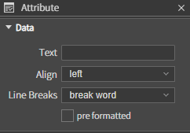
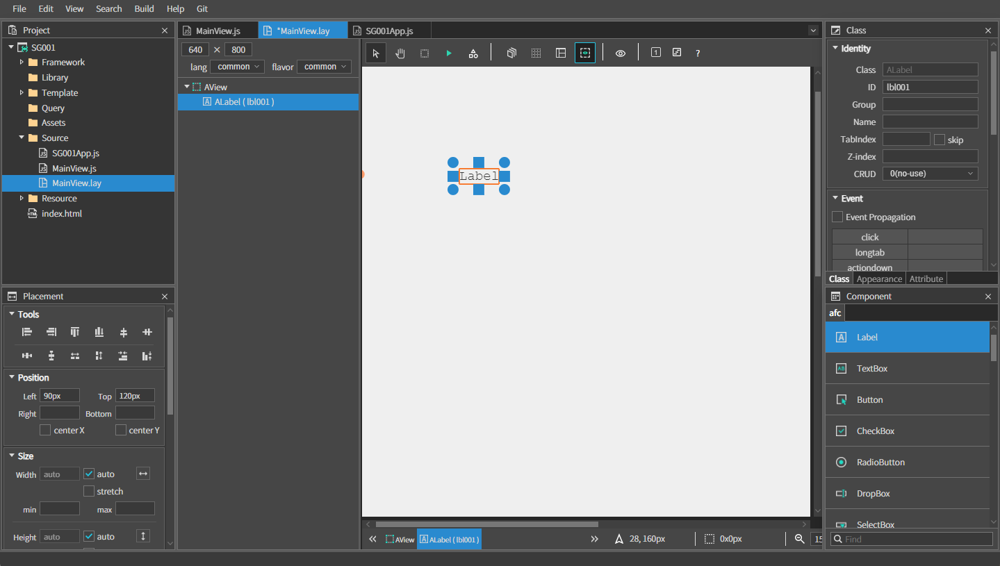
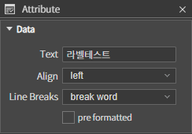
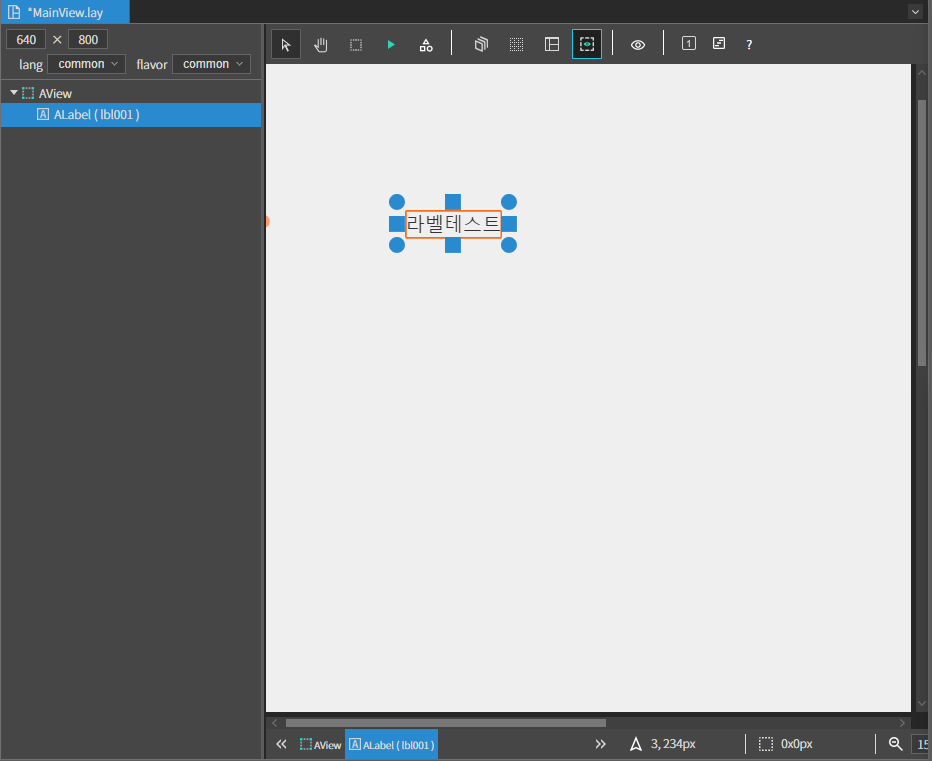
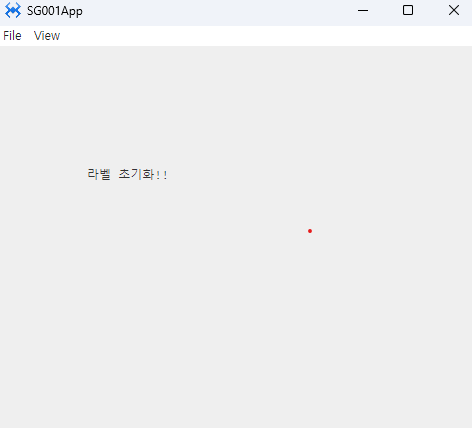
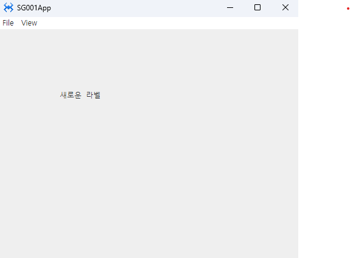
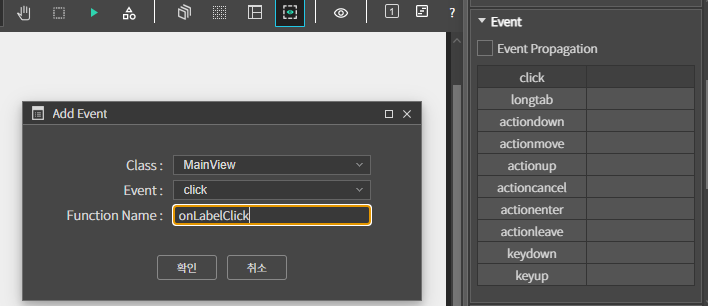

# Label


텍스트를 출력하고 정렬 및 줄바꿈 옵션을 설정할 수 있는 컴포넌트

### Appearance

공통 Appearance 는 [**6. Global Properties**](<../../Guide for SpiderGen/06  SpiderGen Editor/04  Properties Pane/02 Appearence.md>) 속성을 참고

### Attribute

Label 속성



**Data**

레이블의 텍스트 및 텍스트 정렬을 설정하는 속성

| **이름**                       | **설명**                   |
| ---------------------------- | ------------------------ |
| **`Text`**                   | 레이블의 텍스트를 설정하는 속성        |
| **`Align`**                  | 레이블 텍스트의 정렬을 설정하는 속성     |
| **`Align-left`**             | 텍스트를 좌측 정렬               |
| **`Align-center`**           | 텍스트를 가운데 정렬              |
| **`Align-right`**            | 텍스트를 우측 정렬               |
| **`Line Breaks`**            | 레이블의 텍스트 줄바꿈 옵션을 설정하는 속성 |
| **`Line Breaks-break word`** | 단어 단위로 줄바꿈을 실행           |
| **`Line Breaks-break all`**  | 글자 단위로 줄바꿈을 실행           |

**pre formatted**

텍스트의 공백과 줄바꿈이 HTML에서 일반적으로 무시되는 것과 달리, 입력된 그대로 화면에 표시

### Example

**1. 프로젝트 생성**

* 프로젝트 트리뷰에서 Source > MainView.lay 파일을 클릭
* MainView의 레이아웃 파일이 오픈되면 컴포넌트 리스트에서 Label 컴포넌트를 선택하고 드래그하여 아래와 같이 레이아웃에 배치
* Class 에서 ID를 lbl001로 입력
* 


**2. Attribute 텍스트 설정**

* Attribute 에서 Data 항목을 다음과 같이 설정
* Text : 라벨테스트




* 레이아웃에 레이블의 Display를 확인
* 

**3. 텍스트 설정**

* 먼저 MainView.js 파일을 오픈
* 상단의 파일탭에서 MainView.lay 탭을 더블 클릭하거나 우측의 프로젝트 트리에서 MainView.js 파일을 더블 클릭
* 모든 화면뷰는 onInitDone() 함수가 존재하며 이 함수는 화면이 생성될 때 딱 한번 실행
* onInitDone() 함수에서 레이블의 텍스트 내용을 아래와 같이 코드를 입력

```javascript
onInitDone()
{
	super.onInitDone()
	// setText or setHtml
	this.lbl001.setText("라벨 초기화!!");
	// this.lbl001.setHtml("라벨 초기화!!");
}
```

| 이름                  | 설명              |
| ------------------- | --------------- |
| **`setText(text)`** | 텍스트를 세팅         |
| **`setHtml(html)`** | 라벨에 html 태그를 세팅 |

**4. 프로젝트 실행**

* 레이블의 텍스트가 바뀌어서 출력 되는 것을 확인



**5. 코드로 라벨 생성**

* 먼저 MainView.js 파일을 오픈
* onInitDone() 함수에서 아래와 같이 코드를 입력

```javascript
onInitDone()
{
	super.onInitDone()
	let label = new ALabel(); // ALabel 컴포넌트 생성
	label.init(); // AComponet 또는 그 하위 클래스의 인스턴스를 사용할 때는 반드시 init 메서드 호출
	label.setText('새로운 라벨');
	this.addComponent(label); // 레이아웃에 ALabel 추가
	label.setPos(100,100); // 원하는 위치에 배치 setPost(x: any, y: any)
}
```



Build 에러발생시 처리

_**프로젝트 트리뷰에서 Framework > afc 우클릭 > Default Load Settings... > Component > ALabel.js 체크**_

### Event

**Tool 이벤트 설정**

* Class 에서 아래로 스크롤 > Event 더블 클릭 > 확인
* 

```javascript
onLabelClick(comp, info, e)
{
	//TODO:edit here
	console.log("라벨 클릭");
}
```
