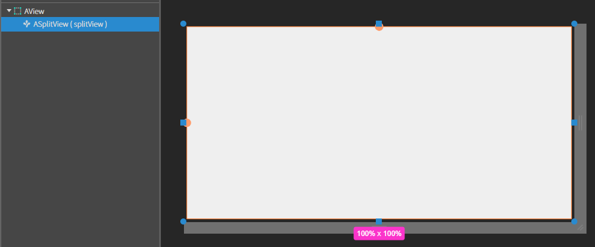
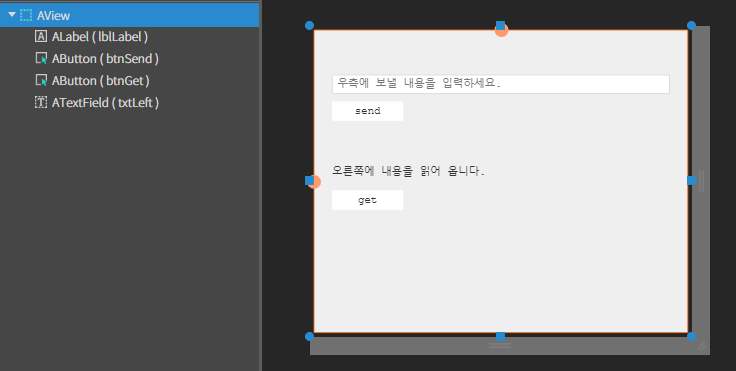
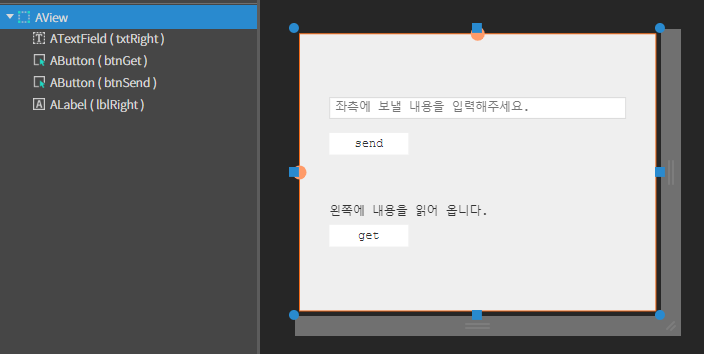

# SplitView


<div align="left"><figure><figcaption></figcaption></figure></div>

두 개 이상의 View 를 원하는 크기로 분할하여 담을 수 있는 컴포넌트

### Example

* **Source 폴더 아래 Views 폴더 생성하고 이름 LeftView, RightView로 지정**

<div align="left"><figure><figcaption></figcaption></figure></div>


* MainView.lay에 SplitView 컴포넌트 추가 -> ID값 지정(ex: splitView)




* **MainView.js 수정**

```javascript
constructor()
{
    super()

    //TODO:edit here

    this.leftView =  null;
    this.rightView =  null;

}

onInitDone() 
{ 

    //스플릿 생성 
    this.splitView.createSplit(2, [-1, -1], 'row');

    //스플릿에 뷰 설정  
    this.leftView = this.splitView.setSplitView(0, 'Source/Views/LeftView.lay');     
    this.rightView = this.splitView.setSplitView(1, 'Source/Views/RightView.lay');     

}; 
```


* **LeftView.lay에 컴포넌트 배치**

| component  | id      | text            | placeholder       |
| ---------- | ------- | --------------- | ----------------- |
| ATextField | txtLeft |                 | 우측에 보낼 내용을 입력하세요. |
| ALabel     | lblLeft | 오른쪽 내용을 읽어 옵니다. |                   |
| AButton    | btnSend | send            |                   |
| AButton    | btnGet  | get             |                   |



**7. RightView.lay 컴포넌트 배치**

| component  | id       | text           | placeholder       |
| ---------- | -------- | -------------- | ----------------- |
| ATextField | txtRight |                | 좌측에 보낼 내용을 입력하세요. |
| ALabel     | lblRight | 왼쪽 내용을 읽어 옵니다. |                   |
| AButton    | btnSend  | send           |                   |
| AButton    | btnGet   | get            |                   |




* **LeftView.js 수정**

```javascript
constructor()
{
    super()

    //TODO:edit here

    
    this.mainView =  null;
    this.rightView =  null;

}

onInitDone() 
{ 
    //메인뷰 설정 
    this.mainView = this.getContainer().getView();     

    this.rightView = this.mainView.splitView.getSplitView(1);     

}; 


onBtnSendClick(comp, info, e)
{

    let sendTxt = this.txtLeft.getText(); 

    if(!sendTxt || sendTxt.length < 1){ 

        AToast.show('전송할 내용을 입력하세요.'); 
        return; 
    } 

    this.rightView.lblRight.setText(sendTxt); 

}

onBtnGetClick(comp, info, e)
{

    let getTxt = this.rightView.txtRight.getText(); 

    if(!getTxt || getTxt.length < 1) 
    { 
        AToast.show('입력된 내용이 없습니다.'); 
        return; 
    } 

    this.lblLeft.setText(getTxt); 

}
```

**9. LeftView.js 수정**

```javascript
...

onInitDone() 
{ 
    //메인뷰 설정 
    this.mainView = this.getContainer().getView();     
 
    this.rightView = this.mainView.splitView.getSplitView(1);     
 
}; 
 
...
```

* **`getContainer()`** 함수는 현재뷰의 최상위 컨테이너를 리턴해줍니다. 따라서 현재 프로젝트가 싱글뷰이므로 main 컨테이너가 리턴됩니다. getView() 메서드는 해당 컨테이너의 뷰를 리턴합니다. 따라서 main 컨테이너의 뷰인 메인뷰가 리턴됩니다.
* 멤버변수 rightView에는 MainView에 있는 splitView를 통해서 나누어진 뷰들 중 두번째 뷰를 얻어 저장합니다.

**10. LeftView의 Send 버튼 클릭 이벤트 설정**

```javascript
...

onBtnSendClick(comp, info, e) 
{ 
 
    let sendTxt = this.txtLeft.getText(); 
 
    if(!sendTxt || sendTxt.length < 1){ 
 
        AToast.show('전송할 내용을 입력하세요.'); 
        return; 
    } 
 
    this.rightView.lblRight.setText(sendTxt); 
 
};  

...
```

**11. LeftView의 get 버튼 클릭 이벤트 설정**

```javascript
...

onBtnGetClick(comp, info, e) 
{ 
 
    let getTxt = this.rightView.txtRight.getText(); 
 
    if(!getTxt || getTxt.length < 1) 
    { 
        AToast.show('입력된 내용이 없습니다.'); 
        return; 
    } 
 
    this.lblLeft.setText(getTxt); 
 
}; 
 
...
```

**12. RightView.js 설정**

* 먼저 멤버변수를 추가

```javascript
...

constructor()
{
	super()
	
	this.mainView =  null;
} 

...
```

**13. RightView.js에 MainView를 설정**

```javascript
...

onInitDone() 
{ 
    this.mainView = this.getContainer().getView();
    this.leftView =  this.mainView.splitView.getSplitView(0);     
};  
...
```

**14. RightView의 send 버튼 클릭 이벤트 설정**

* LeftView의 send버튼 기능 구현과 RightView 기능 구현 차이를 확인

```javascript
...

onBtnSendClick(comp, info, e) 
{ 
 
    let sendTxt = this.txtRight.getText(); 
 
    if(!sendTxt || sendTxt.length < 1){ 
        AToast.show('전송할 내용을 입력하세요.'); 
        return; 
    } 
 
    this.leftView.lblLeft.setText(sendTxt); 
 
}; 

...
```

**15. RightView의 get 버튼 클릭 이벤트 설정**

```javascript
...

onBtnGetClick(comp, info, e) 
{ 
    let getTxt =  this.leftView.txtLeft.getText();
 
    if(!getTxt || getTxt.length < 1){ 
        AToast.show('입력된 내용이 없습니다.'); 
        return; 
    } 
 
    this.lblRight.setText(getTxt); 
}; 
 
...
```

**16. 프로젝트 실행**

* 좌우측에 텍스트 필드에 각각 내용을 입력하고 send 버튼을 클릭
* 서로 상대편의 레이블에 내용이 잘 출력되는 확인
* 이번에는 각 뷰의 get 버튼을 클릭
* 서로 상대편의 텍스트 필드 내용을 잘 가져오는지 확인
