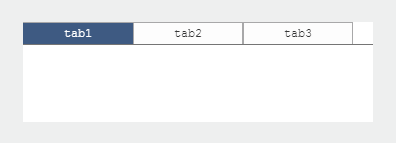
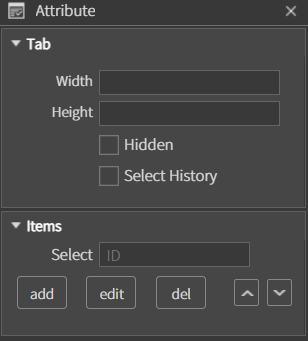
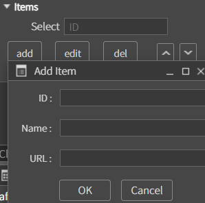
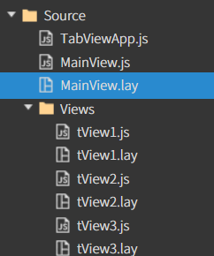
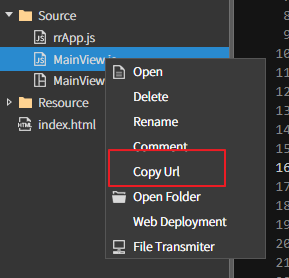
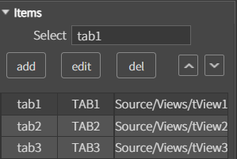
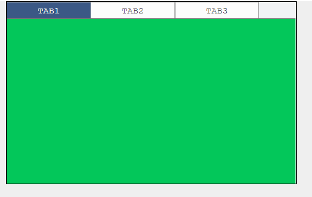
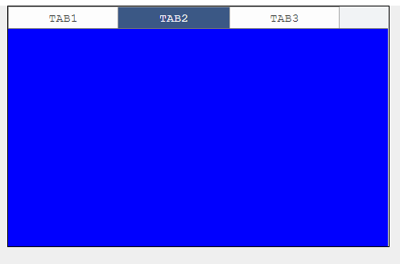
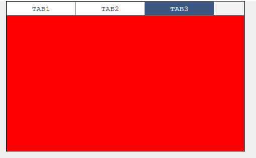
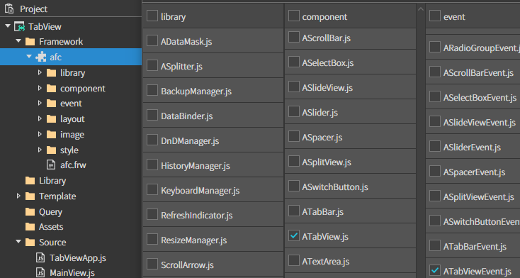

# TabView

<div align="left"></div>

탭을 클릭하여 서로 다른 콘텐츠로 전환하는 UI 컴포넌트.

### Appearance

<div align="left"></div>

**Tab**

* **Width** 탭의 가로 사이즈를 지정하는 속성입니다.
* **Height** 탭의 높이를 지정하는 속성입니다.
* **Hidden** 탭의 name UI를 숨기는 속성입니다.
* **Select History** 탭 전환 시 사용자의 탭 선택 기록을 저장하는 속성입니다.

**Items**

<div align="left"></div>

* **Select** 탭뷰 중 기본적으로 선택될 탭아이디를 설정하는 속성입니다.
* **edit** 탭의 설정 내용을 수정하는 속성입니다.
* **del** 선택한 탭을 삭제합니다.
* **add** 탭뷰를 추가하는 속성입니다.

<div align="left"></div>

* **ID** 탭을 구분하기 위한 ID 입니다.
* **Name** 탭에 표시될 텍스트 입니다.
* **URL** 탭과 매칭될 탭뷰의 URL 입니다.

### Example

**컴포넌트 생성 예제**

* TabView 컴포넌트 생성하고 ID값 mainTabView로 지정

<figure><figcaption></figcaption></figure>

* MainView.lay에ATabView 생성하고 ID값 지정(ex:mainTabView)

<div align="left"><figure><figcaption></figcaption></figure></div>


* 새로운 폴더를 생성해서 TabView에 표시할 화면 추가
* Views 폴더에 SubView 생성 (파일명은 사용자 지정)

<div align="left"><figure><figcaption></figcaption></figure> </div>


* 추가한 화면의 색을 각각 다르게 설정합니다.
* MainView의 tabView 컴포넌트 Appearance > Items에 위에서 생성한 tView를 추가하고 Select에 tab1을 추가합니다.
* Url은 CopyUrl 을 사용해서 복사할 수 있습니다.

<div align="left"> </div>


* 코드를 생성하여 tabview에 표시할SubView 추가.
* 서브뷰 구조 변경 및 TabView Items 설정.(label 컴포넌트 생성해서 view 별로이름 지정)

<div align="left"><figure><figcaption></figcaption></figure> <figure><figcaption></figcaption></figure> <figure><figcaption></figcaption></figure></div>


<div align="left"> </div>

* 생성한 tView의 경로를 복사
* MainView.lay에 생성한 tabView 컴포넌트 > Attribute > items에 생성한 tView를 추가하고 Select에 tab1 추가.
  * Select로 지정한 view는 메인 화면으로 지정.


```
onInitDone()
{
	super.onInitDone()

	// 탭 추가
	this.mainTabView.addTab('Tab 1', 'Source/Views/tView1.lay', 'tab1');
	this.mainTabView.addTab('Tab 2', 'Source/Views/tView2.lay', 'tab2');
	this.mainTabView.addTab('Tab 3', 'Source/Views/tView3.lay', 'tab3');
	
	this.tabView.selectTabById('tab1')
	
} 
```


4. **프로젝트 실행.**

  


### JavaScript를 사용하여 TabView를 생성하는 예제

**1. Framework 추가**

* Framework의 afc에서 ATabView.js + ATabViewEvent.js 추가.



<div align="left"></div>


* MainView.js 수정

```
onInitDone() 
{
        super.onInitDone()
        // ATabView 객체 생성
        const tabView = new ATabView();
        tabView.init();// 탭 뷰 초기화
        tabView.setSize('100%', '100%');// 탭 뷰 크기 설정 (전체 화면 크기)
        tabView.setPos(0, 0);// 탭 뷰 위치 설정 (좌상단 위치로 설정)


        // 탭 추가: 탭 이름, 해당 탭에 로드될 레이아웃 파일 경로, 탭의 고유 ID
        tabView.addTab('Tab 1', 'Source/Views/tView1.lay', 'tab1');
        tabView.addTab('Tab 2', 'Source/Views/tView2.lay', 'tab2');
        tabView.addTab('Tab 3', 'Source/Views/tView3.lay', 'tab3');
        // 첫 번째 탭(tab1)을 선택하여 표시
        tabView.selectTabById('tab1')
        // 탭 뷰를 부모 컨테이너에 추가하여 화면에 표시
        this.getContainer().addComponent(tabView);

}
```


5\. 프로젝트 실행.

  
