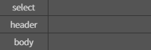
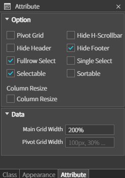
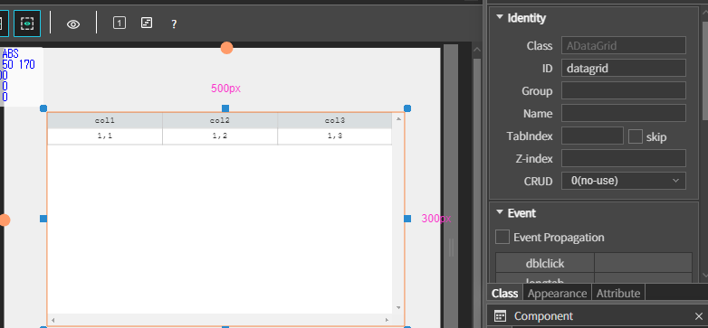
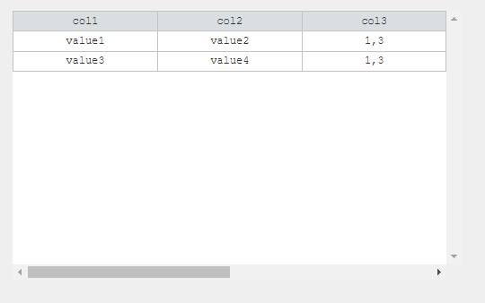
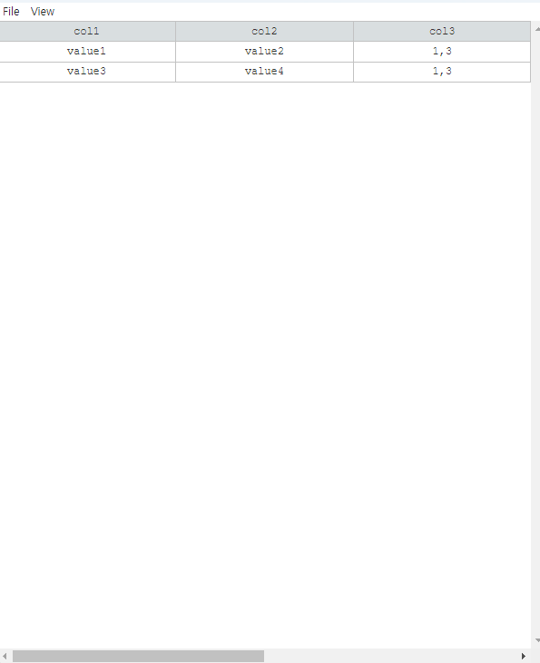

# DataGrid

<div align="left"><figure><figcaption></figcaption></figure></div>

데이터를 테이블 형식으로 표시하고 조작할 수 있는 컴포넌트

### Appearance

<div align="left"></div>

#### Style

* **`Select`**
  * 선택된 셀이나 행의 스타일을 지정하는 속성
  * 사용자가 선택한 셀이나 행의 배경색, 텍스트 색상 등을 설정 가능
* **`Header`**
  * 데이터 그리드의 헤더 영역의 스타일을 지정하는 속성
  * 헤더의 배경색, 텍스트 색상, 폰트 스타일 등을 설정
  * 헤더는 각 열의 제목을 표시하는 부분으로, 사용자에게 데이터의 의미 역할
* **`Body`**
  * 데이터 그리드의 본문 영역의 스타일을 지정하는 속성
  * 본문에 표시되는 데이터 셀의 배경색, 텍스트 색상, 폰트 스타일 등을 설정

### Attribute

<div align="left"></div>

#### Option

* **`Pivot Grid`**
  * 피벗 그리드 사용 여부를 설정하는 옵션
  * 데이터를 요약하고 분석하는 데 유용한 기능을 제공
* **`Hide-H-Scrollbar`**
  * 하단 스크롤바를 숨길지 여부를 설정하는 옵션
  * 활성화 시 가로 스크롤바가 안보이는 기능
* **`Hide Header`**
  * 헤더를 숨길지 여부를 설정하는 옵션
  * 활성화 시 데이터 그리드의 헤더가 안보이는 기능
* **`Hide Footer`**
  * 푸터를 숨길지 여부를 설정하는 옵션
  * 활성화 시 데이터 그리드의 푸터가 안보이는 기능
* **`Fullrow Select`**
  * 특정 셀을 클릭해도 그 행 전체가 선택되도록 하는 옵션
  * 활성화 시 셀을 클릭할 때 해당 행 전체가 강조 표시
* **`Single Select`**
  * Ctrl 키를 누르고 선택해도 하나의 행만 선택되도록 하는 옵션
  * 활성화 시 여러 행을 동시에 선택할 수 없고, 항상 하나의 행만 선택
* **`Selectable`**
  * 선택 가능 여부를 설정하는 옵션
  * 비활성화 시 데이터 그리드의 행이나 셀 선택 가능
* **`Sortable`**
  * 헤더를 클릭했을 때 해당 열의 데이터를 정렬할지 여부 설정
  * 활성화 시 사용자가 헤더를 클릭하여 데이터를 오름차순 또는 내림차순으로 정렬 가능

#### Data

* **`Main Grid Width`**
  * 메인 그리드의 너비를 설정하는 속성
* **`Pivot Gird Width`**
  * 피벗 그리드의 너비를 설정하는 속성

### Example

1. **DataGrid 추가**

* 그리드의 id를 datagrid 로 설정




* MainView.js 수정

```javascript
...

onInitDone()
{
	super.onInitDone()
	//TODO:edit here
	let data =  [
	{ column1:  'value1', column2:  'value2'},
	{ column1:  'value3', column2:  'value4'}
	]
	this.datagrid.setData(data);
}

...
```


* _**Framework > afc > DnDManager.js & ADataMask.js 추가**_

<div align="left"><figure><figcaption></figcaption></figure> <figure><figcaption></figcaption></figure></div>


* 프로젝트 실행

<div align="left"></div>


2. **코드로 DataGrid 추가**

* **Framework > afc > component**
  * &#x20;**AScrollbar.js + ADataGrid.js + AGrid.js 추가**
* **Framework > afc > event**
  * **AScrollbarEvent.js + ADataGridEvent.js + AGridEvent.js 추가**

<div><figure><figcaption></figcaption></figure> <figure><figcaption></figcaption></figure> <figure><figcaption></figcaption></figure></div>


* MainView.js 수정

```javascript
onInitDone()
{
    super.onInitDone()

    let dataGrid = new ADataGrid();
    dataGrid.init();

    dataGrid.setOption({
        hideHeader:  false,
        hideFooter:  false,
        fullrowSelect:  true,
        singleSelect:  false,
        sortable:  true
    });     

    this.addComponent(dataGrid);

    dataGrid.setSize('100%',  '100%');
    dataGrid.setPos(0,0);
    let data =  [
    { column1:  'value1', column2:  'value2'  },
    { column1:  'value3', column2:  'value4'  }
    ];
    
    dataGrid.setData(data);

}
```

* **프로젝트 실행**


