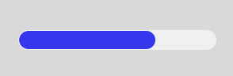

# Progress



진행 상황을 시각적으로 표시하는 데 사용되는 컴포넌트. 작업의 완료 비율을 나타내는 데 유용하며, 사용자에게 현재 진행 상태를 알려주는 역할.

### Example

**컴포넌트 생성**

<div align="left"><figure><figcaption></figcaption></figure></div>


* MainView.js 수정

```js
class  MainView  extends  AView
{
	constructor()
	{
		super()

		// 프로그래스 값 변수
		this.progressVal = 0;
	}

	init(context, evtListener)
	{
		super.init(context, evtListener)
		
		// 초기 프로그레스 값을 설정
		this.progressID.setValue(this.progressVal); 
	}

	// 버튼 클릭 이벤트 함수 추가
	// 버튼을 클릭할 때 마다 프로그레스 값을 증가시키는 로직
	onButtonClick(comp, info, e) {  
		if(this.progressVal < 100) { 
			this.progressVal += 10; // 10%씩 증가 
			// 프로그래스 바 업데이트
			this.progressID.setValue(this.progressVal);  
		} 
	}
}
```


**코드로 컴포넌트 생성**

* **Framework > afc > Default Load Settings**

<div align="left"><figure><figcaption></figcaption></figure></div>


* Component > AProgress.js + AButton.js

<div align="left"><figure><figcaption></figcaption></figure></div>


* event > AButtonEvent.js

<div align="left"><figure><figcaption></figcaption></figure></div>


* MainView.js 수정

```javascript

class MainView extends AView
{
	constructor()
	{
		super()

        this.progressVal = 0; 

		//TODO:edit here

	}

	init(context, evtListener)
	{
		super.init(context, evtListener)

		//TODO:edit here

	}

    onInitDone() {
        super.onInitDone();

        this.progressID = new AProgress();
        this.progressID.init();
        this.addComponent(this.progressID);

        this.progressID.setPos(20, 50);
        this.progressID.setSize("300px", "25px");

        this.progressID.setValue(this.progressVal);


        let btn = new AButton();
        btn.init();
        btn.setText("증가");
        this.addComponent(btn);
        btn.setSize("100px", "30px");
        btn.setPos(40, 80);
        btn.addEventListener("click", this, "onButtonClick");
    }


	onActiveDone(isFirst)
	{
		super.onActiveDone(isFirst)

		//TODO:edit here

	}

    onButtonClick(comp, info, e) {
		if (this.progressVal < 100) {
			this.progressVal += 10;
			this.progressID.setValue(this.progressVal);
		}
	}

}
```


* 프로젝트 실행

<div align="left"><figure><figcaption></figcaption></figure></div>
