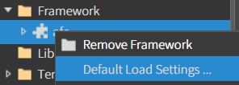

# PagingBar

<figure><figcaption></figcaption></figure>

데이터를 페이지 단위로 나누어 표시할 때 사용되는 컴포넌트. 사용자는 여러 페이지에 걸쳐 있는 데이터를 쉽게 탐색하고  페이지 설정 및 탐색 기능을 지원.


### Example

* **MainView.lay에** [**ListView**](14-listview/)**와 APagingBar 컴포넌트 배치**
  * ListView id값 listView, PagingBar id값 pageBar로 지정

<figure><figcaption></figcaption></figure>


*   **Framework > afc 설정**

    * Default Load Settings 클릭

    \


    * CompEx.css + AToast.js 클릭

    <div align="left"><figure><figcaption></figcaption></figure> <figure><figcaption></figcaption></figure></div>


    * 우측 상단 X 클릭 > 변경 사항 적용 -> Yes


* MainView.js 수정

```javascript
init(context, evtListener)
{
    super.init(context, evtListener)

    this.pageBar.setDelegator(this);
    this.pageBar.setIsCenter(true);
    this.page = 1;

}

onInitDone()
{
    super.onInitDone()

    //TODO:edit here

    this.send_pageList();

}

send_pageList() 
{ 
    const per = 10;
    this.pageBar.setPage(250, this.page, per, 10); 
    
    this.listdata = [] ;
    for (let i = 1; i <= per; i++) {
        const j = ((this.page - 1) * per) + i;
        this.listdata.push({
            number: `번호: ${j}`,             // 보기 좋게 출력용 문자열로
            title: `제목: ${j}번 글입니다.`   // 명확히 줄 구분되도록
        });
    }

    this.pageBar.addParam(this.listdata);
    
    //경로 설정은 하단 이미지 참고
    this.listView.addItem('Source/data/subView.lay', this.listdata);
    
    //페이지 전환 초기화 코
    this.listView.removeAllItems();
    
    this.pageBar.setPageView();  
}


// 페이지 버튼을 클릭할 때마다 호출되는 이벤트 함수 
pagingBindData(comp, info) 
{ 

    // 클릭된 페이지가 현재 페이지와 같으면 리턴 
    const page = info.pageIdx; 
    if (page == this.page) return; 
    
    // 페이지 번호 업데이트 
    this.page = page; 
    
    // 새로운 페이지에 맞는 데이터를 가져오는 함수 호출 
    this.send_pageList(); 
}
```

* listview에 출력할 lay는 프로젝트 우클릭 > Copy Url로 경로 복사

<div align="left"><figure><figcaption></figcaption></figure></div>


* **Source 폴더 우클릭 > New Folder > 폴더명 지정하고(ex: data) 폴더 생성**

<div><figure><figcaption></figcaption></figure> <figure><figcaption></figcaption></figure></div>


*   **ListView 에 추가할 아이템 (레이아웃) 인 subview1.lay를 생성**

    * 생성한 폴더에서 우클릭 > Add new > View > Name 작성(ex: subView.lay) > OK

    <div align="left"><figure><figcaption></figcaption></figure> <figure><figcaption></figcaption></figure></div>


* **subview.lay에 Label 컴포넌트 2개 배치하고, ID값은 각각 number, title로 지정**

<figure><figcaption></figcaption></figure>


* **subView.js 수정**

```javascript
init(context, evtListener)
{
    super.init(context, evtListener)

    //TODO:edit here

    this.element.addEventListener('click', this.onClick.bind(this));

}

setData(data)
{
    this.data = data;
    this.number.setText(data.number);
    this.title.setText(data.title);
}

onClick(comp, info, e)
{
    AToast.show(this.data.number + ' - ' + this.data.title);
}
```


* 프로젝트 실행

<div align="left"><figure><figcaption></figcaption></figure></div>
