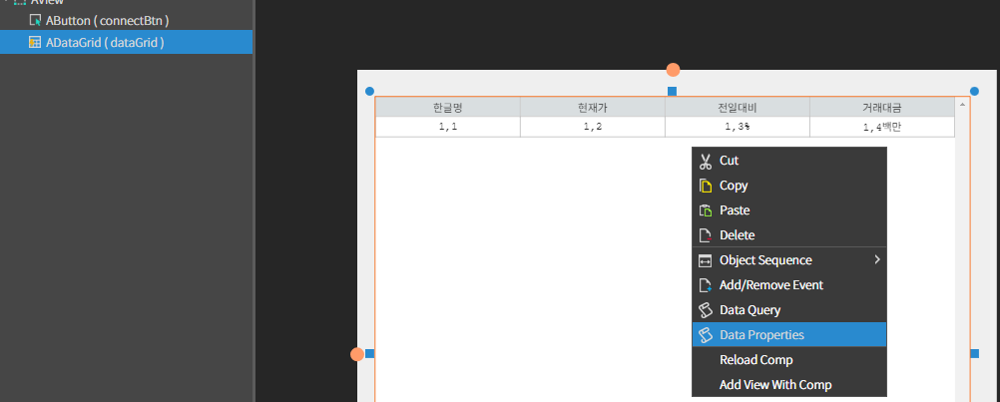

# EXMiniChart

<figure><figcaption></figcaption></figure>

### Appearance

공통 Appearance 는 [**6. Global Properties**](<../../Guide for SpiderGen/06  SpiderGen Editor/04  Properties Pane/02 Appearence.md>) 속성을 참고

### Attribute

<figure><figcaption></figcaption></figure>

<table data-header-hidden><thead><tr><th width="361"></th><th></th></tr></thead><tbody><tr><td><strong>color 속성</strong></td><td></td></tr><tr><td><code>Text</code></td><td>현재가 데이터 라벨 색상</td></tr><tr><td><code>Left Text</code></td><td>가격을 나타내는 Y축 눈금 라벨 색상</td></tr><tr><td><code>Time Text</code></td><td>시간을 나타내는 X축 눈금 라벨 및 시간 단위 색상</td></tr><tr><td><code>Base Text</code></td><td>기준가 눈금 라벨 색상</td></tr><tr><td><code>Base Line</code></td><td>기준가 눈금 기준선 색상</td></tr><tr><td><code>Up</code></td><td>기준가 보다 위쪽에 위치하는 그래프의 색상</td></tr><tr><td><code>Down</code></td><td>기준가 보다 아래쪽에 위치하는 그래프의 색상</td></tr><tr><td><code>Cont Back</code></td><td>그래프 컨텐츠 배경 색상</td></tr><tr><td><code>Cont Border</code></td><td>그래프 컨텐츠 테두리 색상</td></tr><tr><td><code>Divide Line</code></td><td>최대/최소 눈금 경계선 색상</td></tr></tbody></table>

***

### Example <a href="#example" id="example"></a>

**1. 프로젝트 생성**

* 프로젝트 트리뷰에서 Source > MainView.lay 파일을 클릭
* MainView의 레이아웃 파일이 오픈되면 컴포넌트 리스트에서 EXminiChart 컴포넌트를 선택하고 드래그하여 레이아웃에 배치
* Class에서 ID를 mini로입력


**2.데이터 설정**

* 먼저 MainView.js 파일을 오픈
* onInitDone() 함수에서 아래와 같이 코드를 입력



<sub>배열을 이용할 경우</sub>

```javascript
onInitDone() 
{
            super.onInitDone();
            const dataArr = 
            [
                      ["1050", 300],
                      ["1045", 290],
                      ["1040", 260],
                      ["1035", 500],
                      ["1030", 460],
            ];
            //setData(데이터 배열, 기준 값)
            this.mini.setData(dataArr,'400');
            this.mini.updatePosition();
}
```



<sub>객체를 이용할 경우</sub>

```javascript
onInitDone() 
{
            super.onInitDone();
            const dataObj = 
            [
                      { time:"1050",value: 300},
                      { time:"1045",value: 290},
                      { time:"1040",value: 260},
                      { time:"1035",value: 500},
                      { time:"1030",value: 460},
            ];
            //setKeys(키 이름, 값 이름)
            this.mini.setKeys('time', 'value');
            //setData(데이터 객체, 기준가)
            this.mini.setData(dataObj,'400');
            this.mini.updatePosition();
}
```




일부 버전에서 그래프가 정상적으로 위치하지 않을 수 있으므로,\
`updatePosition()` 함수를 사용해 직접 그래프 위치를 재 계산하도록 할 수 있습니다.


**3.결과 확인**

<figure><figcaption></figcaption></figure>

***

## 코드로 EXMiniChart 생성

* 먼저 MainView.js 파일을 오픈
* onInitDone() 함수에서 아래와 같이 코드를 입력

```javascript
onInitDone() {
        super.onInitDone();

        //EXMiniChart 생성 및 초기화
        const mini = new EXMiniChart();
        mini.init();
        
        //데이터 설정
        const dataObj = [ 
            { time:"1155",value: 460},
            { time:"1150",value: 300},
            { time:"1145",value: 290},
            { time:"1140",value: 260},
            { time:"1135",value: 500},
            { time:"1130",value: 460},
            ...생략...
            { time:"1030",value: 460},
            { time:"1025",value: 460},
            { time:"1020",value: 460},
            { time:"1015",value: 460},
            { time:"1010",value: 460},
            { time:"1005",value: 460},
            { time:"1000",value: 460},
        ];
        mini.setKeys('time', 'value');
        mini.setData(dataObj ,'400');
        
        //모드 설정 변경
        mini.setMode("line");    //line 모드는 Y축 눈금 라벨을 제거하고 그래프만 출력합니다.
        mini.setColorMode('white');    // 컴포넌트 테마를 white로 변경합니다.
        mini.setColors({TEXT:'#75b02c'}, true);    //컴포넌트 글자 색을 #75b02c로 변경합니다.
        
        //위치 및 크기 변경
        mini.setPos(50, 50);
        mini.setSize(450, 400);
        
        //추가될 컴포넌트 위치 설정
        this.addComponent(mini);
}
```


**코드로 생성시 직접 컴포넌트 모듈을 불러와야 합니다.**

프로젝트 트리뷰에서 Framework > stock 우클릭 > Default Load Settings.. > Component > **EXMiniChart** 선택 (이벤트 사용시  **EXMiniChartEvent** 선택)

.png>)


**결과 확인**

<p align="center"></p>

***

## Method

<details>

<summary>주요 메서드</summary>

1. `setData(data, basePrice)` : 차트에 데이터를 설정합니다. data는 시간과 값의 배열이며, basePrice는 기준값 입니다.
2. `setKeys(dateKey, valueKey)` : 객체 형태의 데이터를 사용할 때, 값을 참조할 키를 설정합니다.
3. `addNewData(newData)` : 차트에 새로운 데이터를 추가합니다. newData는 시간과 값의 배열입니다.
4. `draw()` :  차트를 그립니다. 필요한 경우 차트를 다시 그리도록 호출합니다.
5. `clearGraph()` : 차트를 초기화하여 모든 데이터를 지웁니다.
6. `updatePosition(pWidth, pHeight)` : 차트의 너비와 높이를 업데이트합니다.  차트의 레이아웃이 변경될 때 호출하여 차트의 크기를 조정합니다.
7. `setMaxCount(maxCount)` : 차트에 표시할 데이터의 최대 개수를 설정합니다. 너무 많은 데이터가 출력되어 제한하고 싶은 경우 사용합니다.
8. `setColors(colors, isDraw)` :  차트의 색상을 설정합니다. colors는 색상 정보 객체이며, isDraw는 설정한 색상을 즉시 적용할지 여부를 결정합니다.
9. `setColorMode(colorMode)` : 차트의 색상 모드를 변경합니다. 예를 들어, 'white' 또는 'black' 모드로 설정할 수 있습니다.
10. `setMode(mode)` : 차트의 모드를 설정합니다. 'line' 또는 'price' 모드를 선택할 수 있으며, 이는 Y축 라벨의 표시 여부에 영향을 줍니다.

</details>
