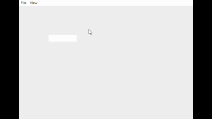

# EXSecureTextField

<figure><figcaption></figcaption></figure>

민감한 정보(비밀번호 등)를 SecurePadManager 클래스 또는 객체를 이용하여 외부 라이브러리와 손쉽게 연동하여 안전하게 입력받을 수 있는 입력 컴포넌트.


### Appearance

공통 Appearance 는 [**6. Global Properties**](<../../Guide for SpiderGen/06  SpiderGen Editor/04  Properties Pane/02 Appearence.md>) 속성을 참고

### Attribute

EXSecureTextField 속성

<figure><figcaption></figcaption></figure>

**Data**

<table data-header-hidden><thead><tr><th width="361"></th><th></th></tr></thead><tbody><tr><td><strong>이름</strong></td><td><strong>설명</strong></td></tr><tr><td><strong>속성</strong></td><td></td></tr><tr><td><code>Text</code></td><td>입력값</td></tr><tr><td><code>Placeholder</code></td><td>입력 전 양식</td></tr><tr><td><code>Align</code></td><td>텍스트 정렬(left, center, right)</td></tr><tr><td><code>Pad Title</code></td><td>키패드가 열릴 때 상단 제목</td></tr><tr><td><code>Data Type</code></td><td>키패드 입력 방식</td></tr><tr><td><code>Return Type</code></td><td>결과 반환 방식</td></tr><tr><td><code>MinLength</code></td><td>최소 입력 길이</td></tr><tr><td><code>MaxLength</code></td><td>최대 입력 길이</td></tr></tbody></table>

### Example

1. **라이브러리**

<figure><figcaption></figcaption></figure>

* _**프로젝트 트리뷰에서 Framework > Library 우클릭 > Add new > Javascript**_&#x20;


| 파일명                     | 설명                                                                              |
| ----------------------- | ------------------------------------------------------------------------------- |
| **SecurePadManager.js** | 보안 키패드의 열기, 닫기 및 입력 처리 관리                                                       |
| **SpiderGenKeyPad.js**  | 가상 키보드를 제어하고 표시하기 위한 임시라이브러리<mark style="color:red;">**(실제 프로젝트 사용 금지)**</mark> |


* **SecurePadManager.js**

```javascript
var SecurePadManager = {
    isEnable: true,//afc.isNative,

    //보안키패드 오픈 함수
    openPad: function(padOption, callback, sxf)
    {
        this.padOption = padOption;
        this.sxf = sxf;

        sxf.clear();
        //키패드를 띄울 때 필요한 정보는 padOption 에서 전달
        //ex) SpiderGenKeyPad.setPadOption(padOption)
        SpiderGenKeyPad.showKeypad(padOption, function(isClosed, encData, len) {
            callback(isClosed, encData, len);
        });
    },

    closePad: function()
    {
        SpiderGenKeyPad.closeKeypad(secureTxf.element);
    }
};
```


* **SpiderGenKeyPad.js**

<figure><figcaption></figcaption></figure>

<pre class="language-javascript"><code class="lang-javascript">var SpiderGenKeyPad = {
    val: '',
<strong>    _onKeyClick: function(key) {
</strong>        let val = SpiderGenKeyPad.val
        if (key === '←') val = val.slice(0, -1)
        else if (key === 'reset') val = ''
        else if (key === '확인') {
            this.closeKeypad()
            return;
        } else if (key === '취소') {
            SpiderGenKeyPad.val = ''
            this.closeKeypad()
            return;
        } else if (key.match(/[0-9]/)) {
            val += key
        }

        SpiderGenKeyPad.val = val;
        this.callback(false, null, val.length);
    },

    closeKeypad()
    {
        let containerEle = document.getElementById('vkey-container')
        if(containerEle) {
            containerEle.remove()
            if(this.callback) {
                let val = SpiderGenKeyPad.val
                this.callback(true, val?new TextEncoder().encode(val):null, val.length)
                this.callback = null
            }
        }
    },

    showKeypad: function (element, callback) {
        if (document.getElementById('vkey-container')) return

        SpiderGenKeyPad.val = ''
        this.callback = callback

        const container = document.createElement('div');
        container.id = 'vkey-container';
        container.style.position = 'fixed';
        container.style.bottom = '0';
        container.style.left = '0';
        container.style.width = '100%';
        container.style.background = '#f2f2f2';
        container.style.padding = '12px';
        container.style.zIndex = '9999';
        container.style.boxShadow = '0 -2px 8px rgba(0,0,0,0.2)';
        container.style.display = 'flex';
        container.style.flexDirection = 'column';
        container.style.alignItems = 'center';
        container.style.gap = '12px';

        const infoText = document.createElement('div');
        infoText.innerText = '59초 후에 보안세션이 만료됩니다.';
        infoText.style.color = '#555';
        infoText.style.fontSize = '14px';
        infoText.style.marginBottom = '8px';
        container.appendChild(infoText);

        const rows = [
            ['🔒', '0', '1', '2', '3', '4'],
            ['5', '6', '7', '🔒', '8', '9']
        ];

        //shuffle Array
        let currentIndex = 12;
        let randomIndex;
        while (currentIndex != 0) {
            randomIndex = Math.floor(Math.random() * currentIndex);
            currentIndex--;
            [rows[parseInt(currentIndex/6)][currentIndex%6], rows[parseInt(randomIndex/6)][randomIndex%6]] = [rows[parseInt(randomIndex/6)][randomIndex%6], rows[parseInt(currentIndex/6)][currentIndex%6]]; // ES6 destructuring
        }

        this.keyBtns = [];
        rows.forEach(rowKeys => {
            const row = document.createElement('div');
            row.style.display = 'flex';
            row.style.justifyContent = 'center';
            row.style.gap = '10px';

            rowKeys.forEach(key => {
                const btn = document.createElement('button');
                btn.innerText = key;
                btn.style.width = '48px';
                btn.style.height = '48px';
                btn.style.borderRadius = '10px';
                btn.style.border = 'none';
                btn.style.background = '#fff';
                btn.style.color = '#000';
                btn.style.fontSize = '18px';
                btn.style.boxShadow = '0 2px 4px rgba(0,0,0,0.2)';
                btn.style.cursor = 'pointer';

                btn.onclick = () => {
                    SpiderGenKeyPad._onKeyClick(key);
                };

                this.keyBtns.push(btn);
                row.appendChild(btn);
            });

            container.appendChild(row);
        });

        const bottomRow = document.createElement('div');
        bottomRow.style.display = 'flex';
        bottomRow.style.justifyContent = 'center';
        bottomRow.style.gap = '12px';
        bottomRow.style.marginTop = '8px';

        const specialKeys = [
            { label: '↻', action: 'reset', bg: '#ccc' },
            { label: '⌫', action: '←', bg: '#ccc' },
            { label: '✔', action: '확인', bg: '#2196f3', color: '#fff' },
            { label: '✖', action: '취소', bg: '#ccc' }
        ];

        specialKeys.forEach(({ label, action, bg, color }) => {
            const btn = document.createElement('button');
            btn.innerText = label;
            btn.style.width = '56px';
            btn.style.height = '48px';
            btn.style.borderRadius = '10px';
            btn.style.border = 'none';
            btn.style.background = bg;
            btn.style.color = color || '#000';
            btn.style.fontSize = '18px';
            btn.style.boxShadow = '0 2px 4px rgba(0,0,0,0.2)';
            btn.style.cursor = 'pointer';

            btn.onclick = () => {
                SpiderGenKeyPad._onKeyClick(action, element);
            };

            bottomRow.appendChild(btn);
        });

        container.appendChild(bottomRow);
        document.body.appendChild(container);
    }
};
</code></pre>


**2. 프로젝트 생성**

* 프로젝트 트리뷰에서 Source > MainView.lay 파일을 클릭
* MainView의 레이아웃 파일이 오픈되면 컴포넌트 리스트에서 EXSecureTextField 컴포넌트를 선택하고 드래그하여 레이아웃에 배치
* 배치된 컴포넌트의 id를 sxf 로 지정
* Attribute > Data > Text > 'Text' 문자열 제거
* 배치된 컴포넌트 마우스 오른쪽 클릭하여 Add/Remove Evnet 선택하여 change 이벤트를 추가
* Run Project 하여 실행 확인


* **MainView.js**

```javascript
onSxfChange(comp, info, e)
{
    console.log(`text: ${comp.getText()} chiperData: ${comp.getCipherData()}`);
}
```


3. **프로젝트 실행**

* SecureTextField 컴포넌트 영역 클릭 후 보안키패드 동작확인

<figure><figcaption></figcaption></figure>


4. **코드로&#x20;**_**EXSecureTextField**_**&#x20;생성**

* 먼저 MainView.js 파일을 오픈
* onInitDone() 함수에서 아래와 같이 코드를 입력

```javascript
onInitDone() {

    super.onInitDone();

    // SecureTextField 생성 및 설정
    let sxf = new EXSecureTextField();
    sxf.init();

    sxf.setText('');
    this.addComponent(sxf);

    sxf.setPos(100, 100);
    sxf.addEventListener('change', this, 'onCodeSxfChange');
}

onCodeSxfChange(comp, info, e)
{
    console.log(`codeSxf text: ${comp.getText()} chiperData: ${comp.getCipherData()}`);
}
```


<mark style="color:red;">**Build 에러발생시**</mark>

_**프로젝트 트리뷰에서 Framework > stock 우클릭 > Default Load Settings.. > Component > EXSecureTextField.js 체크 > 우측 상단  X(창닫기) 클릭 > 변경된 정보를 저장하시겠습니까> > Yes**_

.png>)


