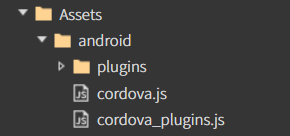
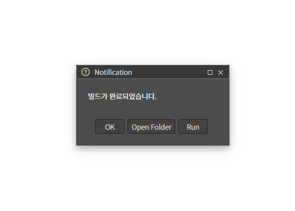

# A. Android 앱 구축하기

## 1. Android 사용 환경 설정

Android 앱을 개발하기 위해서는 환경설정이 필요합니다.\
아래의 환경 설정을 참고해서 진행 해주세요.

[환경설정 가이드](../../03-start-guide/04-mobile/a-android.md)

## 2. 스파이더젠에서 cordova 플러그인 사용법

**Cordova Plugin 설치**

cmd 창에서 <mark style="background-color:red;">cordova 프로젝트 경로</mark>에 진입 후 cordova Plugin을 설치합니다

`cordova plugin add cordova-plugin-screen-orientation`

> [cordova 공식 홈페이지](https://cordova.apache.org/plugins/)

## &#x20;<mark style="color:red;background-color:red;">지원 디바이스에 따른 설정방법</mark>&#x20;

> 지원해야 하는 디바이스에 따라 설정방법이 차이가 있습니다.
>
> <mark style="color:red;">**사용자는 디바이스에 따라 아래 2가지 방법 중 한 가지 방법**</mark>으로 설정해야 합니다.

### 3.1. 네이티브 전용

<figure><figcaption><p>스파이더젠 Properties 화면 ( cordova 상태 )</p></figcaption></figure>

네이티브 전용으로 제작하려면 스파이더젠의 File > Properties에서 Native Bridge를

&#x20;<mark style="color:red;background-color:red;">**cordova**</mark> 로 설정해야 합니다.

<figure><figcaption><p>생성된 Bridge 폴더</p></figcaption></figure>

위에서 cordova로 설정을 완료했다면 위 사진처럼 Bridge 폴더와 그 하위 폴더들이 자동으로 생성되어 있습니다.

각 폴더에 들어있는 cordova.js / cordova\_plugins.js는 시각적으론 보이나 실제론 해당 파일이 각 폴더에 실제로 존재해 있지 않기에 각 폴더에 js를 찾아서 넣어줘야 합니다.

**`MyApp\platforms\android\platform_www`**&#x20;

위 경로에 있는 <mark style="color:red;background-color:red;">폴더와 파일들을</mark> 스파이더젠의 위 사진의 android 폴더에 붙여넣습니다.



**안드로이드앱을 구축하기 위해 ios 폴더는 삭제해줍니다.**&#x20;

### 3.2. 네이티브 & 웹

<figure><figcaption><p>스파이더젠 Properties 화면 ( 기본 none 상태 )</p></figcaption></figure>

네이티브 & 웹 전용으로 제작하려면 스파이더젠의 File > Properties에서 Native Bridge를

&#x20;<mark style="color:red;background-color:red;">none (기본값)</mark> 로 설정해야 합니다.\


`MyApp\platforms\android\platform_www`&#x20;

위 경로에 있는 파일들을 스파이더젠의 Assets 폴더에 붙여넣습니다.


Assets 폴더 내에 파일들은 자동으로 로드하지 않으므로 해당 cordova.js를 코드 내에서 읽어줘야 합니다.

### <mark style="background-color:red;">- Properties가 none일 경우 cordova 읽는 법</mark>


1. xml 파일 내에 코드 추가

&#x20;\platforms\android\app\src\main\res\xml 위치에 존재하는 config.xml에 코드를 추가해야합니다.

<figure><figcaption></figcaption></figure>

사진과 같이 config.xml을 코드 창으로 연 후

<figure><figcaption></figcaption></figure>

아래 코드를 복사 후 붙여넣기 해주세요.

```xml
<preference name="AppendUserAgent" value="TestMyApp" /> 
```

<mark style="color:red;">!!</mark> <mark style="background-color:red;">value 값은 제 임의로 프로젝트 명을 집어넣었으나 마음대로 커스텀해도 무방합니다.</mark>
\
<mark style="color:red;">!!</mark> <mark style="background-color:red;">단, 아래 2번 설명에서 해당 value값으로 받아올 때도 같은 값을 넣어주세요.</mark>


2. 스파이더젠에서 코드 수정

아래와 같이 theApp.js 코드를 작성해줍니다.

```javascript
// Some codeclass 
TestMobileApp extends AApplication
{
    constructor()
    {
        super()
        
         this.userAgent = navigator.userAgent; 
         
         // userAgent란 서버에 자신을 식별하기 위해 보내는 문자열입니다. 
         // 이를 활용하면 서버나 앱 내에서 플랫폼, 브라우저 종류, 버전 등을 판단할 수 있습니다.

    }

    onReady()
    {
        super.onReady();

        this.setMainContainer(new APage('main'))

        // 아래에 작성한 this.isNativeCordova()에 결과가 true인지 false인지에 따라서 프로젝트 오픈 방식을 결정합니다.
        // false일 경우 (윈도우, 스파이더젠 시뮬레이터) 기존과 같이 오픈
        // true일 경우 (Cordova 기반 네이티브 앱 환경, Android/iOS 등에서 실행될 때)
        // ‼️Cordova에서는 deviceready 이벤트가 발생한 이후에 플러그인(API)들이 안전하게 로드되므로,
        // 반드시 이 이벤트 이후에 앱 초기화 코드(화면 오픈 등)를 실행해야 합니다.
        
        if(!this.isNativeCordova()){
            this.mainContainer.open('Source/MainView.lay');
        }else{
            document.addEventListener('deviceready', () => {
                //cordova 로드
                //alert('Native Device가 준비됌.')
                this.mainContainer.open('Source/MainView.lay');            
            });
        }
            
    }
    

    unitTest(unitUrl)
    {
        //TODO:edit here

        this.onReady()

        super.unitTest(unitUrl)
    }


     // 스파이더젠 properties에서 none일 경우 window 쪽 cordova가 없기에
     // window가 아닐 경우에만 cordova를 로드하도록 하는 함수 작성

    isNativeCordova() {
        // 프로젝트가 플랫폼 단위로(Native일 경우) 실행되는지 확인
        // TestMyApp은 
        if (theApp.userAgent.indexOf('TestMyApp') > -1) {
            afc.loadScript('Assets/android/cordova.js');
            return true;
        } else {
            return false;
        }
    }
    
}
```

## 4. 예제 코드 추가

**01. 이벤트 생성**

[<mark style="background-color:red;">3.1. 네이티브 전용</mark>](a-android-cordova.md#id-3.1)<mark style="background-color:red;">인지</mark> [<mark style="background-color:red;">3.2. 네이티브 & 웹</mark>](a-android-cordova.md#id-3.2.-and) <mark style="background-color:red;">방식인지에 따라 예시 코드가 달라집니다.</mark>


* [**3.1. 네이티브 전용**](a-android-cordova.md#id-3.1)**인 경우**

스파이더젠 프로젝트에서 버튼을 생성해서 클릭 이벤트함수에 아래와 같이 작성합니다.

```javascript
class MainView extends AView 
{
    constructor() 
    {
        super()
        
         // 현재 상태를 저장할 변수
        this.isLandscape = false;
    }


   onButtonClick(comp, info, e) 
   {
        // landscape ↔ portrait 토글
        let orientation = this.isLandscape ? "portrait" : "landscape";

        cordova.exec(
            function () {
                alert("화면 방향이 " + orientation + "로 변경되었습니다.");
            },
            function (error) {
                alert("오류 발생: " + error);
            },
            "CDVOrientation",
            "screenOrientation",
            ["set", orientation]
        );

        // 상태 변경
        this.isLandscape = !this.isLandscape;
    }
}

```


* [**3.2. 네이티브 & 웹**](a-android-cordova.md#id-3.2.-and)**인 경우**

스파이더젠 프로젝트에서 버튼을 생성해서 클릭 이벤트함수에 아래와 같이 작성합니다.

```javascript
class MainView extends AView 
{
    constructor() 
    {
        super()
        
         // 현재 상태를 저장할 변수
        this.isLandscape = false;
    }


   onButtonClick(comp, info, e) 
   {
        // landscape ↔ portrait 토글
        let orientation = this.isLandscape ? "portrait" : "landscape";

        // 3.2. 네이티브 & 웹의 theApp에서 선언한 함수를 활용해 환경을 알아내고 모바일 환경일 경우에만 cordova가 실행되도록 예외처리를 추가해 기존 발생한 에러를 방지했습니다.
        if (!theApp.isNativeCordova()) {
            AToast.show('모바일 환경에서만 실행 가능합니다.')
            return
        }
        cordova.exec(
            function () {
                alert("화면 방향이 " + orientation + "로 변경되었습니다.");
            },
            function (error) {
                alert("오류 발생: " + error);
            },
            "CDVOrientation",
            "screenOrientation",
            ["set", orientation]
        );

        // 상태 변경
        this.isLandscape = !this.isLandscape;
    }
}
```


**02. bin파일 생성**

F7을 눌러 빌드하고 bin파일을 생성합니다.

(open folder 기능을 이용해서 프로젝트 폴더로 쉽게 이동할 수 있습니다.)

> `MyApp\platforms\android\app\src\main\assets\www`

1. <mark style="background-color:red;">위 경로에 있는기존 파일을 삭제합니다. (그 후 프로젝트를 수정한 경우엔 덮어씌워도 무방합니다.)</mark>
2. <mark style="background-color:red;">스파이더젠 프로젝트</mark> <mark style="background-color:red;"></mark><mark style="background-color:red;">**bin**</mark> <mark style="background-color:red;"></mark><mark style="background-color:red;">폴더안에 있는 파일을 위 경로에 붙여넣습니다.</mark>


**03. Android Studio 실행**

Menu에 진입 후 File -> Open 생성해두었던 `MyApp\platforms\android` 를 선택하여 파일을 오픈합니다.

> 처음 Android Studio 를 설치하면\
> sdk파일이 없어서 빌드가 안되는 경우가 있을수있습니다. **menu - tools - sdk managersdk tools**에서 사용할 버전을 찾아 설치하고 다시 빌드합니다.

.png>)

**04. Android Studio에서 프로젝트를 실행합니다.**

> 디바이스를 직접 연결 하거나 가상 디바이스를 설정해야 합니다.\
> 가상 디바이스는 **Menu - Tools -Device Manager** 에서 설정할 수 있습니다.

<figure><figcaption></figcaption></figure>

**05. 버튼을 눌러 정상 동작을 확인합니다.**


<div><figure><figcaption></figcaption></figure> <figure><figcaption><p>확인 터치 후 변경 모습</p></figcaption></figure></div>

<div><figure><figcaption></figcaption></figure> <figure><figcaption><p>확인 터치 후 변경 모습</p></figcaption></figure></div>
