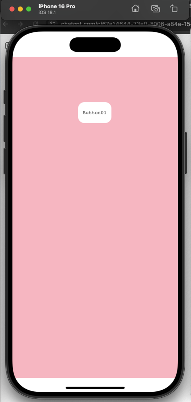
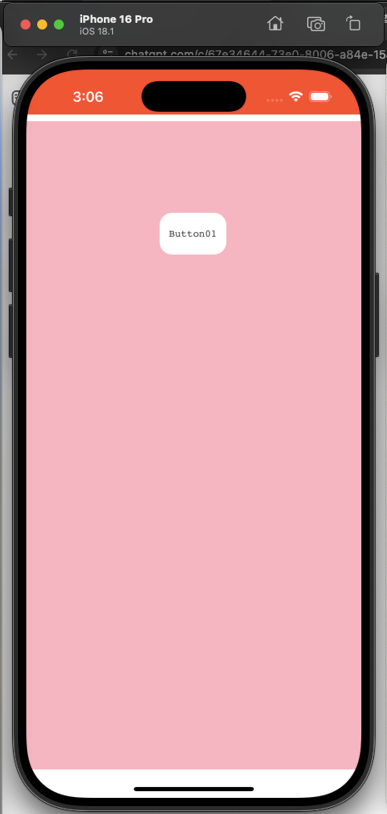

# B. iOS 앱 구축하기

## 1. iOS 사용 환경 설정

***

**iOS** 앱을 개발하기 위해서는 **환경설정이 필요**합니다. 아래의 환경 설정을 참고해서 진행 해주세요.

[환경설정 가이드](../../03-start-guide/04-mobile/b-ios.md)

## 2. Cordova 플러그인 사용하여 SpiderGen 프로젝트 만들기

***

### **1. Cordova Plugin 설치**

* 터미널에서 **Cordova 프로젝트**(`MyApp/`) 경로로 이동합니다.
* 아래 명령어로 플러그인을 설치합니다.&#x20;

```
cordova plugin add cordova-plugin-statusbar 
```

> [cordova 공식 홈페이지](https://cordova.apache.org/plugins/)

* `myApp/platforms/ios/platform_www` 경로에 생성된 **cordova.js, cordova\_plugins.js파일**과 **plugins** **폴더**를 **SpiderGen 프로젝트** **Assets** **폴더**에 복사합니다.

<figure><figcaption></figcaption></figure>

### 2. 예제 코드 추가

* **SpiderGen** 프로젝트 **MainView.lay**에 `Button` 컴포넌트를 추가합니다.
* 추가한 `Button` 컴포넌트의 **클릭이벤트 핸들러를 설정**합니다.

```javascript
//MainView.js

onButtonClick(comp, info, e){
    let newColor = "#FF5733"; // 변경할 상태바 색상
    
    // Cordova exec를 사용하여 네이티브 기능을 호출합니다.
    cordova.exec(
        function () {
            alert("상태 표시줄 색상이 " + newColor + "로 변경되었습니다.");
        },
        function (error) {
            alert("오류 발생: " + error);
        },
        "StatusBar",                  // 플러그인 이름
        "backgroundColorByHexString", // 호출할 네이티브 메서드
        [newColor]                    // 전달할 인자 값
    );
};
```

* **F7**을 눌러 **빌드**합니다. - **`open folder`** 버튼을 이용해서 프로젝트 폴더로 쉽게 이동할 수 있습니다.

## 3. 프로젝트 실행

***

### **1. Xcode에 Cordova 앱 추가**

* **Xcode**에서 File -> Open → `MyApp/platforms/ios/HelloCordova.xcodeproj` 파일 열기
* **SpiderGen프로젝트**에서 빌드후 생성된 **bin폴더**의 폴더와 파일들을 **Cordova프로젝트의** `Staging/www` 폴더로 복사합니다. \
  \- 기존의 www 하위의 파일 및 폴더는 삭제합니다.

<figure><figcaption></figcaption></figure>

### **2. Cordova 설정**

`Staging/www/index.html` 파일에 아래 내용을 추가합니다.

```html
//Cordova 호출
<script src="Assets/cordova.js"></script>
```

```javascript
//상태바가 웹뷰 위에 겹치는 것을 막고, 
//웹뷰를 아래로 내려서 상태바 영역을 피하도록 만듭니다.
<script>
   document.addEventListener("deviceready", function () {
            if (window.StatusBar) {
                StatusBar.overlaysWebView(false);
            }
        }, false);
</script> 
```

### 3. Xcode에서 프로젝트 실행

* **Xcode**의 상단에서 **HelloCordova프로젝트**를 **선택**하고 **실제 디바이스 또는 시뮬레이터 선택후** ▶ 버튼을 눌러 실행합니다.

<figure><figcaption></figcaption></figure>

* 앱실행후 **버튼**을 눌러 상단 바의 **색상이 변하는지 확인**합니다.

<div><figure><figcaption></figcaption></figure> <figure><figcaption></figcaption></figure></div>
