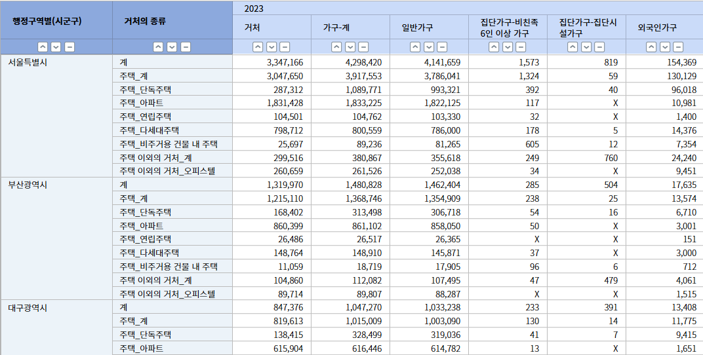

# 04. 대량의 데이터 처리

**대량의 데이터를 처리하기 위해 효과적인 컴포넌트 사용 소개**

1️⃣ [ListView](../../07-components/afc/14-listview/)\
2️⃣ [Grid](<../07  Components/42  Grid.md>)\
3️⃣ [PivotGrid](../../07-components/afc/15-pivotgrid/)

> 본 페이지는 **해당 컴포넌트에 대한 설명이 아니기에** 자세한 설명은\
> **위 컴포넌트 가이드 링크를 참조**

### 1️⃣ [ListView](../../07-components/afc/14-listview/)

다량의 데이터를 단순 혹은 복합적인 컴포넌트를 사용하여 리스트로 표현할때 사용되는 컴포넌트

아래 사진의 자세한 구현은 [링크](../../07-components/afc/14-listview/example.md) 참조

.png>)

### 2️⃣ [Grid](<../07  Components/42  Grid.md>)

**기본적인 데이터 테이블**로써 데이터 목록, 간단한 테이블 형식의 데이터 표시 등에 사용되는 컴포넌트

그리드 컴포넌트 가이드는 [링크](https://wikidocs.net/274109) 참조

### 3️⃣ [PivotGrid](../../07-components/afc/15-pivotgrid/)

Grid 와 동일하나, 대량의 컬럼으로 구성할경우 **좌우 스크롤시 첫 열을 고정시킬수 있는 컴포넌트**

아래 사진의 자세한 구현은 [링크](https://wikidocs.net/276292) 참조

