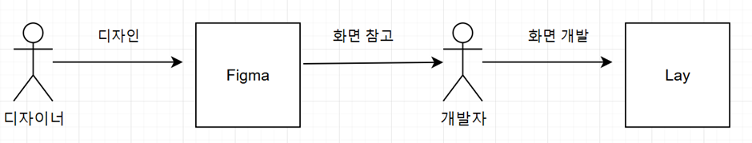

# 08. Figma와 Spidergen 연동하기 (작성중)

## 1. 개발 목적

**<기존 개발 Process>**

**<개선된 Process>**

* 디자이너 측에서 작업한 결과물을 중간에 개발자가 수동으로 진행한 화면 작업에서 변환기를 통한 화면 작업으로 Process 를 개선하기 위함.

## 2. 연동 방법

Figma  와 SpdierGen 을 연동하여  작업하는 방법은 크게 3가지 방법이 있습니다.

### 1. 전부 Figma 에서 진행하는 방법 (Component, Scene 작업)

<figure><figcaption></figcaption></figure>

* Figma ㄴㅇ래ㅑㅓㅇㄴ 에서 Component , Scene&#x20;
  * UI를 구성하는 Component 와, 이를 조합한 Scene 을 전부 Figma 에서 디자인 진행.
  * 완료된 작업을 Figma 플러그인을 통해 Spidergen 으로 변환

진행 순서는 아래와 같습니다.

1. [1-.-figmatolay.md](../../05-advanced/06-figma-spidergen/1-.-figmatolay.md "mention")
2. [1.-template.md](../../05-advanced/06-figma-spidergen/1.-template.md "mention")
3. [3.-component](../../05-advanced/06-figma-spidergen/3.-component/ "mention")
4. [4.-figma.md](../../05-advanced/06-figma-spidergen/4.-figma.md "mention")

### 2.  Component 작업만 Figma 에서 진행하는 방법

<figure><figcaption></figcaption></figure>

* Component는 디자이너가, 실 화면의 개발은 개발자가 진행해야  할경우 사용.
  * 화면을 구성하는 Component 만 Figma 에서 디자인.
  * 디자인된 Component 를 SpiderGen 형식으로 변환
  * 변환된 컴포넌트를 SpiderGen 에서 조합해서 화면 완성.

진행순서는 아래와 같습니다.

1. [1-.-figmatolay.md](../../05-advanced/06-figma-spidergen/1-.-figmatolay.md "mention")
2. [1.-template.md](../../05-advanced/06-figma-spidergen/1.-template.md "mention")
3. [3.-component](../../05-advanced/06-figma-spidergen/3.-component/ "mention")
4. [5.-tlay-sppidergen.md](../../05-advanced/06-figma-spidergen/5.-tlay-sppidergen.md "mention")

