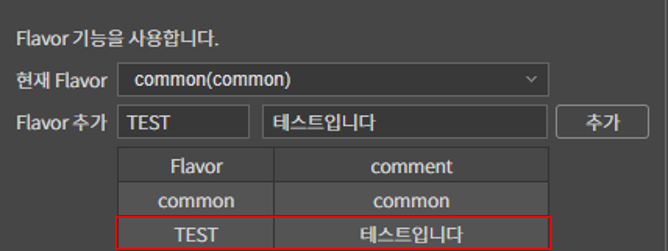
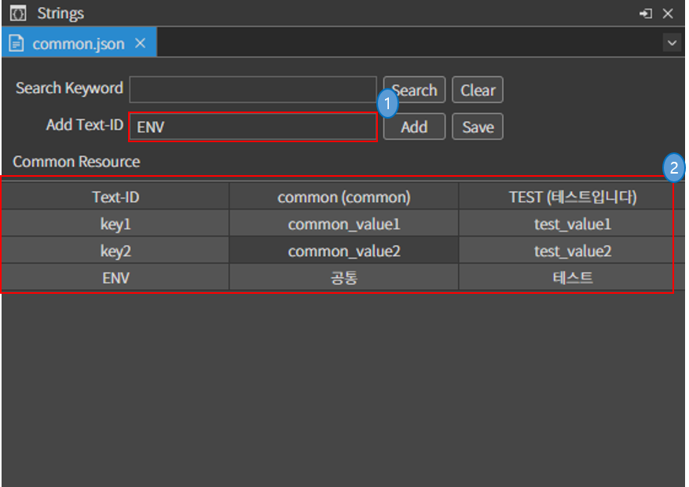
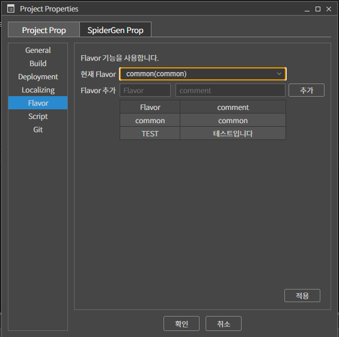
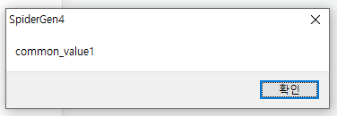
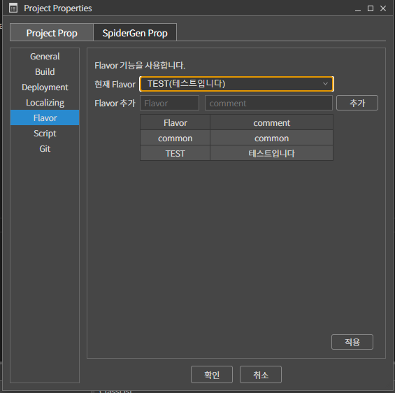
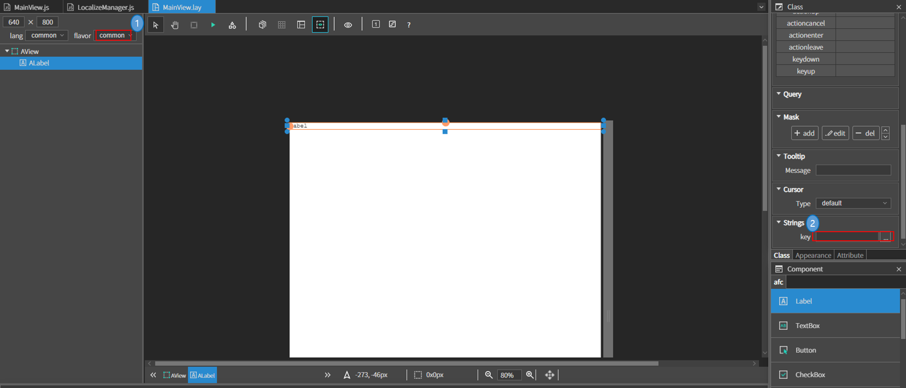
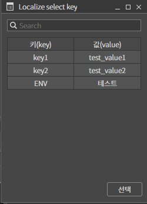
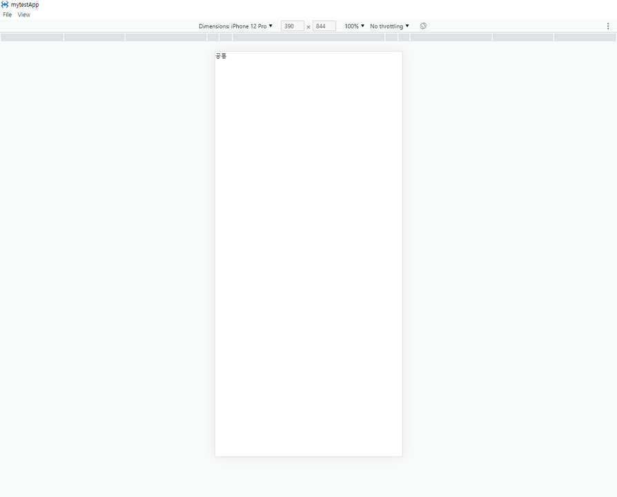
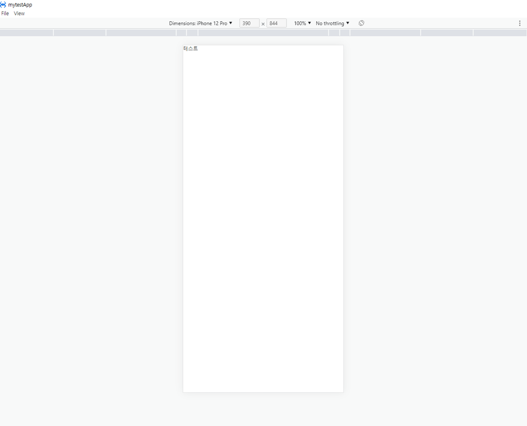

# 07.  Flavor

Flavor를 사용하면 하나의 프로젝트에서 앱에 대한 다양한 설정을 지정하는데 사용할 수 있습니다.\
이는 개발자들이 프로젝트를 더욱 쉽게 관리하고 유연하게 대응할 수 있도록 도와줍니다.

## 설정

***

순서대로 File - Properties - Flavor 를 클릭합니다

.png>)



해당항목의 Flavor,Comment를 입력 후 추가 - 확인 클릭합니다.(common은 기본적으로 생성 되어있는 값입니다.)

추가된 Flavor는 프로젝트 트리의 Resource/common.json 에서 확인할 수 있습니다.\
common.json파일을 더블클릭 해서 열어봅시다.



1. Add-Text-ID 필드에 값을 입력해 사용할 Key값을 추가할 수 있습니다.
2. 추가된 Flavor와 Key,Value 값을 확인 할 수 있으며, 직접 수정 할 수 있습니다.

직접 확인 해보기 위해 Add-Text-ID 필드에 "ENV" 입력해 Text-ID를 추가한 뒤 위 그림처럼 각 값을 더블클릭해서 직접 수정해봅니다.

이것으로 사용해보기 위한 기본적인 설정은 끝났습니다.

## 사용

***

지정한 Flavor을 사용하는 방법은 총 두가지가 있습니다.

1. js에서 사용하기
2. lay에서 사용하기

**1. Js에서 사용하기**

아래처럼 properties - Flavor 에서 현재 Flavor값을 common으로 선택해줍니다.



아래처럼 코드를 작성한 뒤 F5나 run을 눌러 프로젝트를 실행 해줍니다.

```
	onInitDone()
	{
		super.onInitDone()

        alert('key1'.localize());
		
	}
```



common.json에 적어둔 설정대로 key1의 value값으로 common\_value1이 alert창에 띄워져있는걸 확인 하실수 있습니다. 그럼 아래 이미지처럼 현재 Flavor값만 변경해서 실행 해보겠습니다.



변경된 alert의 값 확인


**2. lay에서 사용하기**

다시 Properties - Flavor에서 현재 Flovor를 common으로 선택해줍니다. 그리고 아래처럼 label 컴포넌트 하나를 만들어줍니다.



1. lay에서 Flavor변경에 따른 value값을 확인할때 사용합니다.(lay에서만 확인하는 용도, 값을 변경 하려면 properties에서 설정을 변경해야함)
2. key의 값을 설정해 컴포넌트의 text값을 변경할때 사용합니다.

먼저 Label의 Flavor값을 설정하기위해서 위의 이미지 2번 Strings 버튼을 눌러줍니다.\
아래처럼 Key를 설정할 수 있는 팝업이 나오는데 처음에 추가한 ENV를 선택한 뒤 F5나 run을 통해 프로젝트를 빌드해줍니다.



Flavor값 common 결과확인



이번엔 Properties에서 현재 Flavor값을 TEST로 변경 후 결과를 확인해봅니다.



Flavor값 TEST 결과 확인

Flavor 사용법을 알아보았습니다.
