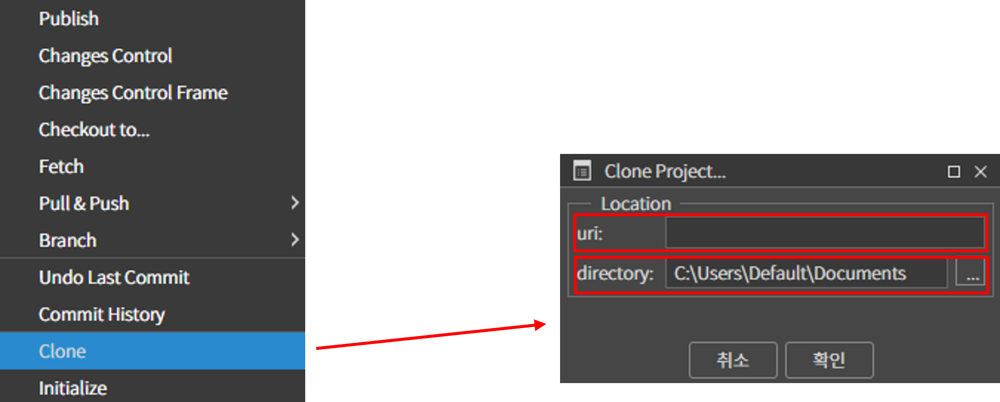
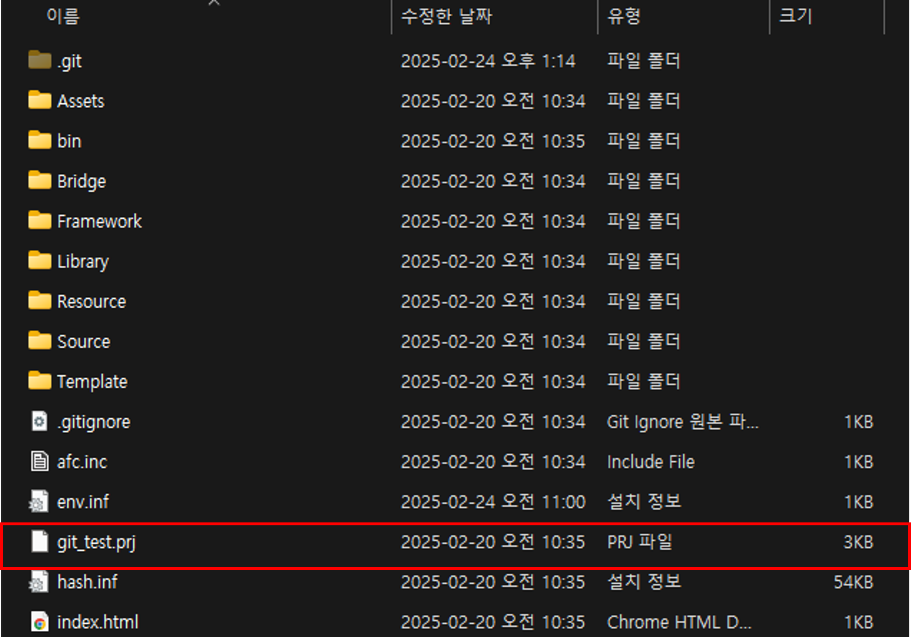
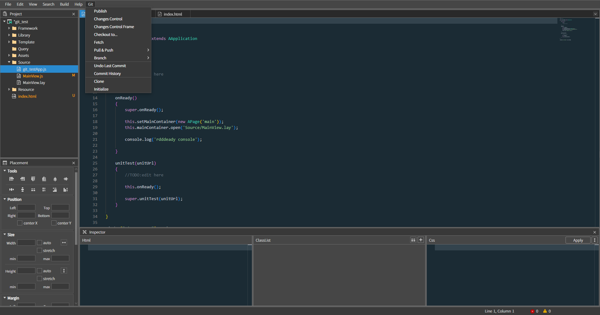

# 08. Git 연동

## 1. Clone

상단 menu 에서 Git 을 눌러 Clone 을 클릭합니다.

Location 에 Clone 할 Git repository url 을 입력하고 Clone 받을 directory 경로를 설정합니다.

Clone 받은 directory 로 이동하여 SpiderGen 에서 .prj 파일을 엽니다.

\<Clone 받은 directory 를 열었을 때>

SpiderGen 에서 실행하면 Git 메뉴 사용이 가능해집니다.

## 2. 각 메뉴별 설명

각 메뉴에 대한 설명은 [Git](https://wikidocs.net/22818)을 참고하여 확인 할 수 있습니다.
