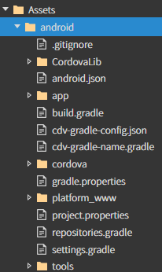
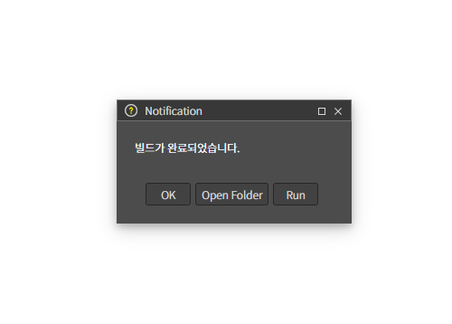

# A. Android 앱 구축하기(cordova)

### 1. Android 사용 환경 설정

Android 앱을 개발하기 위해서는 환경설정이 필요합니다.\
아래의 환경 설정을 참고해서 진행 해주세요.

[환경설정 가이드](../../../03-start-guide/04-mobile/a-android.md)

### 2. 스파이더젠에서 cordova 플러그인 사용법

**Cordova Plugin 설치**

cmd 창에서 프로젝트 경로에 진입 후 cordova Plugin을 설치합니다

`cordova plugin add cordova-plugin-screen-orientation`

> [cordova 공식 홈페이지](https://cordova.apache.org/plugins/)

### 3. 예제 코드 추가

**01. 이밴트 생성**

스파이더젠 프로젝트에서 버튼을 생성해서 클릭 이벤트함수에 아래와 같이 작성합니다.

```
MainView = class MainView extends AView {
    constructor() {
        super()
         // 현재 상태를 저장할 변수
        this.isLandscape = false;
    }


   onButtonClick(comp, info, e) {

        // landscape ↔ portrait 토글
        let orientation = this.isLandscape ? "portrait" : "landscape";

        cordova.exec(
            function () {
                alert("화면 방향이 " + orientation + "로 변경되었습니다.");
            },
            function (error) {
                alert("오류 발생: " + error);
            },
            "CDVOrientation",
            "screenOrientation",
            ["set", orientation]
        );

        // 상태 변경
        this.isLandscape = !this.isLandscape;
    }
}

```

`MyApp\platforms`

위 경로에 있는 android 폴더를 스파이더젠의 Assets 폴더에 복사합니다.



**02. bin파일 생성**

F7을 눌러 빌드하고 bin파일을 생성합니다.

(open folder 기능을 이용해서 프로젝트 폴더로 쉽게 이동할 수 있습니다.)

> `MyApp\platforms\android\app\src\main\assets\www`


위 경로에 있는 파일을 삭제 후 스파이더젠 프로젝트 **bin** 폴더안에 있는 파일을 복사사합니다.

**03. Android Studio 실행**

Menu에 진입 후 File -> Open 생성해두었던 `MyApp\platforms\android` 를 선택하여 파일을 오픈합니다.

> 처음 Android Studio 를 설치하면\
> sdk파일이 없어서 빌드가 안되는 경우가 있을수있습니다. **menu - tools - sdk managersdk tools**에서 사용할 버전을 찾아 설치하고 다시 빌드합니다.

.png>)

**04. Cordova 설정**

`MyApp\platforms\android\app\src\main\assets\www\`

위 경로에 있는 index.html 파일에 아래 내용을 추가합니다.

`<script defer src="./Assets/android/app/src/main/assets/www/cordova.js"></script>`

**05. Android Studio에서 프로젝트를 실행합니다.**

> 디바이스를 직접 연결 하거나 가상 디바이스를 설정해야 합니다.\
> 가상 디바이스는 **Menu - Tools -Device Manager** 에서 설정할 수 있습니다.


**06. 버튼을 눌러 정상 동작을 확인합니다.**


