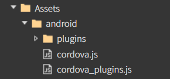

# A. Android 앱 구축하기(cordova)

### 1. Android 사용 환경 설정

Android 앱을 개발하기 위해서는 환경설정이 필요합니다.\
아래의 환경 설정을 참고해서 진행 해주세요.

[환경설정 가이드](../../../03-start-guide/04-mobile/a-android.md)

### 2. 스파이더젠에서 cordova 플러그인 사용법

**Cordova Plugin 설치**

cmd 창에서 프로젝트 경로에 진입 후 cordova Plugin을 설치합니다

`cordova plugin add cordova-plugin-screen-orientation`

> [cordova 공식 홈페이지](https://cordova.apache.org/plugins/)

## &#x20;<mark style="color:red;background-color:red;">지원 디바이스에 따른 설정방법</mark>&#x20;

> 지원해야 하는 디바이스에 따라 설정방법이 차이가 있습니다.
>
> <mark style="color:red;">**사용자는 디바이스에 따라 아래 2가지 방법 중 한 가지 방법**</mark>으로 설정해야 합니다.

### 3.1. 네이티브 전용

<figure><figcaption><p>스파이더젠 Properties 화면 ( cordova 상태 )</p></figcaption></figure>

네이티브 전용으로 제작하려면 스파이더젠의 File > Properties에서 Native Bridge를

&#x20;<mark style="color:red;background-color:red;">**cordova**</mark> 로 설정해야 합니다.

<figure><figcaption><p>생성된 Bridge 폴더</p></figcaption></figure>

위에서 cordova로 설정을 완료했다면 위 사진처럼 Bridge 폴더와 그 하위 폴더들이 자동으로 생성되어 있습니다.

각 폴더에 들어있는 cordova.js / cordova\_plugins.js는 시각적으론 보이나 실제론 해당 파일이 각 폴더에 실제로 존재해 있지 않기에 각 폴더에 js를 찾아서 넣어줘야 합니다.

**`MyApp\platforms\android\platform_www`**&#x20;

위 경로에 있는 파일들을 스파이더젠의 위 사진의 android 폴더에 붙여넣습니다.



**안드로이드앱을 구축하기 위해 ios 폴더는 삭제해줍니다.**&#x20;

### 3.2. 네이티브 & 웹

<figure><figcaption><p>스파이더젠 Properties 화면 ( 기본 none 상태 )</p></figcaption></figure>

네이티브 & 웹 전용으로 제작하려면 스파이더젠의 File > Properties에서 Native Bridge를

&#x20;<mark style="color:red;background-color:red;">none (기본값)</mark> 로 설정해야 합니다.\


`MyApp\platforms\android\platform_www`&#x20;

위 경로에 있는 파일들을 스파이더젠의 Assets 폴더에 붙여넣습니다.


Assets 폴더 내에 파일들은 자동으로 로드하지 않으므로 해당 cordova.js를 코드 내에서 읽어줘야 합니다.

아래와 같이 `afc.loadScript('Assets/android/cordova.js');` 를 theApp.js 코드 최상단에 작성해줍니다.

<figure><figcaption><p>스파이더젠 프로젝트 theApp.js 내 최상단에 위치한 loadScript 코드</p></figcaption></figure>

### 3. 예제 코드 추가

**01. 이벤트 생성**

스파이더젠 프로젝트에서 버튼을 생성해서 클릭 이벤트함수에 아래와 같이 작성합니다.

```
class MainView extends AView 
{
    constructor() 
    {
        super()
        
         // 현재 상태를 저장할 변수
        this.isLandscape = false;
    }


   onButtonClick(comp, info, e) 
   {
        // landscape ↔ portrait 토글
        let orientation = this.isLandscape ? "portrait" : "landscape";

        cordova.exec(
            function () {
                alert("화면 방향이 " + orientation + "로 변경되었습니다.");
            },
            function (error) {
                alert("오류 발생: " + error);
            },
            "CDVOrientation",
            "screenOrientation",
            ["set", orientation]
        );

        // 상태 변경
        this.isLandscape = !this.isLandscape;
    }
}

```

**02. bin파일 생성**

F7을 눌러 빌드하고 bin파일을 생성합니다.

(open folder 기능을 이용해서 프로젝트 폴더로 쉽게 이동할 수 있습니다.)

> `MyApp\platforms\android\app\src\main\assets\www`

위 경로에 있는 파일을 삭제 후 스파이더젠 프로젝트 **bin** 폴더안에 있는 파일을 붙여넣습니다.


**03. Android Studio 실행**

Menu에 진입 후 File -> Open 생성해두었던 `MyApp\platforms\android` 를 선택하여 파일을 오픈합니다.

> 처음 Android Studio 를 설치하면\
> sdk파일이 없어서 빌드가 안되는 경우가 있을수있습니다. **menu - tools - sdk managersdk tools**에서 사용할 버전을 찾아 설치하고 다시 빌드합니다.

.png>)

**04. Cordova 설정**

`MyApp\platforms\android\app\src\main\assets\www\`

위 경로에 있는 index.html 파일에 아래 내용을 추가합니다.

`<script defer src="./Assets/android/app/src/main/assets/www/cordova.js"></script>`

**05. Android Studio에서 프로젝트를 실행합니다.**

> 디바이스를 직접 연결 하거나 가상 디바이스를 설정해야 합니다.\
> 가상 디바이스는 **Menu - Tools -Device Manager** 에서 설정할 수 있습니다.


**06. 버튼을 눌러 정상 동작을 확인합니다.**


