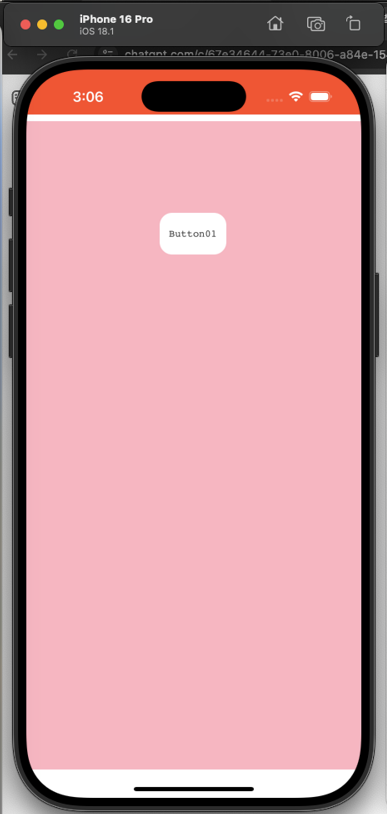

# B. iOS 앱 구축하기(cordova)

## 1. iOS 사용 환경 설정

iOS 앱을 개발하기 위해서는 환경설정이 필요합니다. 아래의 환경 설정을 참고해서 진행 해주세요.

환경설정 가이드

## 2. 스파이더젠에서 cordova 플러그인 사용법

**Cordova Plugin 설치**

cmd 창에서 프로젝트 경로에 진입 후 Plugin을 설치합니다\
경로예시 `MyApp/`

`cordova plugin add cordova-plugin-screen-orientation`

> [cordova 공식 홈페이지](https://cordova.apache.org/plugins/)

## 3. 예제 코드 추가

**01. 이밴트 생성**

스파이더젠 프로젝트에서 버튼을 생성해서 클릭 이벤트함수에 아래와 같이 작성합니다.


```


        let newColor = "#FF5733"; // 변경할 상태바 색상

        // Cordova exec를 사용하여 네이티브 기능을 호출합니다.
        cordova.exec(
            function () {
                alert("상태 표시줄 색상이 " + newColor + "로 변경되었습니다.");
            },
            function (error) {
                alert("오류 발생: " + error);
            },
            "StatusBar",                  // 플러그인 이름
            "backgroundColorByHexString", // 호출할 네이티브 메서드
            [newColor]                    // 전달할 인자 값
        );

```


`MyApp\platforms`

위 경로에 있는 ios 폴더를 스파이더젠의 Assets 폴더에  복합니다.


**02. bin파일 생성**

F7을 눌러 빌드하고 bin파일을 생성합니다.

(open folder 기능을 이용해서 프로젝트 폴더로 쉽게 이동할 수 있습니다.)

.png>)

> `MyApp/platforms/ios/www`


위 경로에 있는 파일을 삭제 후 스파이더젠 프로젝트 bin 폴더안에 있는 파일을 export 합니다.

**03. Xcode 실행**

Menu에 진입 후 File -> Open 생성해두었던`MyApp/platforms/ios` 경로를 를 선택하여 파일을 오픈합니다..

**04. Cordova 설정**

Staging 폴더의 www 경로에 있는 index.html 파일에 아래 내용을 추가합니다.

`//코르도바를 호출합니다`

`//상태바가 웹뷰 위에 겹치는 것을 막고, 웹뷰를 아래로 내려서 상태바 영역을 피하도록 만듭니다.`

\
&#x20;       `document.addEventListener("deviceready", function () {`\
&#x20;           `if (window.StatusBar) {`\
&#x20;               `StatusBar.overlaysWebView(false);`\
&#x20;           `}`\
&#x20;       `}, false);`

<figure><figcaption></figcaption></figure>

**05. Xcode에서 프로젝트를 실행합니다.**

Staging 폴더의 www 경로에 있는 파일을 삭제 후 스파이더젠 프로젝트 bin 폴더안에 있는 파일을 export 합니다.

IOS는 파일프로토콜을 기본 지원하지 않으므로 localhost로 동작하도록 해야합니다. 그러므로 Staging/config.xml 파일에 아래 옵션을 추가해줘야 동작합니다.

```
<preference name="WKWebViewOnly" value="true" />
<preference name="scheme" value="app" />
<preference name="hostname" value="localhost" />
```

**06. 버튼을 눌러 정상 동작을 확인합니다.**


<div><figure><figcaption></figcaption></figure> <figure><figcaption></figcaption></figure></div>
