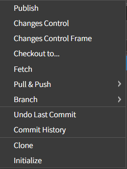
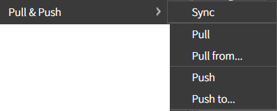
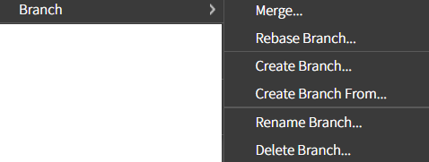

# G. Git

\

**Git** 탭은 프로젝트의 버전 관리를 돕기 위해 다양한 기능을 제공합니다.\

이 탭을 통해 사용자는 **Git**을 활용하여 소스 코드의 변경 사항을 추적하고, 협업을 원활하게 진행할 수 있습니다.

### Git 탭을 사용하는 이유

1️⃣ **저장소 관리**

로컬 저장소와 원격 저장소를 연결하여 프로젝트의 변경 사항을 푸시하거나 풀 수 있습니다.

2️⃣ **커밋**

코드 변경 사항을 커밋하여 이력을 남길 수 있습니다.\
커밋 메시지를 통해 변경 사항에 대한 설명을 추가할 수 있습니다.

3️⃣ **브랜치 관리**

새로운 브랜치를 생성하거나 기존 브랜치를 전환하여 독립적인 개발 환경을 유지할 수 있습니다.\
브랜치를 통해 여러 기능을 병렬로 개발할 수 있습니다.

4️⃣ **병합**

서로 다른 브랜치의 변경 사항을 병합하여 하나의 브랜치로 통합할 수 있습니다.\
병합 충돌이 발생할 경우, 스파이더젠은 이를 해결할 수 있는 도구를 제공합니다.

5️⃣ **이력 보기**

프로젝트의 변경 이력을 시각적으로 확인할 수 있으며, 특정 커밋으로 되돌리거나 변경 사항을 비교할 수 있습니다.

### Git 탭 사용 방법

**스파이더젠에서 Git 탭을 사용하려면, 먼저 프로젝트가 Git 저장소로 초기화되어 있어야 합니다.**

> 프로젝트를 Git 저장소로 초기화하려면 **Initialize** 기능을 사용합니다.

[SpiderGen 과 Git 연동 방법](<../../05  Advanced/08  Git 연동.md>)

### Git 탭 각 기능 설명

**1️⃣ Publish**

**기능 설명** : 로컬 저장소의 변경 사항을 원격 저장소에 푸시하여 다른 팀원들과 공유할 수 있습니다.

**사용 방법** : 변경 사항을 커밋한 후, **Publish** 버튼을 클릭하여 원격 저장소에 푸시합니다.

***

**2️⃣ Changes Control**

**기능 설명** : 현재 작업 중인 파일의 변경 사항을 확인하고 관리할 수 있습니다.

**사용 방법** : 변경된 파일 목록을 확인하고, 필요한 경우 변경 사항을 선택적으로 커밋할 수 있습니다.

***

**3️⃣ Changes Control Frame**

**기능 설명** : 변경 사항을 보다 세부적으로 관리할 수 있는 프레임을 제공합니다.

**사용 방법** : 변경된 파일의 세부 내용을 확인하고, 특정 변경 사항을 선택적으로 커밋할 수 있습니다.

***

**4️⃣ Checkout to...**

**기능 설명** : 특정 브랜치나 커밋으로 체크아웃하여 작업 환경을 전환할 수 있습니다.

**사용 방법** : 원하는 브랜치나 커밋을 선택하고 Checkout to...를 클릭하여 전환합니다.

***

**5️⃣Fetch**

**기능 설명** : 원격 저장소의 최신 변경 사항을 로컬 저장소로 가져옵니다.

**사용 방법** : **Fetch** 버튼을 클릭하여 원격 저장소의 변경 사항을 가져옵니다.

***

**6️⃣ Pull & Push**

**기능 설명** : 원격 저장소의 변경 사항을 로컬로 가져오고, 로컬의 변경 사항을 원격으로 푸시합니다.

**사용 방법** : **Pull & Push** 버튼을 클릭하여 양방향으로 동기화합니다.

\
&#xNAN;**<사진> Pull & Push 세부 탭**\

*   **6️⃣-1️⃣ Sync**\
    \
    **기능 설명** : **Sync**는 로컬 저장소와 원격 저장소 간의 변경 사항을 자동으로 동기화하는 기능입니다.\
    이 기능은 **Pull**과 **Push**를 한 번에 수행하여, 로컬과 원격 저장소의 상태를 일치시킵니다.

    **사용 방법** : **Sync** 버튼을 클릭하면, 로컬 저장소의 변경 사항이 원격 저장소에 **Push**되고, 원격 저장소의 변경 사항이 로컬 저장소로 **Pull**됩니다.

    ***
*   **6️⃣-2️⃣ Pull**\
    \
    **기능 설명** : **Pull**은 원격 저장소의 최신 변경 사항을 로컬 저장소로 가져오는 기능입니다.\
    이를 통해 팀원들이 작업한 최신 코드를 로컬 환경에서 확인할 수 있습니다.

    **사용 방법** : **Pull** 버튼을 클릭하여 원격 저장소의 변경 사항을 로컬로 가져옵니다.

    ***
*   **6️⃣-3️⃣ Pull From**\
    \
    **기능 설명** : **Pull From**은 특정 원격 브랜치나 저장소에서 변경 사항을 가져오는 기능입니다.\
    여러 원격 저장소가 설정된 경우, 특정 저장소를 선택하여 변경 사항을 가져올 수 있습니다.

    **사용 방법** : **Pull From** 옵션을 선택하고, 원하는 원격 저장소나 브랜치를 지정하여 변경 사항을 가져옵니다.

    ***
*   **6️⃣-4️⃣ Push**\
    \
    **기능 설명** : **Push**는 로컬 저장소의 커밋된 변경 사항을 원격 저장소에 반영하는 기능입니다.\
    이를 통해 팀원들과 작업한 내용을 공유할 수 있습니다.

    **사용 방법** : **Push** 버튼을 클릭하여 로컬 저장소의 변경 사항을 원격 저장소에 푸시합니다.

    ***
*   **6️⃣-5️⃣ Push To**\
    \
    **기능 설명** : **Push To**는 특정 원격 브랜치나 저장소에 변경 사항을 푸시하는 기능입니다.\
    여러 원격 저장소가 설정된 경우, 특정 저장소를 선택하여 변경 사항을 푸시할 수 있습니다.

    **사용 방법** : **Push To** 옵션을 선택하고, 원하는 원격 저장소나 브랜치를 지정하여 변경 사항을 푸시합니다.

***

**7️⃣ Branch**

**기능 설명** : 새로운 브랜치를 생성하거나, 기존 브랜치를 관리할 수 있습니다.

**사용 방법** : **Branch** 버튼을 클릭하여 브랜치를 생성하거나 전환합니다.

\
&#xNAN;**<사진> Branch 세부 탭**\

*   **7️⃣-1️⃣ Merge**\
    \
    **기능 설명** : 두 브랜치의 변경 사항을 병합하는 기능입니다.\
    이를 통해 서로 다른 브랜치에서 작업한 내용을 하나의 브랜치로 통합할 수 있습니다.

    **사용 방법** : 병합할 대상 브랜치를 선택하고, **Merge** 기능을 사용하여 현재 브랜치에 병합합니다.

    ***
*   **7️⃣-2️⃣ Rebase Branch**\
    \
    **기능 설명** : 선택한 브랜치를 다른 브랜치의 최신 커밋 위로 재배치하는 기능입니다.\
    이를 통해 깔끔한 커밋 히스토리를 유지할 수 있습니다.

    **사용 방법** : 재배치할 브랜치를 선택하고, **Rebase Branch** 기능을 사용하여 원하는 브랜치 위로 이동시킵니다.

    ***
*   **7️⃣-3️⃣ Create Branch**\
    \
    **기능 설명** : 새로운 브랜치를 생성하는 기능입니다.\
    새로운 기능 개발이나 버그 수정을 위해 독립적인 작업 공간을 만들 수 있습니다.

    **사용 방법** : **Create Branch** 버튼을 클릭하고, 새 브랜치의 이름을 입력하여 생성합니다.

    ***
*   **7️⃣-4️⃣ Create Branch From**\
    \
    **기능 설명** : 특정 커밋이나 브랜치에서 새로운 브랜치를 생성하는 기능입니다.\
    이를 통해 특정 시점의 상태를 기반으로 작업을 시작할 수 있습니다.

    **사용 방법** : 기준이 될 커밋이나 브랜치를 선택하고, **Create Branch From** 기능을 사용하여 새 브랜치를 생성합니다.

    ***
*   **7️⃣-5️⃣ Rename Branch**\
    \
    **기능 설명** : 기존 브랜치의 이름을 변경하는 기능입니다.\
    브랜치의 목적이나 내용을 더 잘 설명할 수 있도록 이름을 수정할 수 있습니다.

    **사용 방법** : 이름을 변경할 브랜치를 선택하고, **Rename Branch** 기능을 사용하여 새 이름을 입력합니다.

    ***
*   **7️⃣-6️⃣ Delete Branch**\
    \
    **기능 설명** : 더 이상 필요하지 않은 브랜치를 삭제하는 기능입니다.\
    이를 통해 브랜치 목록을 정리하고 관리할 수 있습니다.

    **사용 방법** : 삭제할 브랜치를 선택하고, **Delete Branch** 기능을 사용하여 브랜치를 제거합니다.

***

**8️⃣ Undo Last Commit**

**기능 설명** : 마지막 커밋을 취소하여 변경 사항을 되돌릴 수 있습니다.

**사용 방법** : **Undo Last Commit** 버튼을 클릭하여 마지막 커밋을 취소합니다.

***

**9️⃣ Commit History**

**기능 설명** : 프로젝트의 커밋 히스토리를 확인할 수 있습니다. 변경된 내역도 확인가능합니다.

**사용 방법** : **Commit History** 버튼을 클릭하여 커밋 내역을 확인합니다.

***

**🔟 Clone**

**기능 설명** : 원격 저장소를 로컬로 복제하여 새로운 작업 환경을 설정할 수 있습니다.

**사용 방법** : **Clone** 버튼을 클릭하고, 원격 저장소의 URL을 입력하여 복제합니다.

***

**1️⃣1️⃣ Initialize**

**기능 설명** : 현재 프로젝트를 Git 저장소로 초기화합니다.

**사용 방법** : **Initialize** 버튼을 클릭하여 프로젝트를 Git 저장소로 설정합니다.

***
