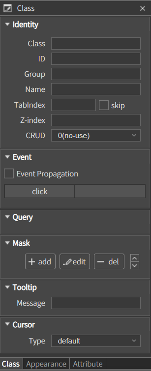
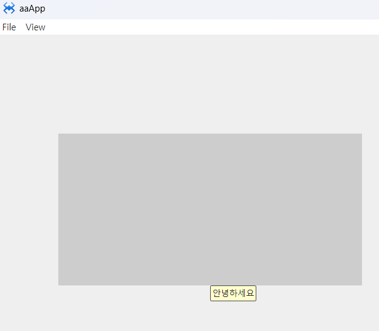

# 01. Class

**스파이더젠에서 클래스와 관련된 다양한 속성 및 기능을 관리하는 영역은 주로 Class Pane에서 이루어집니다.**

**이 영역에서는 Identity, Event, Query, Mask, Tooltip, Cursor 등의 다양한 설정을 할 수 있습니다.**



### Identity

*   **Class**

    컴포넌트에 적용할 CSS 클래스 이름을 지정합니다.\
    이를 통해 스타일을 일관되게 적용할 수 있습니다.
*   **ID**

    컴포넌트의 고유 식별자를 설정합니다.\
    이 ID는 코드에서 해당 컴포넌트를 참조할 때 사용됩니다.\
    예를 들어, 특정 버튼이나 레이블을 조작할 때 이 ID를 통해 접근할 수 있습니다.
*   **Group**

    컴포넌트를 그룹으로 묶어 관리할 수 있는 속성입니다.\
    같은 그룹에 속한 컴포넌트들은 배열로 관리할 수 있으며, 그룹 내의 모든 컴포넌트에 대해 동일한 작업을 수행할 때 유용합니다.
*   **Name**

    컴포넌트의 이름을 설정합니다.\
    이는 주로 코드 내에서 컴포넌트를 식별하거나 참조할 때 사용됩니다.
*   **TabIndex**

    컴포넌트의 탭 순서를 설정합니다.\
    사용자가 키보드의 탭 키를 사용하여 컴포넌트 간에 이동할 때의 순서를 정의합니다.

    * **`skip`** : 해당 컴포넌트가 탭 순서에서 제외되도록 설정하는 기능
*   **Z-index**

    컴포넌트의 쌓임 순서를 설정합니다.\
    동일한 위치에 여러 컴포넌트가 있을 때, 어떤 컴포넌트가 위에 표시될지를 결정합니다.
*   **CRUD**

    Create, Read, Update, Delete의 약자로, 컴포넌트가 데이터와 상호작용하는 방식을 정의합니다.\
    예를 들어, 데이터베이스와의 연동에서 어떤 작업을 수행할 수 있는지를 설정합니다.

### Event

컴포넌트의 이벤트를 설정 할 수 있습니다.\
설정하기 위한 이벤트 컬럼을 더블클릭하면 Add Event 다이얼로그가 오픈됩니다.\
각 컴포넌트의 이벤트 리스트는 [링크](<04  Event List.md>) 를 참고해주세요.

### Query

컴포넌트가 데이터베이스나 외부 데이터 소스와 상호작용할 수 있도록 쿼리 설정을 관리하는 부분입니다.\
이 영역은 데이터를 가져오거나 보낼 때 사용할 쿼리를 바인딩 하는데 사용됩니다.

### Mask

컴포넌트에 마스킹을 설정할 수 있습니다. add 버튼을 클릭하면 사용 가능한 마스크 리스트를 확인 할 수 있습니다.


* **Type**
  * 마스킹 함수의 유형을 설정
  * ex ) 숫자 형식, 날짜 형식 등 다양한 유형
* **Parameter**
  * 선택한 마스킹 함수에 필요한 추가적인 매개변수 설정
  * 숫자 형식의 경우 소수점 자리수 등을 지정

### ToolTip

컴포넌트에 마우스를 올렸을 때 나타나는 **툴팁 메시지를 설정**하고 관리하는 부분입니다.\
이 영역은 사용자가 컴포넌트의 기능이나 정보를 쉽게 이해할 수 있도록 돕는 역할을 합니다.



***

**Tooltip은 코드로 생성할 수 있습니다.**\
**코드로 생성하면 다양한 설정을 추가할 수 있습니다.**

1. **위치 설정**

* 툴팁이 나타날 위치를 설정할 수 있습니다.\
  일반적으로 컴포넌트의 상단, 하단, 좌측, 우측 등 다양한 위치에 툴팁을 표시할 수 있습니다.

2. **스타일링**

* 툴팁의 스타일을 설정할 수 있습니다.\
  예를 들어, 툴팁의 배경색, 텍스트 색상, 테두리 등을 설정하여 사용자 인터페이스와 일관되게 디자인할 수 있습니다.

3. **이미지 툴팁**

* 텍스트뿐만 아니라 이미지를 툴팁으로 표시할 수 있는 기능을 제공합니다.\
  이를 통해 시각적으로 더 많은 정보를 제공할 수 있습니다.

4. **동적 업데이트**

* 툴팁 메시지를 동적으로 업데이트할 수 있습니다.\
  예를 들어, 사용자의 행동에 따라 툴팁 내용을 변경하여 더 적절한 정보를 제공할 수 있습니다.

**Tooltip코드로 생성 예시**

```

// tooltip을 표시할 컴포넌트에 enter 이벤트를 추가합니다.
onButtonEnter(comp, info, e)
{
	// tooltip 생성
	this.tooltip = new ATooltip();
	this.tooltip.init();

	// tooltip 설정
	this.tooltip.show('툴팁 메시지', comp.getBoundRect());

	// tooltip에 메시지가 아닌 이미지로 출력하는 법
	// show 메서드의 세 번째 인자를 true로 설정하면 이미지 툴팁을 표시할 수 있습니다.
	this.tooltip.show('Asset/img/ex.png', comp.getBoundRect(), true);
}

// tooltip을 숨길 leave 이벤트 추가
onButtonLeave(comp, info, e)
{
	// tooltip 삭제
	this.tooltip.hide();
}

```

### Cursor Type

컴포넌트의 마우스 커서를 설정 할 수 있습니다.

* **default**
  * 기본 커서 모양
  * 일반적인 화살표 모양으로, 특별한 동작이 없는 경우 사용
* **pointer**
  * 손가락 모양의 커서
  * 주로 클릭 가능한 요소 위에 마우스를 올렸을 때 사용
* **text**
  * 텍스트 입력 커서 모양
  * 텍스트를 선택하거나 입력할 수 있는 영역 위에 마우스를 올렸을 때 사용
* **wait**
  * 모래시계 또는 원형의 대기 커서
  * 작업이 진행 중일 때 사용
* **crosshair**
  * 십자 모양의 커서
  * 정밀한 선택이 필요한 경우 사용
* **move**
  * 네 방향 화살표 모양의 커서
  * 요소를 이동할 수 있는 경우 사용
* **not-allowed**
  * 금지 표시 모양의 커서
  * 현재 동작이 허용되지 않는 경우 사용
* **help**
  * 물음표 모양의 커서
  * 도움말을 제공할 수 있는 경우 사용
* **progress**
  * 작업이 진행 중이지만 여전히 상호작용이 가능한 경우 사용되는 커서
  * 기본 커서와 대기 커서의 조합
* **resize**
  * 요소의 크기를 조정할 수 있는 경우 사용되는 커서
  * 방향에 따라 커서 모양이 상이
  * ex ) e-resize, n-resize, ne-resize, nw-resize, s-resize, se-resize, sw-resize, w-resize
