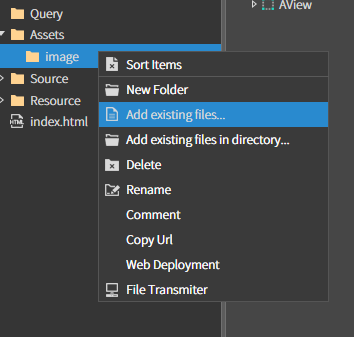
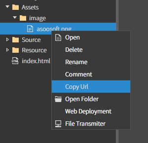
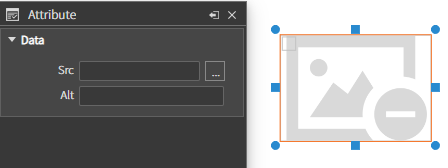
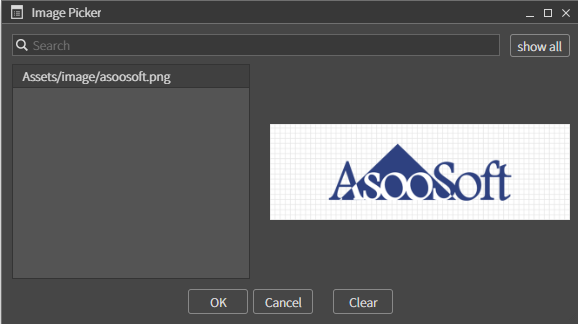
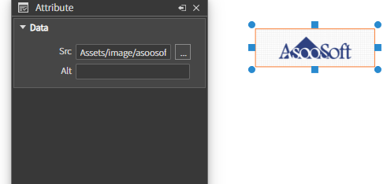

# Image


원하는 영역 및 위치에 이미지를 로드하는 **이미지 컴포넌트**.

### Data

| Data  | 설명                         |
| ----- | -------------------------- |
| `Src` | 이미지의 프로젝트 내 위치 경로를 설정하는 속성 |
| `Alt` | 이미지의 대체 텍스트를 설정하는 속성       |

### Example

> #### 이미지 추가하기

#### 1. 툴을 사용하여 추가하는 방법

**1-1. Assets 폴더에 image 폴더 생성 후 Add existing files... 를 클릭해 이미지 파일을 추가**





`위의 방법으로 Url을 복사 가능`

**1-2. 이미지 컴포넌트를 추가하고, Src 의 `...` 을 클릭해서 이미지를 추가하거나, 위에서 복사한 Url 을 붙어넣기**



\
`[show all] 버튼 클릭시 이미지 파일 목록이 로드 됨.`



`이미지가 성공적으로 들어간 모습`

#### 2. 코드를 통해 추가하는 방법

```js
// 이미지 컴포넌트 생성 
const imageComp = new AImage(); 

// 초기화
imageComp.init()

// 이미지 컴포넌트 추가
this.addComponent(imageComp); 

// 이미지 경로 설정
imageComp.setImage('Assets/image/asoosoft.png');
```
