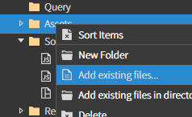
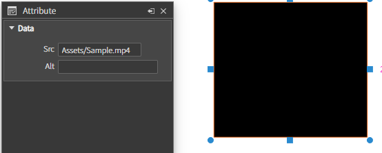

# Video

\


원하는 영역과 위치에 동영상을 로드하여 재생할 수 있는 **비디오 컴포넌트**

### Data

.png>)\
`Src` : 동영상 파일의 경로를 설정\
`Alt` : 동영상의 대체 텍스트를 설정\


### Example

> #### Video 컴포넌트를 추가하고 Sample.mp4 동영상 넣기

#### 1. 툴을 이용하는 방법

#### 1-1. Asset 폴더에 동영상을 추가

\
`Add existing files... 클릭 후 동영상 파일 선택`

**1-2. `Copy Url` 을 통해 경로를 복사하여 `Src` 에 입력**




**1-3. 실행 후 영상을 확인**

\
`해당 문서는 캡처 화면으로, 영상이 재생되지는 않습니다.`

### 2. 코드상에서 동영상 로딩

```js
// 비디오 컴포넌트를 생성
const videoComponent = new AVideo(); 

// 초기화
videoComponent.init()

// 비디오를 메인 뷰에 추가
this.addComponent(videoComponent); 

// 비디오 파일의 경로를 설정합니다. 
videoComponent.setSrc('Assets/Sample.mp4');
```
