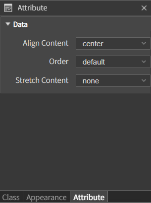

# Vertical

<figure><figcaption></figcaption></figure>

자식  컴포넌트의 배치를 세로로 정렬하는 컴포넌트

## Attribute

<table data-header-hidden><thead><tr><th width="361"></th><th></th></tr></thead><tbody><tr><td><strong>이름</strong></td><td><strong>설명</strong></td></tr><tr><td><code>Align Content</code></td><td>자식 요소들의 정렬 방향을 설정</td></tr><tr><td><code>Order</code></td><td>자식 요소들의 배치 순서를 지정하는 데 사용</td></tr><tr><td><code>Stretch Content</code></td><td>컨테이너 내에서 자식 요소들이 공간을 어떻게 차지할지를 결정하는 데 사용</td></tr></tbody></table>

### Align Content

* top

<figure><figcaption></figcaption></figure>

* center

<figure><figcaption></figcaption></figure>

* bottom

<figure><figcaption></figcaption></figure>

*   space-between

    * 첫 번째 자식 요소는 컨테이너의 **시작점**에, 마지막 자식 요소는 컨테이너의 **끝점**에 배치되고, **나머지 요소들은 사이에 고르게** 배치

    <figure><figcaption></figcaption></figure>

*   space-around

    * 자식 요소들 사이에 **동일한 간격**이 배치되며, 컨테이너의 시작과 끝에도 절반의 간격이 추가. 요소들 사이의 **간격이 동일하게 유지**되면서 컨테이너의 **양 끝에도 간격이 생성**

    <figure><figcaption></figcaption></figure>

*   space-evenly

    * 자식 요소들 사이와 컨테이너의 시작과 끝 사이에 동일한 간격이 배치되며 모든 간격이 동일하게 유지

    <figure><figcaption></figcaption></figure>

### Order

*   reverse

    * 자식 요소들의 순서를 역으로 배치

    <figure><figcaption></figcaption></figure>

* default
  * **기본값**으로 자식 요소들은 작성된 순서로 배치

### Stretch Content

* none
  * 자식 요소들이 컨테이너의 가용 공간을 채우지 않고, 본래의 크기를 유지
*   stretch

    * 자식 요소들이 컨테이너의 가용 공간을 채우지 않고, 본래의 크기를 유지

    <figure><figcaption></figcaption></figure>
