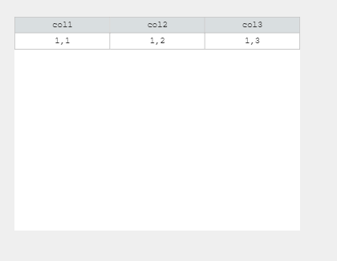
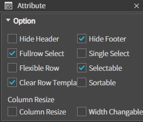
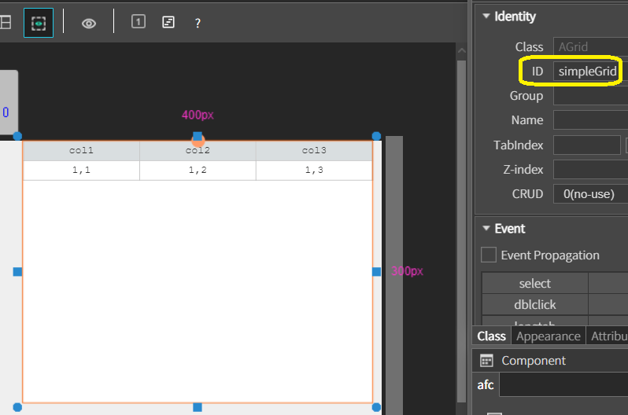
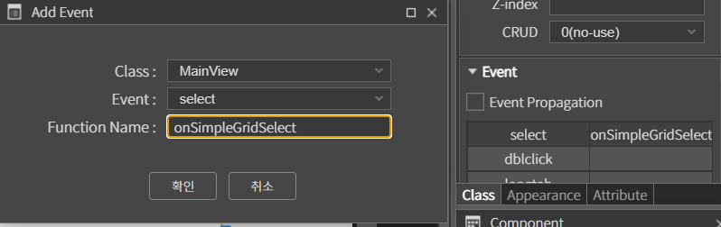
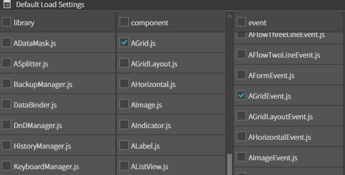

# Grid



컴포넌트는 데이터를 테이블 형식으로 표시하고 관리할 수 있는 도구.  다양한 속성과 메서드를 제공하여 데이터를 효율적으로 표시하고 조작.

### Attributes



<table data-header-hidden><thead><tr><th width="361"></th><th></th></tr></thead><tbody><tr><td><strong>이름</strong></td><td><strong>설명</strong></td></tr><tr><td><code>Hide Header</code></td><td>헤더 숨김 여부를 설정</td></tr><tr><td><code>Hide Footer</code></td><td>푸터 <a data-footnote-ref href="#user-content-fn-1">숨김 여부를 설정</a></td></tr><tr><td><code>Fullrow Select</code></td><td>특정 셀을 클릭해도 그 로우 전체가 선택되도록 설정</td></tr><tr><td><code>Single Select</code></td><td>Ctrl 키를 누르고 선택해도 하나만 선택되도록 설정</td></tr><tr><td><code>Flexible Row</code></td><td>TR의 높이를 TABLE 높이에 맞추는 옵션</td></tr><tr><td><code>Selectable</code></td><td>선택 가능 여부를 설정</td></tr><tr><td><code>Clear Row Template</code></td><td>그리드 초기화 후 템플릿 로우를 보존할지 여부를 설정</td></tr><tr><td><code>Sortable</code></td><td>헤더 선택 시 정렬 처리 여부를 설정</td></tr><tr><td><code>Column Resize</code></td><td>컬럼 리사이즈 여부를 설정</td></tr><tr><td><code>Width Changable</code></td><td>컬럼 리사이즈 시 그리드 넓이 변경 여부를 설정</td></tr></tbody></table>


### Example

* Grid의 id를 simpleGrid로 설정.




* **MainView.js 설정**

```
onInitDone()
{
    super.onInitDone()

    this.simpleGrid.setData([
        ['item 1', 'Description 1', 'Price 1'],
        ['item 2', 'Description 2', 'Price 2'],
        ['item 3', 'Description 3', 'Price 3'],
        ['item 4', 'Description 4', 'Price 4'],
        ['item 5', 'Description 5', 'Price 5'],
    ])

}

onSimpleGridSelect(comp, info, e)
{
    
    let cell = info[0];
    let pos = comp.indexOfCell(cell);

    AToast.show("Selected cell at row: " + pos[0] + ", column: " + pos[1]);

}
```


<figure><figcaption></figcaption></figure>

* **프로젝트 트리뷰에서 Framework > afc 우클릭 Default Load Settings.. > Component > AToast.js 클릭 >  닫기 > 변경 사항 적용 -> Yes**


* select를 눌러 Function Namefme 를 onSimpleGridSelect로 설정하여 Grid의 이벤트 설정




4. **프로젝트 실행**

<figure><figcaption></figcaption></figure>


### 코드로 Grid 생성 예제

**1. Framework 추가.**

* AGrid.js + AToast.js + AGridEvent.js 선




* **MainView.js 수정**

```
onInitDone() {
    super.onInitDone()

    // 그리드 생성
    const grid = new AGrid();
    grid.init();

    // 그리드 속성 설정
    grid.setSize('100%', '100%');
    grid.setPos(0, 0);

    // 그리드 옵션 설정
    grid.setOption({
        hideHeader: false,
        hideFooter: false,
        fullrowSelect: true,
        singleSelect: false,
        sortable: true
    });

    // 그리드를 MainView에 추가
    this.getContainer().addComponent(grid);

    // 그리드 데이터 설정
    let data = [
        ['Item 1', 'Description 1', 'Price 1'],
        ['Item 2', 'Description 2', 'Price 2'],
        ['Item 3', 'Description 3', 'Price 3'],
        ['Item 4', 'Description 4', 'Price 4'],
        ['Item 5', 'Description 5', 'Price 5']
    ];
    grid.setData(data);

    // 그리드 이벤트 설정
    grid.addEventListener('select', this, 'onGridSelect');

}

//선택 이벤트
onGridSelect(comp, info, e) {
    let cell = info[0];
    let pos = comp.indexOfCell(cell);
    AToast.show("Selected cell at row: " + pos[0] + ", column: " + pos[1]);
}
```


* 프로젝트 실행

<figure><figcaption></figcaption></figure>

[^1]: 
