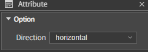
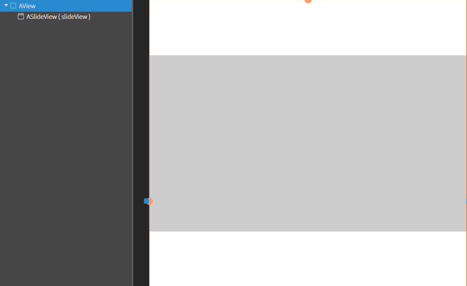
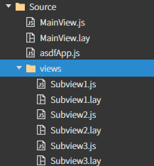
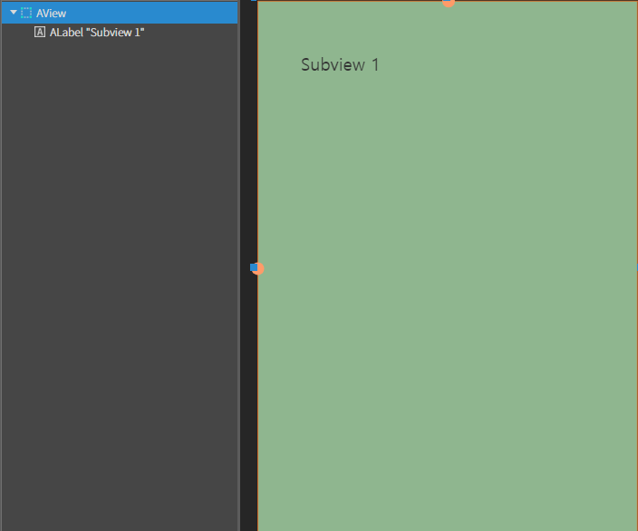
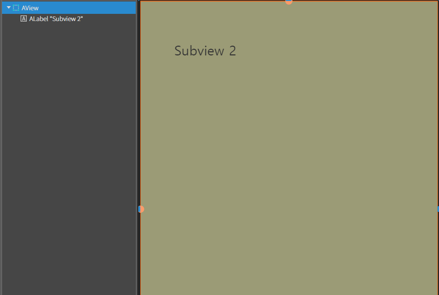
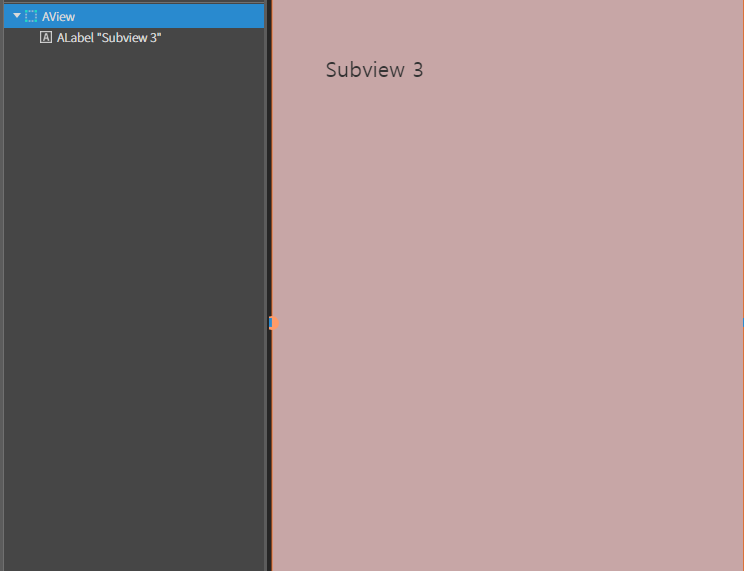
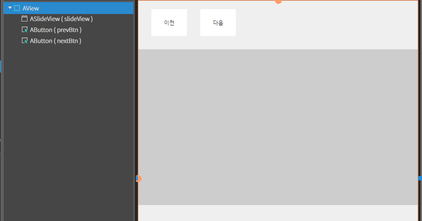
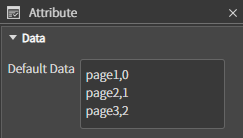

# SlideView

여러 개의 뷰를 슬라이드 형태로 전환하여 표시할 수 있는 컴포넌트\
사용자가 좌우 또는 상하로 스와이프하여 콘텐츠를 탐색할 수 있도록 도와줌.

## Attribute



#### Direction

* **vertical**
  * 자식 요소가 수직 방향으로 슬라이드
  * 주로 세로로 긴 콘텐츠를 표시할 때 사용
* **horizontal**
  * 자식 요소가 수평 방향으로 슬라이드
  * 일반적으로 가로로 배열된 콘텐츠를 표시할 때 사용된다.

## Example

#### 1. SlideView 컴포넌트 배치

id 는 slideView 로 설정



#### 2. Source > New Folder > views 생성 > SubView 생성



#### 3. 각 Subview 설정

* **SubView1.lay**
  * Label 추가 ( text: SubView 1)
  * **`background-color`** : rgb(143, 182, 143)



* **SubView2.lay**
  * Label 추가 ( text: SubView 2)
  * **`background-color`** : rgb(155, 155, 118)



* **SubView3.lay**
  * Label 추가 ( text: SubView 3)
  * **`background-color`** : rgb(199, 166, 166)



#### 4. MainView.js 수정

```js
onInitDone()
{
	super.onInitDone()

	this.slideView.addItem('Source/views/Subview1.lay',  [1]);
	this.slideView.addItem('Source/views/Subview2.lay',  [2]);
	this.slideView.addItem('Source/views/Subview3.lay',  [3]);
}
```

#### 5. 이전, 다음  Button 만들기

* **prevBtn**
  * **text** : 이전
  * **id** : prevBtn
* **nextBtn**
  * **text** : 다음
  * **id** : nextBtn



#### 6. Button에 click 이벤트 설정

<div><figure><figcaption></figcaption></figure> <figure><figcaption></figcaption></figure></div>

* **prevBtn** : onPrevBtnClick
* **nextBtn** : onNextBtnClick

```js
 onPrevBtnClick(comp, info, e)
{
	this.slideView.slidePrev();
}

onNextBtnClick(comp, info, e)
{
	this.slideView.slideNext();
}
```

#### 7. 프로젝트 빌드 후 결과 확인

<figure><figcaption></figcaption></figure>

### Page SlideView Sample

<figure><figcaption></figcaption></figure>

#### 1. View와 Button 배치 및 설정

* **View**
  * **id** : slidePageView
* **Button**
  * **text** : '1', '2', '3'

#### 2. MainView.js 수정

```js
onInitDone()
{
	super.onInitDone()
	
	this.slideView.addItem('Source/afc/SubView/SubView1.lay', [1]);
	this.slideView.addItem('Source/afc/SubView/SubView2.lay', [2]);
	this.slideView.addItem('Source/afc/SubView/SubView3.lay', [3]);

	// 추가
        this.slideView.setButtonView(this.slidePageView);
}
```

#### 3. 프로젝트 실행

<figure><figcaption></figcaption></figure>

### SelectBox SlideView Example

<figure><figcaption></figcaption></figure>

#### 1. SelectBox 컴포넌트 배치

* id: selectbox

#### 2. Attribute의 Default Data 수정



3. SelectBox에 click 이벤트 설정

<figure><figcaption></figcaption></figure>

```javascript
onSelectboxChange(comp, info, e)
{

    const index = comp.getSelectedIndex();
    this.slideView.slideTo(index, true);

}
```

#### 4.MainView.js 수정

```javascript
onInitDone()
{
    super.onInitDone()

    this.slideView.addItem('Source/afc/SubView/SubView1.lay', [1]);
    this.slideView.addItem('Source/afc/SubView/SubView2.lay', [2]);
    this.slideView.addItem('Source/afc/SubView/SubView3.lay', [3]);

    this.selectbox.addEventListener('change', this, 'onSelectboxChange');

}
```


5. **프로젝트 실행**

<figure><figcaption></figcaption></figure>
